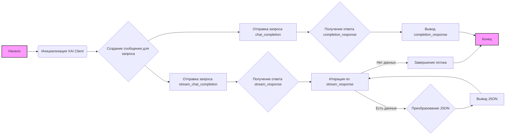

# Анализ кода `README.md`

## 1. <алгоритм>

1.  **Обзор (Overview):**
    *   Описание: Текст в начале документа представляет собой краткое введение в репозиторий, объясняя, что он содержит Python-клиент для взаимодействия с xAI API.
2.  **Особенности (Features):**
    *   Описание: Перечисляются основные возможности клиента, такие как аутентификация, создание ответов и потоковая передача ответов от xAI моделей.
3.  **Установка (Installation):**
    *   Описание: Инструкция по установке, в которой говорится, что требуется Python, и приводятся шаги по установке зависимостей с использованием `pip install requests`.
    *   Пример:  `pip install requests`
4.  **Использование (Usage):**
    *   **Инициализация (Initialization):**
        *   Описание: Объяснение, как инициализировать класс `XAI`, включая создание экземпляра с ключом API.
        *   Пример: `xai = XAI(api_key)`
    *   **Завершение чата (Chat Completion):**
        *   Описание: Объяснение, как использовать метод `chat_completion` для получения ответов от модели, включая формирование сообщений для передачи.
        *   Пример:
            ```python
            messages = [
                {"role": "system", "content": "You are Grok..."},
                {"role": "user", "content": "What is the answer..."}
            ]
            completion_response = xai.chat_completion(messages)
            ```
    *   **Потоковое завершение чата (Streaming Chat Completion):**
        *   Описание: Объяснение, как использовать метод `stream_chat_completion` для получения потоковых ответов от модели, включая обработку полученных строк JSON.
        *   Пример:
            ```python
            stream_response = xai.stream_chat_completion(messages)
            for line in stream_response:
                if line.strip():
                    print(json.loads(line))
            ```
5.  **Пример (Example):**
    *   Описание: Показывается полный пример использования клиента `XAI`, включая импорт необходимых библиотек, инициализацию клиента, выполнение как обычного запроса, так и потокового.
    *   Поток данных: `messages` -> `xai.chat_completion()` -> `completion_response` ИЛИ `messages` -> `xai.stream_chat_completion()` ->  `stream_response`-> for loop -> `json.loads(line)`
6.  **Вклад (Contributing):**
    *   Описание: Краткое руководство о том, как внести свой вклад в проект.
7.  **Лицензия (License):**
    *   Описание: Указание на MIT лицензию.
8.  **Благодарности (Acknowledgments):**
    *   Описание: Благодарность xAI и мотивации для создания этого клиента.

## 2. <mermaid>



**Анализ зависимостей:**

*   **Инициализация XAI Client (B):**  
    Предполагает наличие класса `XAI` из модуля `xai`. Это означает, что в проекте есть файл или модуль `xai.py`, который содержит определение класса `XAI`.
*   **Создание сообщения для запроса (C):**  
    Этап не имеет явных зависимостей, так как сообщение создается как структура данных (список словарей) в коде.
*   **Отправка запроса chat_completion (D):**  
    Зависит от метода `chat_completion` класса `XAI`,  который был инициализирован ранее.
*   **Получение ответа completion_response (E):**  
    Зависит от успешного выполнения запроса `chat_completion`.
*   **Отправка запроса stream_chat_completion (G):**  
    Зависит от метода `stream_chat_completion` класса `XAI`.
*   **Получение ответа stream_response (H):**  
    Зависит от успешного выполнения запроса `stream_chat_completion`.
*   **Итерация по stream_response (I):**  
    Этап является частью логики обработки ответа `stream_response` и не имеет зависимостей от сторонних модулей.
*   **Преобразование JSON (J):**  
    Используется библиотека `json`, что подразумевает импорт `json` в начале файла с примером. Зависит от наличия строки в формате `json`.
*   **Вывод JSON (K):**  
    Этот блок печатает разобранный `json` формат и не имеет зависимостей от внешних библиотек.

## 3. <объяснение>

### Импорты:

*   `json`: Используется для обработки JSON-ответов, полученных от API xAI при потоковой передаче данных. Модуль `json` входит в стандартную библиотеку Python. Он необходим для преобразования JSON-строк в объекты Python (например, словари).

### Классы:

*   `XAI`:
    *   **Роль:** Класс `XAI` является основным компонентом данного клиента. Он предоставляет интерфейс для взаимодействия с xAI API.
    *   **Атрибуты:** В коде упоминается только `api_key` при инициализации экземпляра класса, но в рамках этого документа не видны другие атрибуты. 
    *   **Методы:**
        *   `chat_completion(messages)`:  Принимает список сообщений (`messages`) в виде словарей, отправляет их в API xAI и возвращает ответ.
        *   `stream_chat_completion(messages)`: Принимает список сообщений и отправляет запрос в API xAI для получения потокового ответа. Возвращает итератор строк.

### Функции:

*   В данном документе нет явных функций, кроме методов класса `XAI`.

### Переменные:

*   `api_key`:  Строковая переменная, хранит ключ API для аутентификации запросов к xAI API. **ВАЖНО**: В примерах кода используется заполнитель `"your_api_key_here"`. Пользователь должен заменить его на свой фактический ключ API.
*   `messages`:  Список словарей, представляющий собой сообщения для отправки в API xAI. Каждый словарь содержит ключи `role` (роль сообщения - `system`, `user` и т.д.) и `content` (содержание сообщения).
*   `completion_response`:  Строковая переменная, хранит ответ от `chat_completion`, т.е. не потоковый ответ.
*   `stream_response`:  Итератор, хранит ответ от `stream_chat_completion`, т.е. потоковый ответ.
*   `line`: Строковая переменная, представляет собой одну строку из потокового ответа, полученного из `stream_response`.

### Потенциальные ошибки и улучшения:

*   **Обработка ошибок:**  В предоставленном коде не предусмотрена обработка ошибок, которые могут возникнуть при выполнении запросов к API, например, ошибки аутентификации, сетевые проблемы, ошибки 404. Рекомендуется добавить блок `try-except` для обработки таких ситуаций.
*   **Конфиденциальность API-ключа**: Хранение API ключа в коде не является безопасным. Рекомендуется использовать переменные окружения или механизмы управления секретами.
*   **Валидация данных:**  Перед отправкой запроса не выполняется валидация формата сообщений, что может привести к непредсказуемым ошибкам при взаимодействии с API. Необходимо добавить валидацию `messages` перед отправкой в API.
*   **Расширение функционала:** Класс `XAI` можно расширить дополнительными методами для поддержки других функций xAI API.
*   **Документация методов**: В `README.md` не описаны подробно параметры и тип возвращаемого значения для методов `chat_completion` и `stream_chat_completion`. Следует добавить JSDoc (или его аналог для Python).

### Цепочка взаимосвязей с другими частями проекта:

1.  **`xai.py`**: Как видно из `mermaid`, `XAI` класс должен быть реализован в файле `xai.py` (или модуле `xai`),  который не описан в предоставленном тексте.
2.  **`requests`**: Зависимость от библиотеки `requests` говорит о том, что `XAI` класс будет отправлять http запросы в xAI API.
3.  **Конфигурация**: Данный код предполагает, что ключ API передается как строка. В реальном проекте он, скорее всего, будет читаться из переменных окружения или конфигурационного файла.

Таким образом, `README.md` предоставляет общую информацию о том, как использовать клиент для xAI API, а детали реализации, вероятно, находятся в файле `xai.py` и требуют дополнительного анализа.