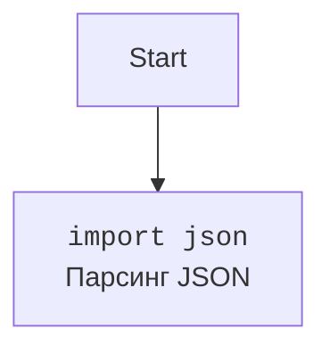

## Анализ кода `README.md`

### <алгоритм>

1.  **Начало**: Пользователь читает файл `README.md` для получения информации о клиенте xAI API.

2.  **Обзор**: Файл предоставляет общее описание клиента, его предназначение (упрощение взаимодействия с xAI API) и основные возможности.

3.  **Функциональность**: Описание возможностей клиента:
    *   Аутентификация: Использование API-ключа для безопасного доступа к API.
    *   Завершение чата: Отправка сообщений и получение ответа от модели xAI (однократный ответ).
    *   Потоковая передача ответов: Получение ответов от модели xAI в режиме реального времени (ответ по частям).

4.  **Установка**: Инструкции по установке необходимых библиотек (в данном случае `requests`).
   - `pip install requests`

5.  **Инициализация**:
    *   Пример кода для инициализации клиента `XAI` с API-ключом.
    ```python
    from xai import XAI
    api_key = "your_api_key_here"
    xai = XAI(api_key)
    ```

6.  **Завершение чата**:
    *   Пример кода для отправки списка сообщений и получения не потокового ответа.
    ```python
    messages = [
    {"role": "system", "content": "You are Grok..."},
    {"role": "user", "content": "What is the answer..."}
    ]
    completion_response = xai.chat_completion(messages)
    print("Non-streaming response:", completion_response)
    ```

7. **Потоковое завершение чата:**
    *   Пример кода для отправки сообщений и получения потокового ответа.
    ```python
    stream_response = xai.stream_chat_completion(messages)
    print("Streaming response:")
    for line in stream_response:
        if line.strip():
            print(json.loads(line))
    ```

8.  **Пример**: Объединенный пример использования клиента для обоих типов запросов (не потокового и потокового).

9.  **Содействие**: Приглашение к участию в разработке (pull request, issue).

10. **Лицензия**: Указание лицензии проекта (MIT License).

11. **Благодарности**: Упоминание xAI и источника вдохновения.

12. **Ссылки**: Ссылки на документацию xAI API и консоль.

### <mermaid>
```mermaid
flowchart TD
    Start[Начало] --> Overview[Обзор: Описание клиента xAI API]
    Overview --> Features[Функциональность]
    Features --> Authentication[Аутентификация с API-ключом]
    Features --> ChatCompletion[Завершение чата]
    Features --> StreamingCompletion[Потоковая передача ответов]
    Features --> Installation[Установка (pip install requests)]
    Installation --> Initialization[Инициализация XAI с API-ключом]
    Initialization --> ChatCompletionExample[Пример запроса chat_completion]
    Initialization --> StreamingChatCompletionExample[Пример запроса stream_chat_completion]
    ChatCompletionExample --> CompletionResponse[Получение не потокового ответа]
    StreamingChatCompletionExample --> StreamingResponse[Получение потокового ответа]
    CompletionResponse --> Example[Пример использования]
    StreamingResponse --> Example
    Example --> Contributing[Содействие]
    Contributing --> License[Лицензия (MIT)]
    License --> Acknowledgments[Благодарности]
    Acknowledgments --> Links[Ссылки на документацию]
    Links --> End[Конец]
```

**Зависимости (импорты):**

В данном `README.md` файле есть импорт только для библиотеки `json`.


### <объяснение>

**Импорты:**

*   `json`: Эта библиотека используется для работы с данными в формате JSON. В данном контексте, она используется для разбора строк JSON, которые возвращаются при потоковом запросе.

**Классы:**

*   `XAI`: Это основной класс, который предоставляет интерфейс для взаимодействия с xAI API. Он должен быть определен в модуле `xai.py`, который импортируется в примерах использования `from xai import XAI`.

**Функции и методы:**

*   `XAI.__init__(api_key)`: Конструктор класса `XAI`, принимающий API-ключ для аутентификации.
*   `XAI.chat_completion(messages)`: Метод, отправляющий список сообщений и возвращающий не потоковый ответ от модели.
*   `XAI.stream_chat_completion(messages)`: Метод, отправляющий список сообщений и возвращающий потоковый ответ от модели (генератор).
*   `json.loads(line)`: Функция для парсинга строки JSON.

**Переменные:**

*   `api_key`: Строка, содержащая API-ключ пользователя.
*   `messages`: Список словарей, представляющих сообщения для модели xAI. Каждый словарь содержит `role` ("system", "user") и `content`.
*   `completion_response`: Строка с не потоковым ответом от модели.
*   `stream_response`: Генератор, выдающий строки JSON потокового ответа.
*   `line`: Строка в потоковом ответе, которая представляет JSON объект.

**Взаимосвязь с другими частями проекта:**

Этот файл `README.md` является входной точкой для разработчиков, желающих использовать клиент xAI API. Он описывает, как использовать класс `XAI`, предполагая наличие других файлов в проекте, а именно:

*   `xai.py`: Файл, который должен содержать определение класса `XAI` и его методы (`chat_completion`, `stream_chat_completion`).

**Потенциальные ошибки и улучшения:**

*   Отсутствие обработки ошибок в примерах: Примеры не обрабатывают возможные ошибки, которые могут возникнуть при запросах к API, например, ошибки аутентификации, сетевые ошибки или неверный формат данных.
*   Отсутствие файла `requirements.txt`: Рекомендуется создать файл `requirements.txt` для управления зависимостями проекта.
*   Более подробное описание входных и выходных данных методов `chat_completion` и `stream_chat_completion`.
*  Необходимо добавить информацию о формате `messages` (системные сообщения, сообщения пользователя, и тд)

**Цепочка взаимосвязей с другими частями проекта:**

1.  `README.md`: Предоставляет общее представление о клиенте и инструкцию по использованию.
2.  `xai.py` (предполагаемый): Содержит реализацию класса `XAI` и его методов для взаимодействия с xAI API.
3.  Внешняя зависимость `requests`: Используется внутри `xai.py` для отправки HTTP-запросов к xAI API.

Таким образом, `README.md` выступает в качестве документации для разработчиков, а реальная логика работы с API скрыта в других файлах проекта, таких как `xai.py`.