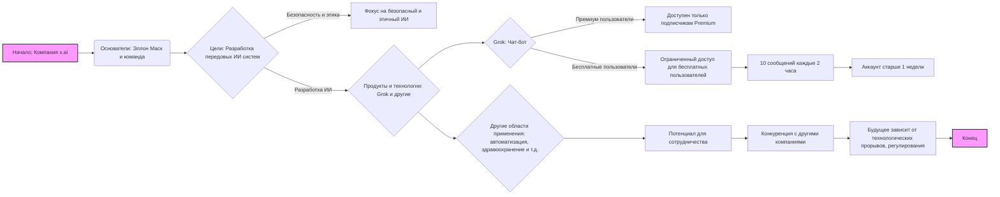
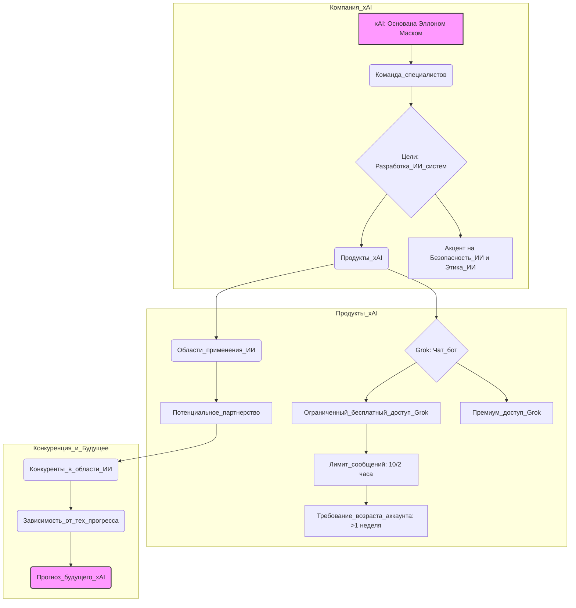

## ИНСТРУКЦИЯ:

Анализируй предоставленный код подробно и объясни его функциональность. Ответ должен включать три раздела:  

1. **<алгоритм>**: Опиши рабочий процесс в виде пошаговой блок-схемы, включая примеры для каждого логического блока, и проиллюстрируй поток данных между функциями, классами или методами.  
2. **<mermaid>**: Напиши код для диаграммы в формате `mermaid`, проанализируй и объясни все зависимости, 
    которые импортируются при создании диаграммы. 
    **ВАЖНО!** Убедитесь, что все имена переменных, используемые в диаграмме `mermaid`, 
    имеют осмысленные и описательные имена. Имена переменных вроде `A`, `B`, `C`, и т.д., не допускаются!  
    
    **Дополнительно**: Если в коде есть импорт `import header`, добавьте блок `mermaid` flowchart, объясняющий `header.py`:\
    ```mermaid
    flowchart TD
        Start --> Header[<code>header.py</code><br> Determine Project Root]
    
        Header --> import[Import Global Settings: <br><code>from src import gs</code>] 
    ```

3. **<объяснение>**: Предоставьте подробные объяснения:  
   - **Импорты**: Их назначение и взаимосвязь с другими пакетами `src.`.  
   - **Классы**: Их роль, атрибуты, методы и взаимодействие с другими компонентами проекта.  
   - **Функции**: Их аргументы, возвращаемые значения, назначение и примеры.  
   - **Переменные**: Их типы и использование.  
   - Выделите потенциальные ошибки или области для улучшения.  

Дополнительно, постройте цепочку взаимосвязей с другими частями проекта (если применимо).  

Это обеспечивает всесторонний и структурированный анализ кода.
## Формат ответа: `.md` (markdown)
**КОНЕЦ ИНСТРУКЦИИ**

## <алгоритм>

Представленный текст - это не код, а описание компании x.ai и ее продукта Grok. Поэтому алгоритмизировать его в виде блок-схемы напрямую невозможно. Однако мы можем создать блок-схему, иллюстрирующую основные моменты, описанные в тексте, как если бы это был процесс.

**Блок-схема:**



**Примеры для блоков:**

*   **A (Начало):** Текст начинается с представления компании x.ai.
*   **B (Основатели):** Упоминается Эллон Маск как основатель и команда специалистов.
*   **C (Цели):** Основная цель - разработка передовых ИИ-систем, включая этические аспекты.
*   **D (Фокус на безопасный и этичный ИИ):** Подчеркивается важность безопасности и этики в работе x.ai.
*   **E (Продукты и технологии):** Описываются продукты, в первую очередь Grok, и другие возможные применения.
*   **F (Grok: Чат-бот):** Представление чат-бота Grok.
*  **G (Доступен только подписчикам Premium):** Ограниченный доступ Grok первоначально для платных подписчиков.
*   **H (Ограниченный доступ для бесплатных пользователей):** Введен ограниченный доступ для бесплатных пользователей.
*  **I (10 сообщений каждые 2 часа):** Ограничение на использование бота.
*  **J (Аккаунт старше 1 недели):** Требование к аккаунту для использования бота.
*   **K (Другие области применения):** Указываются потенциальные области применения разработок x.ai.
*   **L (Потенциал для сотрудничества):** Указывается на возможность сотрудничества с другими компаниями.
*   **M (Конкуренция с другими компаниями):** Указывается на конкуренцию с другими игроками на рынке ИИ.
*   **N (Будущее зависит от технологических прорывов, регулирования):** Указываются факторы, от которых зависит будущее x.ai.
*   **O (Конец):** Завершение описания.

## <mermaid>



**Анализ диаграммы:**

*   **Компания\_xAI:** Основной блок, представляющий компанию, ее основателей (Эллон Маск и команда), цели и продукты.
*   **Продукты\_xAI:** Этот блок детализирует продукты компании, в частности Grok, а также условия доступа к нему для разных категорий пользователей и возможные области применения технологий.
*   **Конкуренция\_и\_Будущее:** Этот блок описывает конкуренцию в области ИИ и будущее компании, зависящее от различных факторов, а также дает общий прогноз.
*   **Стрелки:** Показывают поток информации и зависимость между блоками.
*   **Имена переменных:** Используются осмысленные и описательные имена, такие как `xAI: Основана Эллоном Маском`, `Цели: Разработка_ИИ_систем`, `Grok: Чат_бот`, `Ограниченный_бесплатный_доступ_Grok` и т.д., что делает диаграмму более понятной.

## <объяснение>

**Общее описание:**

Предоставленный текст представляет собой описание компании x.ai, основанной Эллоном Маском, и ее основного продукта — чат-бота Grok. В тексте дается обзор целей компании, ее команды, а также текущего статуса и планов на будущее.

**Импорты**:
    * В данном тексте **нет импортов**, поскольку это описание, а не программный код.

**Классы**:
    * В данном тексте **нет классов**, поскольку это описание, а не программный код.

**Функции**:
    * В данном тексте **нет функций**, поскольку это описание, а не программный код.

**Переменные**:

*   В данном тексте, переменных как таковых нет, но есть некоторые концептуальные элементы, такие как:
    *   **x.ai**: Название компании, занимающейся разработкой ИИ.
    *   **Эллон Маск**: Основатель компании, предприниматель и изобретатель.
    *   **Grok**: Название чат-бота, разработанного x.ai.
    *   **Premium**: Тип подписки, предоставляющий полный доступ к Grok.
    *   **Бесплатный пользователь**: Пользователи с ограниченным доступом к Grok.
    *   **10 сообщений/2 часа**: Ограничение на использование чат-бота для бесплатных пользователей.
    *  **Аккаунт старше 1 недели**: Требование к аккаунту для использования бота.

**Детализированное объяснение:**

1.  **x.ai**: Компания, основанная Эллоном Маском, с целью разработки передовых ИИ-систем. В тексте подчеркивается, что компания привлекает талантливых специалистов в области ИИ и машинного обучения.
2.  **Цели и видение**: x.ai стремится создавать ИИ-системы, способные решать сложные задачи и взаимодействовать с людьми естественным образом. Особое внимание уделяется безопасности и этике ИИ.
3.  **Продукты и технологии**: Основным продуктом компании является чат-бот Grok, который изначально был доступен только подписчикам Premium, но теперь также доступен бесплатным пользователям с ограничениями.  Особое внимание уделяется его функциональности, включая перевод текста в изображение и распознавание картинок.
4.  **Конкуренция и партнерства**:  x.ai конкурирует с такими компаниями, как OpenAI и Google DeepMind, и возможно сотрудничество с другими компаниями Маска, такими как Tesla и SpaceX.
5.  **Будущее**: Будущее x.ai зависит от технологических прорывов, регуляторных изменений и рыночных условий, однако, компания имеет потенциал стать одним из лидеров в области ИИ.
6.  **Grok**: чат-бот, который изначально был доступен только платным подписчикам, теперь доступен бесплатному пользователю с ограничением: 10 сообщений каждые 2 часа. Также у пользователя должен быть аккаунт старше 1 недели.
7.  **Тарифы**: Для разработчиков, использующих API Grok, стоимость составляет $5 за миллион входных токенов (примерно 750 000 слов) и $15 за миллион выходных токенов.
8.  **Области применения**: x.ai нацелена на широкое применение ИИ, включая автоматизацию, здравоохранение, транспорт и финансы.

**Потенциальные ошибки или области для улучшения**:

*   **Недостаток конкретики**: Текст довольно общий и не предоставляет конкретные детали о технологиях и продуктах x.ai.
*   **Отсутствие технических деталей**: Нет информации о моделях машинного обучения, архитектуре ИИ-систем и других технических аспектах.

**Взаимосвязь с другими частями проекта**:
    *   Поскольку это описание, а не код, прямая взаимосвязь с другими частями проекта отсутствует. Однако, если бы это был файл документации или часть веб-сайта, то информация могла бы быть связана с другими файлами, описывающими продукты x.ai или API.