## Анализ кода: Описание компании x.ai и чат-бота Grok

### <алгоритм>

1.  **Начало**: Текст начинается с описания компании x.ai, основанной Эллоном Маском.
    *   **Пример**: "x.ai — это компания, основанная Эллоном Маском..."

2.  **Описание основателей и команды**: Идет акцент на ключевую роль Эллона Маска и упоминание о привлечении талантливых специалистов в области ИИ.
    *   **Пример**: "Эллон Маск: Один из самых известных предпринимателей... Другие ключевые фигуры: ...привлекает талантливых специалистов..."

3.  **Описание целей и видения**: Описываются цели x.ai, включая развитие ИИ, безопасность и этику.
    *   **Пример**: "x.ai фокусируется на создании передовых ИИ-систем... Учитывая озабоченность по поводу безопасности и этики ИИ..."

4.  **Описание продуктов и технологий**: Подчеркивается недостаток публичной информации о конкретных продуктах, но высказываются предположения о возможных областях применения.
    *   **Пример**: "Пока что публично доступная информация о конкретных продуктах x.ai ограничена... ИИ-системы x.ai могут быть использованы в таких областях..."

5.  **Описание конкуренции и партнерств**: Обсуждается конкуренция с другими крупными игроками и возможные партнерства с другими компаниями Маска.
    *   **Пример**: "x.ai будет конкурировать с другими крупными игроками в области ИИ... возможно, что x.ai будет сотрудничать с другими его компаниями..."

6.  **Обсуждение будущего**: Рассматриваются факторы, влияющие на будущее x.ai, и ее потенциал в области ИИ.
    *   **Пример**: "ИИ — это быстро развивающаяся область, и будущее x.ai зависит от множества факторов... Учитывая предыдущие успехи Маска и его команды, x.ai имеет потенциал стать одним из лидеров..."

7.  **Описание чат-бота Grok**: Вводится информация о чат-боте Grok и его доступности для бесплатных пользователей соцсети X с ограничениями.
    *   **Пример**: "Чат-бот Grok стартапа xAI Илона Маска теперь доступен всем бесплатным пользователям соцсети X... Те, у кого нет подписки Premium, получили возможность отправлять чат-боту до 10 сообщений каждые два часа."

8.  **Описание развития Grok**: Описаны добавленные функции и возможности.
    *   **Пример**: "В августе стартап добавил в чат-бот функцию перевода текста в изображение, а в октябре —опцию распознавания картинок."

9.  **Описание API Grok**: Описывается открытие API Grok для разработчиков и его тарификация.
     *  **Пример**: "Тогда же стартап открыл API Grok для разработчиков. На данный момент стартап предлагает единственную модель — «grok-beta», которая оценивается в $5 за миллион входных токенов (примерно 750 000 слов) и в $15 за миллион выходных токенов."

10. **Конец**: Текст завершается описанием модели "grok-beta" и ее стоимости.

```mermaid
graph LR
    A[Начало: Описание x.ai] --> B(Основатели и команда);
    B --> C(Цели и видение);
    C --> D(Продукты и технологии);
    D --> E(Конкуренция и партнерства);
    E --> F(Будущее x.ai);
    F --> G[Описание Grok];
    G --> H(Развитие Grok);
    H --> I(API Grok);
    I --> J[Конец: Описание модели grok-beta];
    
    style A fill:#f9f,stroke:#333,stroke-width:2px
    style J fill:#f9f,stroke:#333,stroke-width:2px

    classDef heading fill:#bbb,stroke:#333,stroke-width:2px
    class A,J heading;
```

### <mermaid>

**Объяснение зависимостей в `mermaid`:**

*   **graph LR**: Определяет направление графа слева направо.
*   **A[Начало: Описание x.ai]**: Начальный узел, представляющий общее описание компании x.ai.
*   **B(Основатели и команда)**: Узел, представляющий информацию об основателях и команде x.ai.
*   **C(Цели и видение)**: Узел, представляющий цели и видение компании.
*   **D(Продукты и технологии)**: Узел, представляющий информацию о продуктах и технологиях компании.
*   **E(Конкуренция и партнерства)**: Узел, представляющий информацию о конкурентах и возможных партнерствах.
*   **F(Будущее x.ai)**: Узел, представляющий будущее компании в контексте ИИ.
*   **G[Описание Grok]**: Узел, представляющий информацию о чат-боте Grok.
*   **H(Развитие Grok)**: Узел, представляющий информацию о развитии чат-бота Grok.
*   **I(API Grok)**: Узел, представляющий информацию об API чат-бота Grok.
*   **J[Конец: Описание модели grok-beta]**: Конечный узел, представляющий описание модели grok-beta и её стоимость.
*   **A --> B**, **B --> C**, ..., **I --> J**: Стрелки указывают на последовательность и поток информации между узлами.
*   **style A fill:#f9f,stroke:#333,stroke-width:2px** и **style J fill:#f9f,stroke:#333,stroke-width:2px**: Применяют стили к начальному и конечному узлам для выделения.
*    **classDef heading fill:#bbb,stroke:#333,stroke-width:2px**: Определяет стиль для классов узлов.
*    **class A,J heading;**: Применяет стиль `heading` к узлам `A` и `J`.

Диаграмма отображает логическую последовательность представления информации о компании x.ai и её чат-боте Grok, начиная с общего описания и заканчивая деталями о модели grok-beta.

### <объяснение>

**Импорты:**

*   В данном коде нет импортов, так как это текст в формате markdown, а не программный код.

**Классы:**

*   В данном тексте нет классов. Это описательный текст, а не программный код, поэтому классы не используются.

**Функции:**

*   В данном тексте нет функций. Это описательный текст, а не программный код, поэтому функции не используются.

**Переменные:**

*   В тексте есть упоминания переменных, но они не представлены в виде переменных в программном коде. Это описательные элементы:
    *   **Эллон Маск**: Основатель x.ai.
    *   **x.ai**: Название компании.
    *   **Grok**: Название чат-бота.
    *   **grok-beta**: Название модели.
    *   **Premium**: Тип подписки в соцсети X.
    *   **Токены**: Единица измерения входных и выходных данных для модели.

**Детальное объяснение:**

Текст представляет собой описание компании x.ai и её продукта – чат-бота Grok. Основные моменты включают:

*   **x.ai**: Описывается как компания, основанная Эллоном Маском, занимающаяся разработкой ИИ. Отмечаются ее цели, видение и конкуренция с другими крупными игроками в области ИИ.

*   **Эллон Маск**: Указывается как ключевая фигура, основатель компании, что подчеркивает его влияние в сфере технологий.

*   **Grok**: Представлен как чат-бот, разработанный x.ai, который сначала был доступен только для подписчиков Premium, а затем стал доступен для бесплатных пользователей с ограничениями.  В августе получил функцию перевода текста в изображение, а в октябре — опцию распознавания картинок.

*   **API Grok**: Описано открытие API для разработчиков, что позволяет интегрировать Grok в другие приложения.

*   **grok-beta**: Описана как модель, предлагаемая x.ai, с указанием стоимости входных и выходных токенов.

**Потенциальные ошибки и области для улучшения:**

1.  **Недостаток технических деталей**: Текст не содержит конкретных технических подробностей о технологиях, используемых x.ai или в работе Grok. Это ожидаемо, учитывая, что информация носит общий характер.

2.  **Размытость формулировок**: Некоторые формулировки, например, о будущих технологиях и их применении, могут быть слишком общими и неясными.

3.  **Зависимость от публичной информации**: Информация ограничена публичными данными, что не позволяет глубоко оценить технические аспекты x.ai и Grok.

**Цепочка взаимосвязей с другими частями проекта (если применимо):**

Поскольку предоставлен текстовый файл, а не программный код, прямая взаимосвязь с другими частями проекта отсутствует. Однако этот файл `.md`  предоставляет контекст для понимания целей, задач и продуктов компании x.ai.  В будущих файлах `.md`, связанных с анализом кода, эта информация может быть полезна для понимания функционала проекта.

**Дополнение:**

*   Этот `.md` файл, вероятно, является частью документации или информационной страницы проекта, предоставляя общую информацию о компании и продукте.
*   При наличии других файлов с программным кодом или более детальной информацией, анализ будет включать эти данные, чтобы обеспечить более комплексное понимание проекта.