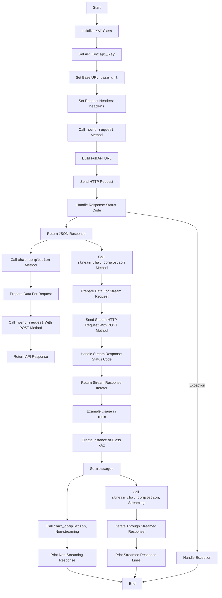

## <алгоритм>

1. **Инициализация (`__init__`)**:
   - Создается экземпляр класса `XAI`, при этом передается `api_key`.
   - Устанавливается `base_url` (базовый URL API) и `headers` (заголовки запроса, включая `api_key`).
   ```python
   api_key = "your_api_key" # Замените на ваш ключ
   xai = XAI(api_key) # Создание экземпляра класса XAI
   ```
2. **Отправка запроса (`_send_request`)**:
   - Принимает `method` (HTTP-метод: GET, POST и т.д.), `endpoint` (конечная точка API) и `data` (данные для отправки).
   - Формирует полный URL, используя `base_url` и `endpoint`.
   - Отправляет запрос с использованием библиотеки `requests`.
   - Обрабатывает ошибки, если статус ответа не 2xx.
   - Возвращает JSON-ответ.
   ```python
   url = f"{self.base_url}/{endpoint}"
   response = requests.request(method, url, headers=self.headers, json=data)
   return response.json() # возвращает JSON
   ```
3. **Завершение чата (`chat_completion`)**:
   - Принимает `messages`, `model`, `stream` (флаг потоковой передачи) и `temperature` (температура генерации).
   - Формирует `data` для отправки (сообщения, модель, стриминг, температура).
   - Вызывает метод `_send_request` с методом POST.
   - Возвращает ответ API.
   ```python
    data = {
        "messages": messages,
        "model": model,
        "stream": stream,
        "temperature": temperature
    }
    response = self._send_request("POST", endpoint, data)
    return response # возвращает json
   ```
4. **Потоковое завершение чата (`stream_chat_completion`)**:
   - Принимает `messages`, `model`, `temperature`.
   - Формирует `data` для отправки (сообщения, модель, стриминг включен, температура).
   - Отправляет POST запрос с `stream=True` с использованием библиотеки `requests`.
   - Возвращает итератор строк `response.iter_lines(decode_unicode=True)` для потоковой обработки ответа.
   ```python
    url = f"{self.base_url}/{endpoint}"
    response = requests.post(url, headers=self.headers, json=data, stream=True)
    return response.iter_lines(decode_unicode=True) # возвращает итератор
   ```
5. **Пример использования (`if __name__ == "__main__":`)**:
   - Инициализация `api_key` (необходимо заменить на ваш ключ).
   - Создание объекта `xai` класса `XAI`.
   - Формирование `messages` (сообщения для чата).
   - Вызов `chat_completion` для непотокового запроса, вывод ответа.
   - Вызов `stream_chat_completion` для потокового запроса, обработка и вывод каждой строки ответа.
   ```python
    messages = [
        {"role": "system", "content": "..." },
        {"role": "user", "content": "..."}
    ]
    completion_response = xai.chat_completion(messages) # не потоковый запрос
    stream_response = xai.stream_chat_completion(messages) # потоковый запрос
   ```
## <mermaid>

## <объяснение>
### Импорты:
- `import requests`: Используется для отправки HTTP-запросов к API. Библиотека `requests` является популярной и широко используемой для работы с HTTP протоколом в Python.
- `import json`: Используется для работы с данными в формате JSON, в частности, для преобразования данных в JSON-формат при отправке запросов и для разбора ответов от API.

### Класс `XAI`:
- **Роль**: Этот класс представляет собой клиент для взаимодействия с API `x.ai`. Он инкапсулирует логику для отправки запросов и обработки ответов.
- **Атрибуты**:
    - `api_key`: Ключ API для аутентификации запросов. Передается при создании объекта класса.
    - `base_url`: Базовый URL для API `x.ai`. Все запросы к API будут использовать этот префикс.
    - `headers`: Заголовки HTTP-запросов, включая авторизацию с использованием API-ключа и тип содержимого (JSON).
- **Методы**:
    - `__init__(self, api_key)`: Конструктор класса, который инициализирует атрибуты `api_key`, `base_url` и `headers`.
    - `_send_request(self, method, endpoint, data=None)`: Приватный метод для отправки запросов к API. Принимает метод HTTP, конечную точку и данные (опционально) в качестве аргументов. Возвращает JSON-ответ.
    - `chat_completion(self, messages, model="grok-beta", stream=False, temperature=0)`: Метод для отправки запроса на завершение чата (непотоковый). Принимает сообщения для чата, модель, флаг потоковой передачи и температуру. Возвращает JSON-ответ от API.
    - `stream_chat_completion(self, messages, model="grok-beta", temperature=0)`: Метод для отправки запроса на завершение чата с потоковой передачей. Возвращает итератор, предоставляющий доступ к потоковому ответу.

### Функции:
- `_send_request(self, method, endpoint, data=None)`:
    - **Аргументы**:
        - `method` (str): HTTP-метод (например, "GET", "POST").
        - `endpoint` (str): Конечная точка API.
        - `data` (dict, optional): Данные для отправки в теле запроса (для POST, PUT).
    - **Возвращаемое значение**:
        - JSON-объект, полученный из ответа API.
    - **Назначение**: Отправляет запрос к API, обрабатывает статус ответа и возвращает данные в формате JSON.
- `chat_completion(self, messages, model="grok-beta", stream=False, temperature=0)`:
    - **Аргументы**:
        - `messages` (list): Список сообщений для чата.
        - `model` (str, optional): Модель для использования (по умолчанию "grok-beta").
        - `stream` (bool, optional): Флаг для включения потоковой передачи (по умолчанию `False`).
        - `temperature` (float, optional): Температура для генерации ответа (по умолчанию 0).
    - **Возвращаемое значение**:
        - JSON-объект, полученный из ответа API.
    - **Назначение**: Отправляет запрос на завершение чата и возвращает ответ.
- `stream_chat_completion(self, messages, model="grok-beta", temperature=0)`:
    - **Аргументы**:
         - `messages` (list): Список сообщений для чата.
        - `model` (str, optional): Модель для использования (по умолчанию "grok-beta").
        - `temperature` (float, optional): Температура для генерации ответа (по умолчанию 0).
    - **Возвращаемое значение**:
        - Итератор строк, представляющий потоковый ответ от API.
    - **Назначение**: Отправляет запрос на завершение чата с потоковой передачей.

### Переменные:
- `api_key` (str): Ключ API для аутентификации.
- `base_url` (str): Базовый URL для API.
- `headers` (dict): Заголовки для HTTP-запросов, включая авторизацию и тип контента.
- `messages` (list): Список сообщений для чата.
- `model` (str): Модель, используемая для генерации ответов.
- `stream` (bool): Флаг для управления потоковой передачей.
- `temperature` (float): Температура для контроля случайности ответов.
- `data` (dict): Данные для отправки в запросе.
- `url` (str): Сформированный URL для запроса.
- `response` (requests.Response): Объект ответа, полученный от запроса.
- `completion_response` (dict): Ответ от API на непотоковый запрос.
- `stream_response` (iterator): Итератор для работы с потоковым ответом.

### Потенциальные ошибки и области для улучшения:
- **Обработка ошибок**: Код обрабатывает только ошибки HTTP-статуса, но не обрабатывает другие возможные исключения (например, сетевые ошибки). Необходимо добавить обработку исключений `requests.exceptions.RequestException`, чтобы код был более устойчивым.
- **Логирование**: Отсутствует логирование. Добавление логирования поможет отслеживать проблемы и дебажить код.
- **Управление API ключом**: API ключ хардкодится в примере. Необходимо использовать переменные среды или другое более безопасное решение для хранения API-ключа.
- **Асинхронность**: Для повышения производительности можно использовать асинхронные запросы, особенно для потоковой передачи. Можно рассмотреть использование `asyncio` и `aiohttp`.

### Взаимосвязи с другими частями проекта:
- Данный код является частью модуля `grock`, который отвечает за взаимодействие с API x.ai.
- Код не зависит от других частей проекта, кроме стандартных библиотек `requests` и `json`. Однако, он может использоваться другими модулями проекта, например, модулем чат-бота, для взаимодействия с моделью `grok`.
-  Для интеграции в другие модули, достаточно импортировать класс `XAI` и использовать его методы `chat_completion` и `stream_chat_completion`.

В целом, код представляет собой хорошо структурированный клиент для работы с API `x.ai`. Он включает в себя основные функции, необходимые для отправки запросов и получения ответов, как в потоковом, так и в непотоковом режиме. Необходима доработка обработки исключений, а также внедрение логирования для более надежной работы приложения.