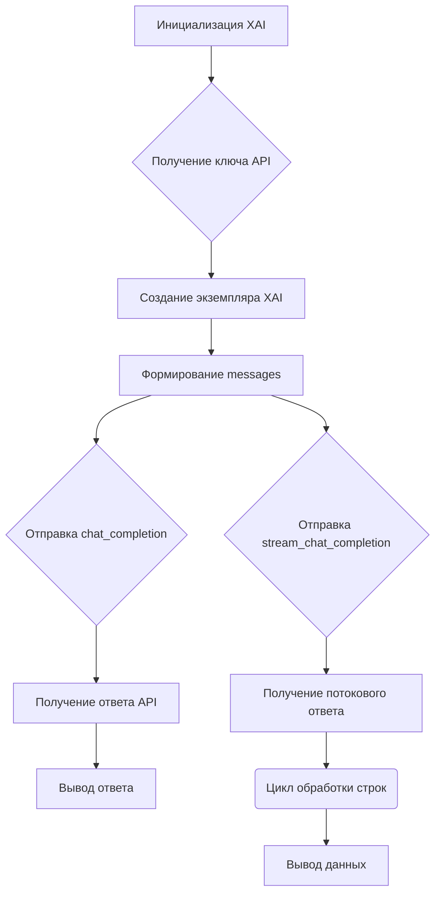

```MD
# Клиент API xAI

## <input code>

```python
# Клиент API xAI

## Обзор

Этот репозиторий содержит Python-клиент для взаимодействия с API xAI. Клиент разработан для упрощения процесса отправки запросов к API xAI, включая как стандартные, так и потоковые запросы.

## Возможности

- **Аутентификация**: Безопасная аутентификация ваших запросов с использованием ключа API xAI.
- **Завершение чата**: Генерация ответов от моделей xAI с использованием метода `chat_completion`.
- **Потоковая передача ответов**: Потоковая передача ответов от моделей xAI с использованием метода `stream_chat_completion`.

## Установка

Для использования этого клиента вам необходимо установить Python на вашей системе. Вы можете установить необходимые зависимости с помощью pip:

```bash
pip install requests
```

## Использование

### Инициализация

Сначала инициализируйте класс `XAI` с вашим ключом API:

```python
from xai import XAI

api_key = "your_api_key_here"  # Замените на ваш реальный ключ API
xai = XAI(api_key)
```

### Завершение чата

Для генерации ответа от модели xAI используйте метод `chat_completion`:

```python
messages = [
    {
        "role": "system",
        "content": "You are Grok, a chatbot inspired by the Hitchhikers Guide to the Galaxy."
    },
    {
        "role": "user",
        "content": "What is the answer to life and universe?"
    }
]

completion_response = xai.chat_completion(messages)
print("Non-streaming response:", completion_response)
```

### Потоковая передача завершения чата

Для потоковой передачи ответов от модели xAI используйте метод `stream_chat_completion`:

```python
stream_response = xai.stream_chat_completion(messages)
print("Streaming response:")
for line in stream_response:
    if line.strip():
        print(json.loads(line))
```

## Пример

Вот полный пример использования клиента `XAI`:

```python
import json
from xai import XAI

api_key = "your_api_key_here"  # Замените на ваш реальный ключ API
xai = XAI(api_key)

messages = [
    {
        "role": "system",
        "content": "You are Grok, a chatbot inspired by the Hitchhikers Guide to the Galaxy."
    },
    {
        "role": "user",
        "content": "What is the answer to life and universe?"
    }
]

# Непотоковый запрос
completion_response = xai.chat_completion(messages)
print("Non-streaming response:", completion_response)

# Потоковый запрос
stream_response = xai.stream_chat_completion(messages)
print("Streaming response:")
for line in stream_response:
    if line.strip():
        print(json.loads(line))
```
```

## <algorithm>

Алгоритм работы клиента API xAI включает следующие шаги:

1. **Инициализация:**  Создается экземпляр класса `XAI` с ключом API.  Данные (ключ API) передаются в конструктор класса.
2. **Формирование запроса:**  Составляется список `messages` с данными запроса (например, ролью и содержимым).
3. **Отправка запроса (chat_completion):** Используется метод `chat_completion` для отправки запроса с `messages` на API xAI.  Результат (строка JSON) возвращается.
4. **Обработка ответа:**  Программа выводит полученный ответ в консоль.
5. **Отправка запроса (stream_chat_completion):** Используется метод `stream_chat_completion` для отправки запроса с `messages` на API xAI в потоковом режиме.
6. **Обработка потокового ответа:** Цикл `for` обрабатывает каждую строку из потокового ответа, преобразует ее в JSON и выводит.

Пример: При отправке запроса на определение ответа на вопрос о смысле жизни, модель API возвращает JSON-строку с ответом.

## <mermaid>



## <explanation>

**Импорты:**

- `from xai import XAI`: Импортирует класс `XAI` из модуля `xai`. Предполагается, что этот модуль содержит реализацию взаимодействия с API xAI. Связь с другими пакетами проекта (`src.`)  не указана в предоставленном коде.
- `import json`: Импортирует модуль `json` для работы с JSON-данными, необходимый для обработки ответов API, который может возвращать данные в формате JSON.

**Классы:**

- `XAI`: Предполагаемый класс, реализующий взаимодействие с API xAI. Атрибуты: `api_key`.  Методы: `chat_completion`, `stream_chat_completion`.  Взаимодействие с другими частями проекта через API xAI.

**Функции:**

- `chat_completion(messages)`: Отправляет запрос на API xAI, используя данные `messages`, и возвращает ответ в виде строки JSON.
- `stream_chat_completion(messages)`: Отправляет запрос на API xAI в потоковом режиме.  Возвращает итератор, позволяющий обрабатывать ответ по частям.

**Переменные:**

- `api_key`: Строковый ключ API xAI.
- `messages`: Список словарей, содержащих данные запроса (роль и содержимое).


**Возможные ошибки или области для улучшений:**

- Отсутствие обработки ошибок при взаимодействии с API (например, проверка кода ответа).
- Отсутствие валидации входных данных (например, проверка структуры `messages`).
- Отсутствие документации в самом коде.
- Необходимость четкого определения, как реализован класс `XAI`.  Подробности (например, используемая библиотека для HTTP-запросов) не предоставлены.

**Взаимосвязи с другими частями проекта:**

- Клиент `XAI` напрямую взаимодействует с API xAI.  Необходимые данные (ключ API) предоставляются извне.  В проекте должна быть документация, как использовать `XAI`.