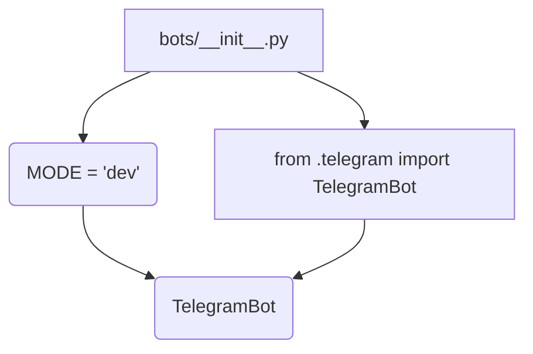

# <input code>

```python
## \file hypotez/src/bots/__init__.py
# -*- coding: utf-8 -*-\
#! venv/Scripts/python.exe
#! venv/bin/python/python3.12

"""
.. module: src.bots 
	:platform: Windows, Unix
	:synopsis:

"""
MODE = 'dev'


from .telegram import TelegramBot
```

# <algorithm>

Этот код представляет собой инициализационную часть модуля `bots`.  Он определяет глобальную переменную `MODE` и импортирует класс `TelegramBot` из подмодуля `telegram`.  Никаких вычислений или обработки данных здесь нет. Алгоритм состоит из одного шага:

1. **Инициализация:** Задается значение переменной `MODE` равным строке 'dev'.
2. **Импорт:** Импортируется класс `TelegramBot` из модуля `telegram`.

Пример:


```
# Допустим, в файле hypotez/src/bots/telegram.py определен класс TelegramBot.
# При импорте TelegramBot из этого файла, мы получаем доступ к нему в текущем модуле.
```

# <mermaid>



# <explanation>

* **Импорты**:
    `from .telegram import TelegramBot`: Этот импорт подключает класс `TelegramBot` из подмодуля `telegram`, расположенного в той же директории, что и текущий файл (`hypotez/src/bots/telegram.py`).  Символ `.telegram` указывает на поиск в подпапке `telegram` внутри текущего пакета. Это ключевая часть структуры пакета, позволяющая импортировать код из других файлов и модулей.

* **Классы**:
    `TelegramBot`: Этот класс, определенный в модуле `telegram.py`, вероятно, представляет собой бота для Telegram. Подробности реализации (атрибуты и методы) не указаны в данном файле.  Взаимодействие с ним будет осуществляться через импорт и дальнейшее использование экземпляра этого класса.

* **Функции**:
    Нет определенных функций в данном файле.

* **Переменные**:
    `MODE = 'dev'`: Глобальная переменная, скорее всего, используется для настройки режима работы программы (например, 'dev' - для разработки, 'prod' - для производства).  Это полезно для настройки поведения кода в зависимости от контекста.


* **Возможные ошибки или области для улучшений**:
    Код достаточно простой и, вероятно, не содержит явных ошибок. Однако,  не указан способ использования `MODE`, и не видно, как он используется далее в проекте.  Было бы хорошо добавить документацию о назначении переменной `MODE`.  Также желательно описать предполагаемые взаимодействия с другими частями проекта (например, с другими ботами или сервисами).

* **Взаимосвязи с другими частями проекта**:
    Модуль `bots` отвечает за взаимодействие с ботами (TelegramBot, и т.д.).  Он импортирует компоненты из модуля `telegram`.  Вероятно, в других модулях или файлах проекта будут инициализироваться и использоваться экземпляры `TelegramBot` для запуска взаимодействия с Telegram.  Без дополнительного контекста трудно проследить полную взаимосвязь.