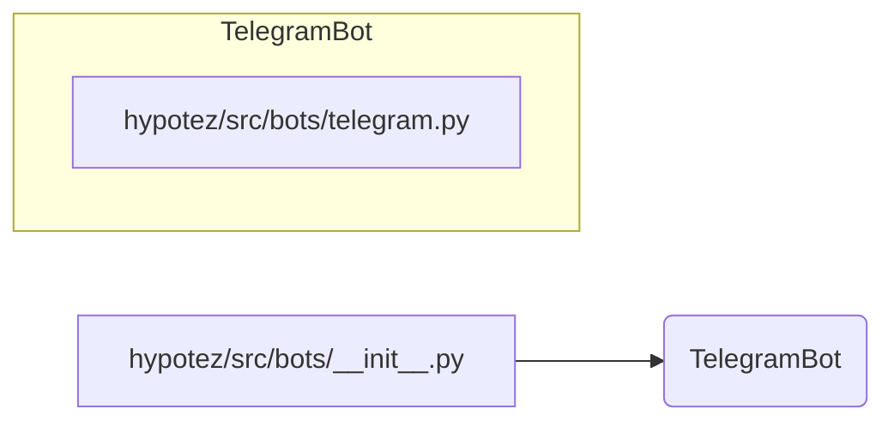

# <input code>

```python
## \file hypotez/src/bots/__init__.py
# -*- coding: utf-8 -*-
#! venv/Scripts/python.exe
#! venv/bin/python/python3.12

"""
.. module: src.bots 
	:platform: Windows, Unix
	:synopsis:

"""
MODE = 'dev'


from .telegram import TelegramBot
```

# <algorithm>

Алгоритм работы данного файла состоит из одной операции: импорта модуля `TelegramBot`.  Поскольку это файл инициализации (\_\_init\_\_.py), он выполняет только импорт.  Нет циклов, условий или вычислений.  Все данные перемещаются исключительно через механизм импорта Python.

**Шаг 1:** Импорт модуля `TelegramBot`

```
from .telegram import TelegramBot
```

Пример: Файл `telegram.py` находится в подпапке `src/bots/`.  Код в `__init__.py` импортирует класс `TelegramBot` из файла `telegram.py`.

# <mermaid>



# <explanation>

**Импорты:**

- `from .telegram import TelegramBot`:  Этот импорт подключает класс `TelegramBot` из модуля `telegram.py`, находящегося в той же директории, что и `__init__.py`.  Символ `.` указывает на то, что модуль `telegram.py` находится в подпапке `bots` внутри пакета `src`.  Это стандартный способ импорта модулей Python.

**Классы:**

- `TelegramBot`: Класс `TelegramBot` определён в файле `telegram.py`.  Этот файл не показан в предоставленном коде.  Функциональность класса `TelegramBot` неизвестна без доступа к полному коду.  Он, вероятно, содержит атрибуты и методы для взаимодействия с Telegram API.

**Функции:**

Нет явных функций в данном коде, только импорт.

**Переменные:**

- `MODE = 'dev'`: Это константа, которая хранит значение 'dev'. Она вероятно используется для определения режима работы (например, режим разработки или производства).  Константы должны писаться в верхнем регистре по соглашению.

**Возможные ошибки или области для улучшений:**

- **Недостаточно информации:** Без кода из `telegram.py` невозможно оценить потенциальные ошибки и области для улучшений в работе с классом `TelegramBot`.
- **Документация:**  Добавление подробной документации к классу `TelegramBot` в `telegram.py` (документационные строки) будет полезным для понимания его работы.
- **Использование константы `MODE`:** Нет явного использования переменной `MODE` в коде.  В более крупном проекте её использование может помочь в управлении конфигурацией или выбором логики поведения в зависимости от значения.


**Взаимосвязь с другими частями проекта:**

Файл `__init__.py` в директории `hypotez/src/bots` является точкой входа для доступа к классу `TelegramBot`.  Он выступает как связующее звено между этим классом и другими частями проекта, которые могут использовать `TelegramBot` для взаимодействия с Telegram.  Без кода `telegram.py` мы не можем видеть, как `TelegramBot` взаимодействует с другими модулями проекта.