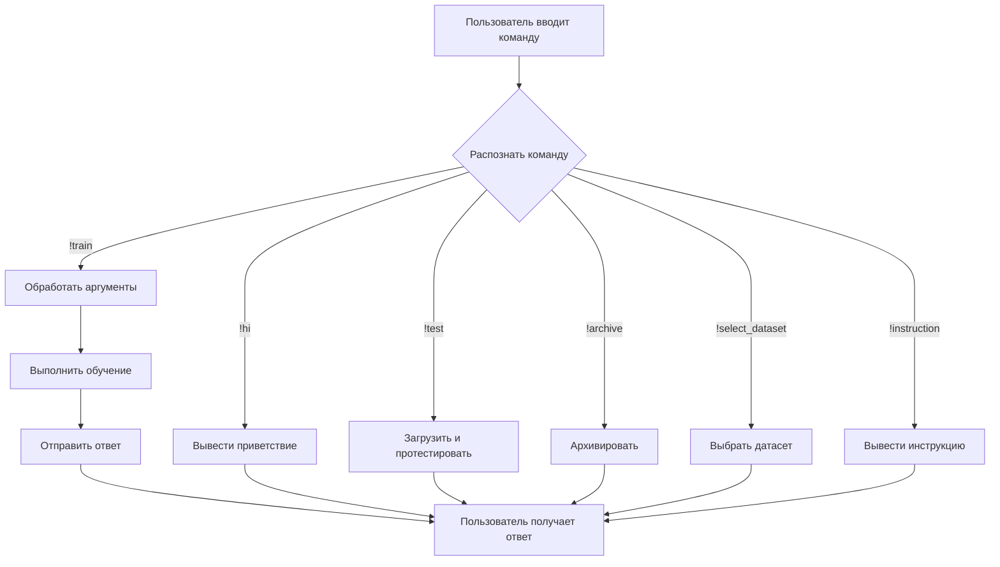

# Анализ кода бота

## <input code>

```
!hi: Greets the user.
!train <data> <data_dir> <positive> <attachment>: Trains the model with the provided data. Use data for a file, data_dir for a directory, or attachment for a file attachment.
!test <test_data>: Tests the model with provided JSON test data.
!test <directory>: Tests the model with provided JSON data in the specified directory.
!archive <directory>: Archives files in the specified directory.
!select_dataset <path_to_dir_positive> <positive>: Selects a dataset for training from the specified directory.
!instruction: Displays this instruction message.
```

## <algorithm>

Этот код представляет собой набор команд (или инструкций) для бота.  Алгоритм работы заключается в том, что бот распознает команду, основанную на префиксе `!`, и выполняет соответствующее действие.

**Пример:**

Пользователь вводит `!train my_data data/positive`.  Бот распознает команду `!train` и передаёт аргументы `my_data`, `data/positive`  внутреннему механизму обработки. Этот механизм в свою очередь должен:

1. Обработать `my_data` (файл или директория).
2. Обработать `data/positive`.
3. Выполнить процесс обучения модели.

**Блок-схема (в данном случае описать подробную блок-схему сложно, т.к. отсутствует код исполнения):**

(Блок-схема будет выглядеть как набор блоков, представляющих команды, с условными переходами на обработку данных и вызов функций, но без подробностей реализации)

## <mermaid>



## <explanation>

**Импорты:** Нет импортов, код представляет собой набор команд для интерпретатора.

**Классы:** Нет классов.

**Функции:** Нет функций, код представляет собой набор команд для интерпретатора.

**Переменные:**  Нет переменных в представленном коде.

**Возможные ошибки/улучшения:**

* Не описан механизм обработки ошибок (например, если введенная команда некорректная или отсутствует необходимый файл).
* Отсутствует описание, как данные `data` и `data_dir` интерпретируются. Требуется подробная информация о формате файлов и директорий.
* Отсутствуют детали о внутренней реализации процесса обучения и тестирования.

**Взаимосвязи с другими частями проекта:**

Этот код описывает интерфейс взаимодействия бота с пользователем.  Для функционирования необходим механизм, интерпретирующий команды `!hi`, `!train`, `!test`, etc., и реализующий соответствующие действия.  Например, для `!train` необходима функция/модуль для обучения модели. То есть этот код является частью интерфейса более крупной программы или проекта, включающей логику работы с данными и модели.

**Заключение:**  Код представляет собой описание интерфейса команд, предназначенного для взаимодействия с ботом.  Для его полного понимания требуется информация о реализации бота, включая обработку введенных аргументов, взаимодействие с файловой системой и внутренней логикой обучения/тестирования модели.