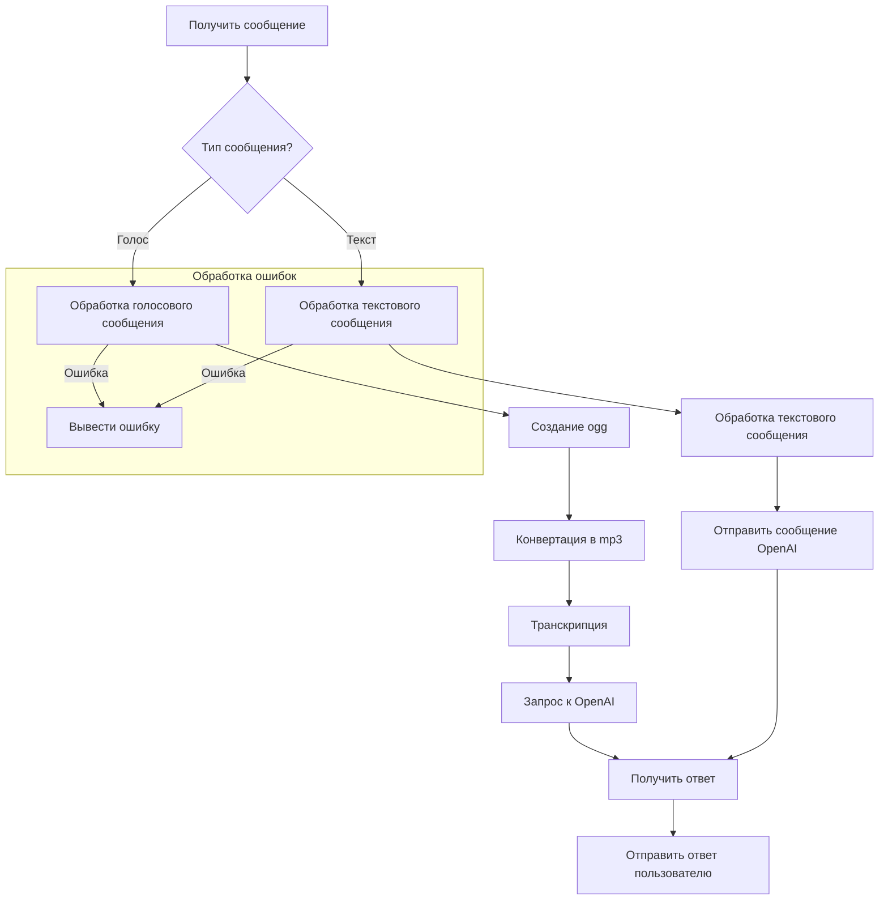
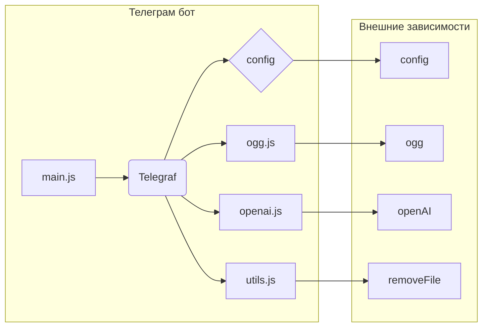

# Анализ кода Telegram бота

## <input code>

```javascript
import { Telegraf } from 'telegraf'
import { message } from 'telegraf/filters'
import { code } from 'telegraf/format'
import config from 'config'
import { ogg } from './ogg.js'
import { openai } from './openai.js'
import { removeFile } from './utils.js'

const bot = new Telegraf(config.get('TELEGRAM_TOKEN'))
bot.command('start', async(ctx) => {
    await ctx.reply(JSON.stringify(ctx.message));
})

bot.on(message('voice'), async (ctx) => {
    try {
        await ctx.reply(code('Сообщение принял. Жду ответ от сервера...'))
        const link = await ctx.telegram.getFileLink(ctx.message.voice.file_id)
        const userId = String(ctx.message.from.id)
        const oggPath = await ogg.create(link.href, userId)
        const mp3Path = await ogg.toMp3(oggPath, userId)
        removeFile(oggPath)
        const text = await openai.transcription(mp3Path)
        await ctx.reply(code(`запрос: ${text}`))
        const messages = [{ role: openai.roles.USER, content: text }]
        const response = await openai.chat(messages)
        await ctx.reply(response.content)
    } catch (e) {
        console.error(`Error while proccessing voice message`, e.message)
    }
})

bot.on(message('text'), async (ctx) => {
    ctx.session ??= INITIAL_SESSION
    try {
        await ctx.reply(code('Сообщение принял. Жду ответ от сервера...'))
        await processTextToChat(ctx, ctx.message.text)
    } catch (e) {
        console.log(`Error while voice message`, e.message)
    }
})

bot.launch()
process.once('SIGINT', () => bot.stop('SIGINT'))
process.once('SIGTERM', () => bot.stop('SIGTERM'))
```

## <algorithm>



Пример: Пользователь отправляет голосовое сообщение. Алгоритм преобразует его в текстовый формат, обращается к OpenAI за ответом, и возвращает результат пользователю. Если возникла ошибка, то выводится соответствующая ошибка.

## <mermaid>



**Объяснение диаграммы:**

* `main.js` – главный файл бота, который использует `Telegraf`, `config`, `ogg`, `openai` и `utils`.
* `config` хранит настройки Telegram бота (токен).
* `ogg.js` – модуль для обработки аудио,  `openai.js` – для работы с OpenAI API,  `utils.js` – для вспомогательных функций, например удаления файлов.
* `Telegraf` – библиотека для создания Telegram ботов.

## <explanation>

**Импорты:**

* `Telegraf`: Библиотека для создания Telegram ботов. Связана с `src/` через зависимости.
* `message`, `code`: Фильтры и формат сообщений, соответственно, для `Telegraf`.
* `config`: Конфигурационный файл, хранит токен Telegram бота. Связан с `src/` через импорт.
* `ogg`: Модуль для обработки аудиофайлов, конвертирует голос в текст (ogg).
* `openai`: Модуль для взаимодействия с OpenAI API.
* `removeFile`: Функция для удаления временных файлов.

**Классы:**

В коде нет явных определений пользовательских классов. Используются классы, предоставляемые `Telegraf`, для обработки сообщений.

**Функции:**

* `bot.command('start', ...)`: Обрабатывает команду /start, возвращает JSON сообщения.
* `bot.on(message('voice'), ...)`: Обрабатывает голосовые сообщения.  Получает голосовое сообщение, преобразует его в текст, отправляет запрос в OpenAI и возвращает ответ.  Обрабатывает исключения.
* `bot.on(message('text'), ...)`: Обрабатывает текстовые сообщения. Вызывает функцию `processTextToChat`, которая обрабатывает текст и отправляет его в OpenAI.  Обрабатывает исключения.
* `processTextToChat`: Функция (не определена в примере кода), предполагается обрабатывает текстовые сообщения. Принимает контекст и текст сообщения, использует API OpenAI для обработки.  Возвращает результат.
* Функции `ogg.create()`, `ogg.toMp3()`, `openai.transcription()`, `openai.chat()`, и `removeFile()` – это функции из модулей `ogg`, `openai` и `utils`.


**Переменные:**

* `bot`: Экземпляр `Telegraf` для управления ботом.
* `ctx`: Объект контекста, предоставляемый `Telegraf`, содержит информацию о сообщении.
* `link`: Ссылка на загруженный файл голоса.
* `userId`: Идентификатор пользователя.
* `oggPath`: Путь к временному файлу в формате ogg.
* `mp3Path`: Путь к временному файлу в формате mp3.
* `text`: Текстовый контент, полученный из голосового сообщения с помощью OpenAI.
* `messages`: Массив с данными для запроса к OpenAI.
* `response`: Ответ от OpenAI.
* `INITIAL_SESSION`: Значение по умолчанию для сессии,  не определено в коде, предполагается объект данных для сессии.


**Возможные ошибки и улучшения:**

* Отсутствует обработка ситуации, когда `INITIAL_SESSION` не определено.
* Не описана функция `processTextToChat`.
* Не указаны пути для временных файлов (ogg и mp3).
* Не оптимально хранить `INITIAL_SESSION` в глобальном состоянии.  Предлагается использовать методы Telegraf для сохранения данных.
* Необходимо добавить логирование для отслеживания действий бота.


**Взаимосвязи с другими частями проекта:**

Этот код взаимодействует с модулями `ogg.js`, `openai.js`, `utils.js` и `config`.  `config` предоставляет настройки для доступа к API Telegram и OpenAI.