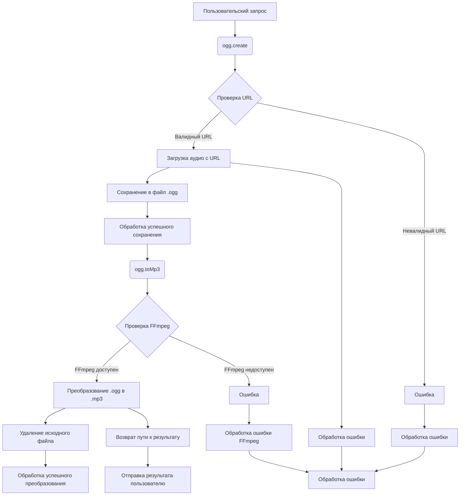

# Анализ кода OggConverter

**1. <input code>**

```javascript
import axios from 'axios'
import { createWriteStream } from 'fs'
import { dirname, resolve } from 'path'
import { fileURLToPath } from 'url'
import ffmpeg from 'fluent-ffmpeg'
import installer from '@ffmpeg-installer/ffmpeg'
import { removeFile } from './utils.js'

const __dirname = dirname(fileURLToPath(import.meta.url))
// ====
class OggConverter {
  constructor() {
    ffmpeg.setFfmpegPath(installer.path)
  }
    toMp3(input, output) {
        try {
            const outputPath = resolve(dirname(input), `${output}.mp3`)
            return new Promise((resolve, reject) : {\n
                ffmpeg(input)\n
                    .inputOption('-t 30')\n
                    .output(outputPath)\n
                    .on('end', () : {\n
                        removeFile(input)\n
                        resolve(outputPath)})\n
                    .on('error', (err) : reject(err.message))\n
                    .run()\n
            })
        } catch (e) {
            console.log('Error while creating mp3', e.message)
        }
    } // ====
    async create(url, filename) {
        try {
            const oggPath = resolve(__dirname, '../voices', `${filename}.ogg`)
            const response = await axios({
                method: 'get',
                url,
                responseType: 'stream',
            })
            return new Promise((resolve) : {\n
                const stream = createWriteStream(oggPath)\n
                response.data.pipe(stream)\n
                stream.on('finish', () : resolve(oggPath))\n
            })
        } catch (e) {
            console.log('Error while creating ogg', e.message)
        }
    }
}
export const ogg = new OggConverter()
```

**2. <algorithm>**

**Класс `OggConverter`:**

* **`constructor()`:** Устанавливает путь к FFmpeg.  **Пример:** `ffmpeg.setFfmpegPath('/usr/local/bin/ffmpeg')`

* **`toMp3(input, output)`:** Преобразует аудиофайл `.ogg` в `.mp3`.  **Пример:** `toMp3('/path/to/input.ogg', 'output')`
   * Создает путь к выводу `.mp3`.
   * Использует `fluent-ffmpeg` для преобразования, ограничивая длительность обработанного аудио до 30 секунд.  **Пример:** `ffmpeg('/path/to/input.ogg').inputOption('-t 30').output('/path/to/output.mp3').run()`
   * Обрабатывает события `'end'` и `'error'` для управления успехом и ошибками преобразования.
   * Удаляет исходный файл `.ogg` с помощью `removeFile`.
   * Возвращает путь к преобразованному файлу `.mp3`.

* **`create(url, filename)`:** Скачивает аудиофайл в формате `.ogg` с указанного URL.  **Пример:** `create('https://example.com/audio.ogg', 'myAudio')`
    * Создает путь к сохраняемому файлу `.ogg`
    * Использует `axios` для загрузки файла по указанному `url`.
    * Использует `createWriteStream` для сохранения загруженного потока в `.ogg`-файл.
    * Обрабатывает событие `'finish'` для подтверждения завершения загрузки.
    * Возвращает путь к сохраненному файлу `.ogg`.


**3. <mermaid>**



**4. <explanation>**

* **Импорты:**
    * `axios`: Для работы с HTTP запросами (скачивание аудио).
    * `fs`: Для работы с файловой системой (создание потока для записи файла).
    * `path`: Для работы с путями к файлам.
    * `url`: Для работы с URL.
    * `fluent-ffmpeg`: Для преобразования аудио формата.
    * `@ffmpeg-installer/ffmpeg`:  Указывает путь к установленной программе FFmpeg.  Необходим для корректной работы `fluent-ffmpeg`.
    * `utils.js`:  Возможно содержит вспомогательные функции, такие как `removeFile` для удаления файла.

* **Классы:**
    * `OggConverter`: Класс для управления преобразованием и загрузкой аудио.
    *  `constructor()`:  Инициализирует класс, устанавливая путь к FFmpeg, необходимый для корректной работы преобразований.

* **Функции:**
    * `toMp3(input, output)`:  Преобразует входной аудиофайл в `.mp3` формат, используя FFmpeg.
    * `create(url, filename)`: Загружает аудиофайл в формате `.ogg` с указанного URL.

* **Переменные:**
    * `__dirname`: Директория, в которой расположен текущий файл.
    * `oggPath`: Путь к файлу `.ogg` для сохранения.
    * `outputPath`: Путь к результату преобразования `.mp3`.
    * `response`: Ответ от `axios` после скачивания файла.
    * `stream`: Поток для записи загруженного файла.

* **Возможные ошибки/улучшения:**

    * **Обработка ошибок:**  Код пытается обрабатывать ошибки, но можно улучшить логику обработки ошибок в обоих методах (`toMp3` и `create`), возвращая более информативные сообщения об ошибках (например, тип ошибки, сообщение).
    * **Отслеживание прогресса:** Добавление отслеживания прогресса при загрузке и преобразовании значительно улучшит пользовательский опыт.
    * **Временные ограничения:**  В `toMp3` ограничение по времени (30 секунд) — это хороший пример. Но лучше было бы иметь возможность переопределять это ограничение.
    * **Передача ошибок:**  Используется `reject` в `Promise`, но лучше было бы возвращать reject непосредственно из функции.  Сейчас это `return new Promise`, а лучше `return new Promise((resolve, reject) => { ... })`.
    * **Обработка разных ошибок (`ffmpeg`)**: Улучшение обработки ошибок `ffmpeg` для повышения отказоустойчивости. Например, проверка статуса процесса преобразования.
    * **Документация**: Добавьте документацию к методам и классам для лучшего понимания кода.


**Цепочка взаимосвязей:**

`ogg.js` использует `axios`, `fluent-ffmpeg`, `@ffmpeg-installer/ffmpeg` и `utils.js` для своих функций.  Функции внутри `ogg.js` могут вызывать другие функции в `utils.js` (например, `removeFile`). `ogg.js` также полагается на внешние модули для работы, особенно на FFmpeg для преобразования аудио.


```
ogg.js
   └─ axios
   └─ fluent-ffmpeg
   └─ @ffmpeg-installer/ffmpeg
   └─ utils.js