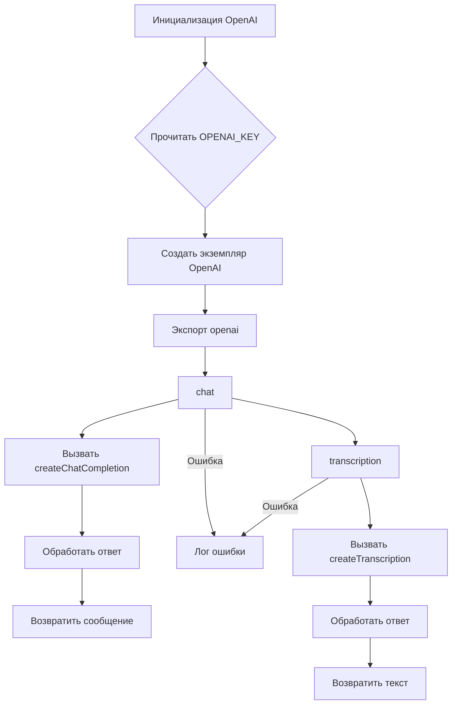

# Анализ кода openai.js

**1. <input code>**

```javascript
import { Configuration, OpenAIApi } from 'openai'
import config from 'config'
import { createReadStream } from 'fs'
class OpenAI {
    roles = {
        ASSISTANT: 'assistant',
        USER: 'user',
        SYSTEM: 'system',
    }
    constructor(apiKey) {
        const configuration = new Configuration({
            apiKey,
        })
        this.openai = new OpenAIApi(configuration)
    }
    async chat(messages) {
        try {
            const response = await this.openai.createChatCompletion({
                model: 'gpt-3.5-turbo',
                messages,
            })
            return response.data.choices[0].message
        } catch (e) {
            console.log('Error while gpt chat', e.message)
        }
    }
    async transcription(filepath) {
        try {
            const response = await this.openai.createTranscription(
                createReadStream(filepath),
                'whisper-1'
            )
            return response.data.text
        } catch (e) {
            console.log('Error while transcription', e.message)
        }
    }
}
export const openai = new OpenAI(config.get('OPENAI_KEY'))
```

**2. <algorithm>**



**Пример:**

В блоке `chat`: Пользовательский запрос `messages` передаётся в функцию `chat`. Функция выполняет запрос к API OpenAI с моделью `gpt-3.5-turbo`. Результат (сообщение от бота) возвращается. В случае ошибки, выводится сообщение в консоль.

В блоке `transcription`: Путь к файлу `filepath` передаётся в функцию `transcription`. Функция считывает содержимое файла (потоком) и выполняет транскрипцию через API OpenAI.  Результат (текст транскрипции) возвращается. В случае ошибки, выводится сообщение в консоль.


**3. <mermaid>**

```mermaid
graph LR
    subgraph OpenAI Class
        OpenAI((OpenAI)) --> constructor(Инициализация);
        constructor --> chat(Метод chat);
        chat --> openai.createChatCompletion(Вызов API);
        openai.createChatCompletion --> response(Обработка ответа);
        response --> message(Возврат сообщения);
        chat --Ошибка--> errorHandling(Обработка ошибки);
        chat --> transcription(Метод transcription);
        transcription --> openai.createTranscription(Вызов API);
        openai.createTranscription --> response(Обработка ответа);
        response --> text(Возврат текста);
        transcription --Ошибка--> errorHandling;
    end
    subgraph Dependencies
        OpenAI --> Configuration(OpenAI.Configuration);
        OpenAI --> OpenAIApi(OpenAI.OpenAIApi);
        OpenAI --> config(config);
        config --> OPENAI_KEY(Ключ API);
        OpenAI --> fs(createReadStream);
    end
```

**4. <explanation>**

* **Импорты:**
    * `import { Configuration, OpenAIApi } from 'openai'`: Импортирует необходимые классы из библиотеки `openai`, которые используются для взаимодействия с API OpenAI.
    * `import config from 'config'`: Импортирует конфигурационный модуль `config`, вероятно, для получения ключа API OpenAI.
    * `import { createReadStream } from 'fs'`: Импортирует функцию `createReadStream` из модуля `fs` для работы с файлами.
* **Класс `OpenAI`:**
    * `roles`: Статическая переменная, хранящая константы для ролей сообщений в чате (ASSISTANT, USER, SYSTEM).
    * `constructor(apiKey)`: Конструктор класса, принимающий ключ API OpenAI. Инициализирует экземпляр `OpenAIApi` с заданным ключом.
    * `chat(messages)`: Асинхронный метод для отправки запроса на чат с OpenAI.  Принимает массив `messages` (объекты с ролью и текстом). Возвращает сообщение от бота или `undefined` при ошибке.
    * `transcription(filepath)`: Асинхронный метод для транскрипции аудиофайла. Принимает путь к файлу и возвращает текст транскрипции.
* **Функции:**
    * `config.get('OPENAI_KEY')`: Получение ключа API OpenAI из конфигурационного файла.
    * `openai.createChatCompletion`, `openai.createTranscription`: Методы API OpenAI для создания чатового диалога и транскрипции соответственно.
* **Переменные:**
    * `apiKey`: Хранит ключ API OpenAI.
    * `messages`: Массив объектов, каждый содержащий роль (например, 'user' или 'assistant') и сообщение.
    * `filepath`: Путь к файлу для транскрипции.
    * `response`: Хранит ответ от API OpenAI.
    * `text`: Хранит полученный текст транскрипции.

**Возможные ошибки и улучшения:**

* **Обработка ошибок:**  Обработка ошибок в `try...catch` блоках важна. Однако, можно добавить более информативные сообщения об ошибке, например, информацию о коде статуса ответа.
* **Обработка timeout:**  Добавление таймаута к запросам к API OpenAI поможет предотвратить зависания приложения.
* **Передача конфигурации:** Вместо `config.get('OPENAI_KEY')` можно создать отдельный класс или структуру данных для настройки OpenAI, чтобы можно было передавать разные параметры (например, model, temperature) в метод.
* **Проверка на корректность данных:** Проверка входных параметров (например, `messages` в методе `chat`) на корректность поможет избежать неожиданных ошибок.


**Взаимосвязь с другими частями проекта:**

Модуль `openai.js` взаимодействует с конфигурационным файлом (`config`) для получения ключа API OpenAI. Вероятно, существует другой код, который использует экземпляр `openai` для взаимодействия с API.   Например, бот в Telegram или другой интерфейс, который использует функции `chat` и `transcription` для обработки сообщений или файлов.