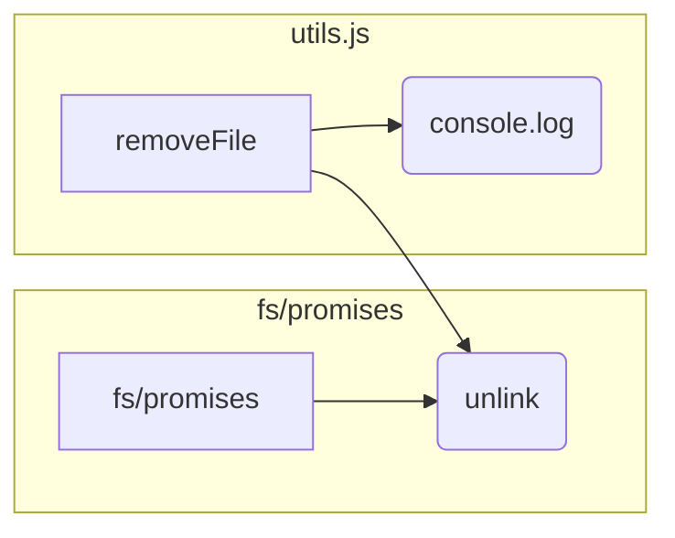

```MD
# Анализ кода utils.js

**1. <input code>**

```javascript
import { unlink } from 'fs/promises'
export async function removeFile(path) {
    try {
        await unlink(path)
    } catch (e) {
        console.log('Error while removing file', e.message)
    }
}
```

**2. <algorithm>**

```mermaid
graph TD
    A[Вызов removeFile(path)] --> B{Проверка существования файла по пути path};
    B -- Да --> C[unlink(path)];
    B -- Нет --> D[Логирование ошибки и возврат];
    C --> E[Успешное удаление файла];
    D --> F[Логирование ошибки];
    E --> G[Конец функции];
    F --> G;

    subgraph Ошибки
        B -- Ошибка --> H[Обработка ошибки];
        H --> F;
    end
```

**Пример:**

Если `path` указывает на файл `/tmp/myFile.txt`, функция `removeFile` пытается удалить этот файл с помощью `unlink()`.  Если файл удален успешно, функция завершается. Если возникает ошибка (например, файл не найден или нет доступа), функция логгирует сообщение об ошибке и завершается.

**3. <mermaid>**



**4. <explanation>**

* **Импорты:**
    * `import { unlink } from 'fs/promises'`:  Импортирует асинхронную функцию `unlink` из модуля `fs/promises`.  Этот модуль предоставляет асинхронные методы для работы с файловой системой Node.js, что важно для избегания блокировок в асинхронных операциях.  `fs/promises` — часть модуля `fs` (file system), но предоставляет асинхронные функции, которые не блокируют выполнение программы.  Связь с другими частями проекта: Эта функция используется в других частях приложения для удаления временных файлов или файлов, которые больше не нужны.

* **Функции:**
    * `removeFile(path)`: Эта асинхронная функция принимает один аргумент `path` (строка) — путь к файлу, который нужно удалить.
        * Использует `try...catch`: Блок `try` выполняет операцию удаления (`unlink(path)`). Если возникает ошибка (например, файл не найден, нет прав доступа), `catch` блок её обрабатывает, логгируя сообщение об ошибке в консоль.
        * Возвращает значение: Хотя функция не явно возвращает значение, при успешном удалении или неудаче, функция  `unlink` выполняется, и контроль управления передаётся дальше.

* **Переменные:**
    * `path`: Строка, представляющая путь к файлу.

* **Возможные ошибки и улучшения:**
    * Не указано, что происходит если `path` равен null или undefined, поэтому может быть полезно добавить проверку на это.
    * Лучше логгировать ошибки более детально: вместо простого `e.message` логгировать весь объект ошибки `e`.
    * Проверка на существование файла перед его удалением (например, с помощью `fs.access` или `fs.stat`) может предотвратить ненужные ошибки и повысить надежность.
    * Добавление `await` в `console.log`:  Если `console.log` вызывается до завершения async операции, то может появиться проблема с ожиданием выполнения асинхронного кода. В данном случае, `console.log` выполняется асинхронно, поэтому ожидания не требуется.

**Цепочка взаимосвязей:**

Функция `removeFile` используется в других частях проекта (например, в обработчиках событий,  при работе с базами данных, в тестах), для удаления файлов, созданных в процессе выполнения приложения.  Например, функция может использоваться для удаления временных файлов, загрузок или результатов вычислений.