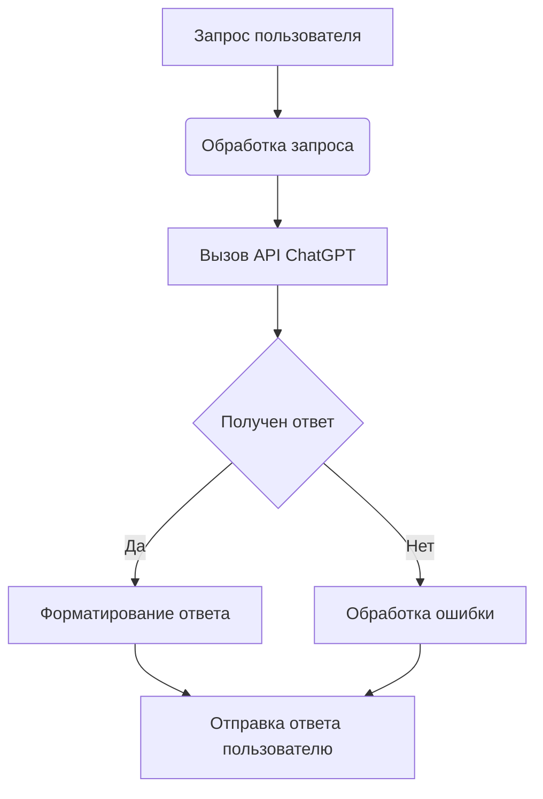

# Анализ кода чат-бота ChatGPT на Node.js

## <input code>

Реализация чаgpt бота средстами nodejs
https://habr.com/ru/companies/selectel/articles/731692/

## <algorithm>

К сожалению, предоставленный код отсутствует.  Ссылка на статью на Хабре описывает *идею* реализации, а не сам код.  Поэтому алгоритм работы представить невозможно.  Необходимо предоставить исходный код для анализа.

## <mermaid>

**Описание диаграммы:**

Эта диаграмма представляет упрощенный алгоритм работы чат-бота.  Она не отражает детали реализации, так как код отсутствует.  

* **A:** Пользователь отправляет запрос.
* **B:** Чат-бот обрабатывает запрос (например, парсит его, проверяет корректность).
* **C:** Выполняется запрос к API ChatGPT.
* **D:** Получен ответ от ChatGPT.
* **E:** Чат-бот форматирует ответ от ChatGPT для удобства пользователя.
* **F:**  Обработка ошибки (например, проблемы с соединением, ошибочный ответ API).
* **G:** Чат-бот отправляет отформатированный ответ пользователю.

## <explanation>

Из-за отсутствия кода невозможно выполнить подробный анализ импортов, классов, функций, переменных и возможных ошибок.  Для того, чтобы провести анализ, необходимо предоставить исходный код.

**Общая информация о реализации чат-бота на Node.js:**

Реализация чат-бота на Node.js, как правило, включает:

* **Импорты:** Библиотеки для работы с HTTP-запросами (например, `express`),  для взаимодействия с API (например, `axios`),  для обработки текста (например, `natural` или аналогичные),  и другие в зависимости от функциональности бота.
* **Классы:**  Класс для представления чат-бота, модели данных (для сохранения истории диалогов), возможно класс для работы с API.
* **Функции:** Функции для обработки запросов, для вызова API, для обработки ответов, для форматирования вывода,  для логирования и т.д.
* **Переменные:**  Переменные для хранения ключей API, настроек бота, данных о текущем диалоге, запросах пользователя.

**Возможные ошибки и улучшения:**

Без кода невозможно указать конкретные ошибки и области для улучшения.  Однако при реализации чат-бота на Node.js можно выделить общие потенциальные проблемы:

* **Неэффективный код:** Излишние циклы, некорректные алгоритмы.
* **Отсутствие обработки ошибок:**  Неправильная обработка исключений (недостаточная проверка вводимых данных, возможных сбоев при запросе к API).
* **Плохая масштабируемость:** Некорректное использование ресурсов.
* **Недостаточное тестирование:** Отсутствие тестирования приводит к ошибкам, которые сложнее найти в процессе разработки.

**Связь с другими частями проекта:**

Чат-бот взаимодействует с другими частями проекта, если он, например, интегрирован в систему управления диалогами. Без кода конкретные взаимосвязи установить невозможно.