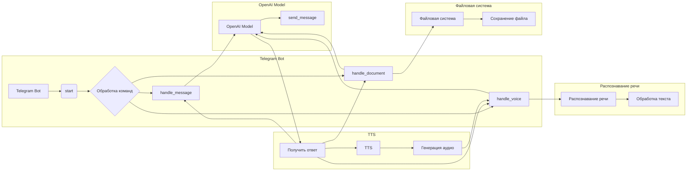

# <input code>

```python
## \file hypotez/src/bots/openai_bots/telegram_bot_trainger.py
# -*- coding: utf-8 -*-\
#! venv/Scripts/python.exe
#! venv/bin/python/python3.12

"""
.. module: src.bots.openai_bots 
	:platform: Windows, Unix
	:synopsis:

"""
MODE = 'dev'


""" This script creates a simple Telegram bot using the python-telegram-bot library."""

from pathlib import Path
import tempfile
import asyncio
from telegram import Update
from telegram.ext import Application, CommandHandler, MessageHandler, filters, CallbackContext

import header
from src import gs
from src.ai.openai.model.training import Model
from src.utils import j_loads, j_loads_ns, j_dumps
from src.logger import logger
import speech_recognition as sr  # Библиотека для распознавания речи
import requests  # Для скачивания файлов
from pydub import AudioSegment  # Библиотека для конвертации аудио
from gtts import gTTS  # Библиотека для текстового воспроизведения
from src.utils.convertors.tts import recognizer, text_to_speech

model = Model()

# Replace 'YOUR_TOKEN_HERE' with your actual bot token
TELEGRAM_TOKEN = gs.credentials.telegram.bot_token

async def start(update: Update, context: CallbackContext) -> None:
    """ Handle the /start command."""
    await update.message.reply_text('Hello! I am your simple bot. Type /help to see available commands.')

async def help_command(update: Update, context: CallbackContext) -> None:
    """ Handle the /help command."""
    await update.message.reply_text('Available commands:\n/start - Start the bot\n/help - Show this help message')
    
async def handle_document(update: Update, context: CallbackContext):
    # Получаем файл
    file = await update.message.document.get_file()
    #tmp_file_path = f"{tempfile.gettempdir()}/received.txt"
    tmp_file_path = await file.download_to_drive()  # Сохраняем файл локально

    # Читаем содержимое файла
    with open(tmp_file_path, 'r') as f:
        file_content = f.read()

    response = model.send_message(f"Обучение модели на следующем содержимом:{file_content}")
    await update.message.reply_text(response)
    #tts_file_path = await text_to_speech (response)
    #await update.message.reply_audio(audio=open(tts_file_path, 'rb'))
    
async def handle_message(update: Update, context: CallbackContext) -> None:
    """ Handle any text message."""
    text_received = update.message.text
    response = model.send_message(text_received)
    await update.message.reply_text(response)
    #tts_file_path = await text_to_speech (response)
    #await update.message.reply_audio(audio=open(tts_file_path, 'rb'))
   
async def handle_voice(update: Update, context: CallbackContext) -> None:
    """ Handle voice messages."""
    voice_file = await update.message.voice.get_file()
    message = recognizer(audio_url=voice_file.file_path)
    response = model.send_message(message)
    await update.message.reply_text(response)
    tts_file_path = await text_to_speech (response)
    await update.message.reply_audio(audio=open(tts_file_path, 'rb'))

def main() -> None:
    """ Start the bot."""
    application = Application.builder().token(TELEGRAM_TOKEN).build()

    # Register command handlers
    application.add_handler(CommandHandler('start', start))
    application.add_handler(CommandHandler('help', help_command))

    # Register message handlers
    application.add_handler(MessageHandler(filters.TEXT & ~filters.COMMAND, handle_message))
    application.add_handler(MessageHandler(filters.VOICE, handle_voice))
    application.add_handler(MessageHandler(filters.Document.ALL, handle_document))
    # Start the bot
    application.run_polling()

if __name__ == '__main__':
    main()
```

# <algorithm>

**Блок-схема:**

```mermaid
graph TD
    A[Получить команду] --> B{Команда /start?};
    B -- Да --> C[Отправить "Привет"];
    B -- Нет --> D{Команда /help?};
    D -- Да --> E[Отправить справку];
    D -- Нет --> F[Получить сообщение];
    F --> G[Обработать сообщение];
    G --> H[Отправить сообщение модели];
    H --> I[Получить ответ от модели];
    I --> J[Отправить ответ в Telegram];
    F -- Документ --> K[Получить файл];
    K --> L[Сохранить файл];
    L --> M[Прочитать файл];
    M --> N[Обработать файл];
    N --> O[Отправить сообщение модели];
    O --> I;
    F -- Голосовое сообщение --> P[Получить аудио];
    P --> Q[Распознать речь];
    Q --> R[Обработать текст];
    R --> O;
```

**Примеры:**

* Команда /start:  Пользователь отправляет /start.  Бота отправляет сообщение "Hello!".
* Текстовое сообщение: Пользователь отправляет сообщение "Привет!". Бота отправляет это сообщение модели, получает ответ от модели и отправляет ответ в Telegram.
* Документ: Пользователь отправляет документ. Бота загружает документ, читает его, отправляет содержание модели, получает ответ, и отправляет его пользователю.
* Голосовое сообщение: Пользователь отправляет голосовое сообщение. Бота распознает речь, отправляет распознанный текст модели, получает ответ и отправляет его пользователю вместе с аудио-версией ответа.

**Перемещение данных:**

Данные перемещаются между функциями и классами посредством аргументов и возвращаемых значений. Например, функция `handle_message` принимает объект `Update` и `CallbackContext`, и использует содержимое сообщения (`update.message.text`) для дальнейшей обработки. Результат обработки (отправленное сообщение модели и полученный ответ) используется для отправки ответа пользователю.


# <mermaid>




# <explanation>

**Импорты:**

* `from pathlib import Path`:  Используется для работы с путями к файлам (хотя в данном примере не используется напрямую).
* `import tempfile`:  Необходим для временных файлов, но в коде используется `await file.download_to_drive()`.
* `import asyncio`:  Используется для асинхронных операций (важно для Telegram ботов).
* `from telegram import Update`:  Объект, представляющий обновление Telegram (например, полученное сообщение).
* `from telegram.ext import Application, CommandHandler, MessageHandler, filters, CallbackContext`:  Компоненты библиотеки `python-telegram-bot` для создания и обработки Telegram ботов.
* `import header`: Вероятно, файл с настройками, но его содержимое не видно.
* `from src import gs`:  Импорт модуля `gs` из пакета `src`, скорее всего для доступа к конфигурации.
* `from src.ai.openai.model.training import Model`:  Класс для взаимодействия с моделью OpenAI для обучения.
* `from src.utils import j_loads, j_loads_ns, j_dumps`:  Функции для работы с JSON.
* `from src.logger import logger`:  Логирование.
* `import speech_recognition as sr`:  Библиотека для распознавания речи.
* `import requests`:  Библиотека для запросов к серверам (вероятно, используется в `recognizer`, но не видно).
* `from pydub import AudioSegment`:  Библиотека для работы с аудиофайлами.
* `from gtts import gTTS`:  Библиотека для генерации речи.
* `from src.utils.convertors.tts import recognizer, text_to_speech`: Модули для распознавания речи и синтеза речи.


**Классы:**

* `Model`:  Класс для взаимодействия с моделью OpenAI.  Этот класс отвечает за отправку сообщений и получение ответов от модели.  Необходимы детали реализации внутри этого класса.

**Функции:**

* `start`, `help_command`, `handle_message`, `handle_document`, `handle_voice`:  Обработчики различных событий Telegram бота.
* `main`:  Основная функция, запускающая Telegram бота.
* `recognizer`, `text_to_speech`: функции из `src.utils.convertors.tts` для распознавания и генерации речи.

**Переменные:**

* `TELEGRAM_TOKEN`: Токен Telegram бота.
* `model`: Экземпляр класса `Model`.


**Возможные ошибки/улучшения:**

* Отсутствие обработки ошибок при работе с файлами, например, при чтении файла.
* Отсутствие явного указания кодировки при чтении документа.  Рекомендуется явно указывать кодировку: `with open(tmp_file_path, 'r', encoding='utf-8') as f:`.
* Отсутствие проверки на корректность полученных данных (например, ответ от модели, распознанное сообщение).
* Непонятные назначения переменных `tts_file_path` - по идеи этот код должен генерировать аудио ответ и сохранять его, а потом отправлять в телеграм.
* Возможно, использование `await file.download_to_drive()` вместо `tmp_file_path = f"{tempfile.gettempdir()}/received.txt"` неверно.  Этот код должен сработать, но не идеальный.
* Отсутствие описания логики работы `recognizer` и `text_to_speech`.

**Взаимосвязи с другими частями проекта:**

Проект использует классы и функции из других модулей (`src`), таких как `gs` для доступа к конфигурации, `Model` для взаимодействия с моделью OpenAI, `recognizer` и `text_to_speech` для работы с распознаванием и генерацией речи.  Без доступа к коду этих модулей сложно оценить полную картину взаимодействия.