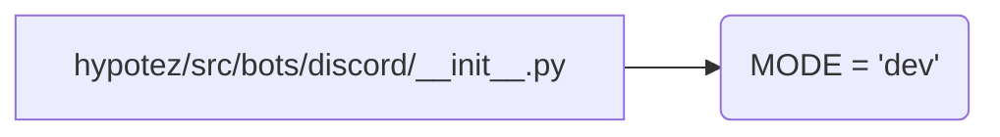

# <input code>

```python
## \file hypotez/src/bots/discord/__init__.py
# -*- coding: utf-8 -*-
#! venv/Scripts/python.exe
#! venv/bin/python/python3.12

"""
.. module: src.bots.discord 
	:platform: Windows, Unix
	:synopsis:

"""
MODE = 'dev'

"""
	:platform: Windows, Unix
	:synopsis:

"""


"""
	:platform: Windows, Unix
	:synopsis:

"""


"""
  :platform: Windows, Unix

"""
"""
  :platform: Windows, Unix
  :platform: Windows, Unix
  :synopsis:
"""MODE = 'dev'
  
""" module: src.bots.discord """

```

# <algorithm>

Этот файл представляет собой инициализационный модуль для бота Discord, находящегося в проекте `hypotez`.  Алгоритм работы сводится к инициализации переменной `MODE` со значением 'dev'.  В данном случае, пошаговая блок-схема не имеет смысла, т.к. действий нет. Файл скорее служит для организации структуры проекта и маркировки модуля.


# <mermaid>



# <explanation>

**Импорты:**

Файл `hypotez/src/bots/discord/__init__.py` не содержит импортов. Это инициализационный файл для пакета `bots/discord`. Он определяет константу `MODE`, которая, скорее всего, будет использоваться в других частях проекта для выбора режима работы (например, 'dev' для разработки, 'prod' для производства).


**Классы:**

В файле нет определений классов.


**Функции:**

Нет функций.


**Переменные:**

- `MODE`: Строковая переменная, содержащая значение 'dev'. Она задаёт режим работы бота.  Типизированный как `str`.


**Возможные ошибки или области для улучшений:**

- **Отсутствие явного назначения:** Файл не выполняет никакой действия и только определяет константу, что делает его менее функциональным.   
- **Недостаточная документированность:**  Документация в виде `""" """`  не даёт понимания назначения `MODE`, так как не описывает, как она используется.

**Взаимосвязи с другими частями проекта:**

Этот файл служит частью пакета `bots/discord`.  Он, скорее всего, будет использоваться в других модулях или файлах этого пакета, которые будут инициализироваться и содержать логику взаимодействия с Discord API. Например, файл `__init__.py` вложенного пакета (скажем, `src/bots/discord/commands/__init__.py`) может импортировать эту константу `MODE` для использования при настройке команды Discord.  Однако без дополнительных данных о коде, сложно нарисовать полную схему.