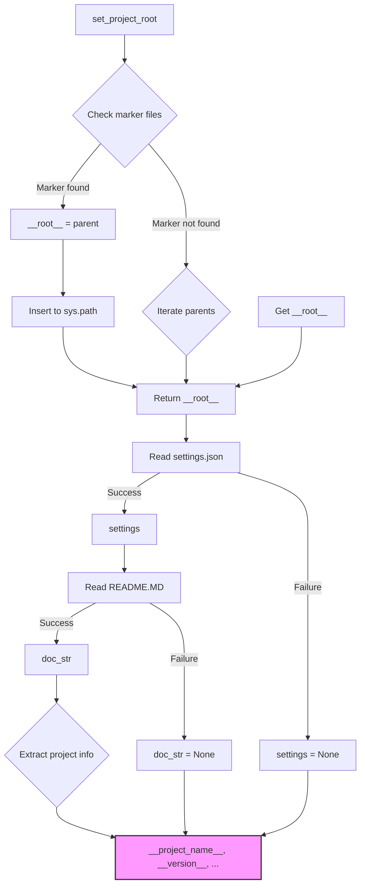

```MD
# <input code>

```python
## \file hypotez/src/bots/discord/header.py
# -*- coding: utf-8 -*-\
#! venv/Scripts/python.exe
#! venv/bin/python/python3.12

"""
.. module: src.bots.discord 
	:platform: Windows, Unix
	:synopsis:

"""
MODE = 'dev'


"""
	:platform: Windows, Unix
	:synopsis:

"""


"""
	:platform: Windows, Unix
	:synopsis:

"""


"""
  :platform: Windows, Unix

"""
"""
  :platform: Windows, Unix
  :platform: Windows, Unix
  :synopsis:
"""MODE = 'dev'
  
""" module: src.bots.discord """

import sys
import json
from packaging.version import Version

from pathlib import Path
def set_project_root(marker_files=('pyproject.toml', 'requirements.txt', '.git')) -> Path:
    """
    Finds the root directory of the project starting from the current file's directory,
    searching upwards and stopping at the first directory containing any of the marker files.

    Args:
        marker_files (tuple): Filenames or directory names to identify the project root.
    
    Returns:
        Path: Path to the root directory if found, otherwise the directory where the script is located.
    """
    __root__:Path
    current_path:Path = Path(__file__).resolve().parent
    __root__ = current_path
    for parent in [current_path] + list(current_path.parents):
        if any((parent / marker).exists() for marker in marker_files):
            __root__ = parent
            break
    if __root__ not in sys.path:
        sys.path.insert(0, str(__root__))
    return __root__


# Get the root directory of the project
__root__ = set_project_root()
"""__root__ (Path): Path to the root directory of the project"""

from src import gs

settings:dict = None
try:
    with open(gs.path.root / 'src' /  'settings.json', 'r') as settings_file:
        settings = json.load(settings_file)
except (FileNotFoundError, json.JSONDecodeError):
    ...

doc_str:str = None
try:
    with open(gs.path.root / 'src' /  'README.MD', 'r') as settings_file:
        doc_str = settings_file.read()
except (FileNotFoundError, json.JSONDecodeError):
    ...


__project_name__ = settings.get("project_name", 'hypotez') if settings  else 'hypotez'
__version__: str = settings.get("version", '')  if settings  else ''
__doc__: str = doc_str if doc_str else ''
__details__: str = ''
__author__: str = settings.get("author", '')  if settings  else ''
__copyright__: str = settings.get("copyrihgnt", '')  if settings  else ''
__cofee__: str = settings.get("cofee", "Treat the developer to a cup of coffee for boosting enthusiasm in development: https://boosty.to/hypo69")  if settings  else "Treat the developer to a cup of coffee for boosting enthusiasm in development: https://boosty.to/hypo69"
```

# <algorithm>

1. **`set_project_root` функция:**
   - Принимает кортеж `marker_files` (файлы/директории, по которым ищется корень проекта).
   - Начинает поиск с текущей директории (`__file__`).
   - Итерируется по родительским директориям.
   - Если в родительской директории есть какой-либо файл из `marker_files`, то `__root__` устанавливается в найденную директорию и цикл прерывается.
   - Если корень проекта не найден, `__root__` остается неизменной.
   - Добавляет найденную директорию в `sys.path`.
   - Возвращает найденный путь (`__root__`).

2. **Получение `__root__`:**
   - Вызывается функция `set_project_root()`.
   - Полученный путь сохраняется в переменной `__root__`.

3. **Чтение `settings.json`:**
   - Читает файл `settings.json` из директории `gs.path.root / 'src'`.
   - При успешном чтении загружает настройки в переменную `settings`.
   - При ошибке (например, файл не найден)  переменная `settings` остается `None`.

4. **Чтение `README.MD`:**
   - Читает файл `README.MD` из директории `gs.path.root / 'src'`.
   - При успешном чтении загружает содержимое в переменную `doc_str`.
   - При ошибке (например, файл не найден)  переменная `doc_str` остается `None`.

5. **Обработка настроек:**
   - Извлекает значения из словаря `settings` с помощью `settings.get()`.
   - Если значение не найдено, используется значение по умолчанию.
   - Значения сохраняются в переменных, например `__project_name__`, `__version__`, `__doc__`, и т.д.


# <mermaid>



**Объяснение зависимостей (для mermaid):**

- `set_project_root`:  Работает с `Path` для манипуляции путями, `sys.path` для добавления в список импортируемых модулей, внутренне использует функцию `any` и генератор.
- `json.load`: Загружает данные из `settings.json`.
- `Path`: Работает с файловыми путями.
- `gs.path.root`: Предполагается, что это объект или модуль из пакета `gs`, отвечающий за определение корневой директории проекта.
- `sys`:  Стандартная библиотека для работы с интерпретатором Python.

# <explanation>

**Импорты:**

- `sys`:  Стандартный модуль, предоставляющий доступ к системным переменным и функциям (например, `sys.path`).
- `json`: Модуль для работы с JSON-форматом.
- `packaging.version`: Модуль для работы с версиями пакетов.
- `pathlib`: Модуль для работы с файловыми путями в объектно-ориентированном стиле.
- `gs`:  Пользовательский модуль, вероятно, предоставляющий функции и переменные для работы с путями проекта (возможно, это абстракция, чтобы не напрямую работать с `sys.path`).


**Классы:**

- Нет явных классов в данном файле.


**Функции:**

- `set_project_root(marker_files)`:  Ищет корень проекта, используя заданные файлы-маркеры. Важно: возвращает `Path` объект, что обеспечивает более безопасную работу с путями.


**Переменные:**

- `MODE`:  Строковая константа, вероятно, для обозначения режима работы.
- `__root__`:  Переменная, содержащая путь к корневому каталогу проекта.
- `settings`: Словарь с настройками проекта, загружен из `settings.json`.
- `doc_str`: Содержимое файла `README.MD`.
- `__project_name__`, `__version__`, `__doc__`, `__details__`, `__author__`, `__copyright__`, `__cofee__`:  Строковые переменные, содержащие метаданные проекта, полученные из `settings`.


**Возможные ошибки или улучшения:**

- Необходимо проверить, что файлы `settings.json` и `README.MD` существуют и имеют корректный формат.
- Рекомендуется использовать более описательные имена переменных (`project_root` вместо `__root__`).
- Обработка ошибок при чтении JSON или файловой системе могла бы быть улучшена, например, путем вывода более информативного сообщения об ошибке.
- Можно улучшить документацию для `gs.path.root`.
- Если модуль `gs` определяет корень проекта, то лучше определить функцию `gs.get_project_root()`.


**Взаимосвязи с другими частями проекта:**

- Функция `set_project_root` позволяет получить корневую директорию проекта.
- Модуль `gs` абстрагирует взаимодействие с данными о проекте.
- Этот файл, вероятно, подключается в других частях проекта (`bots/discord`).
- Файлы `settings.json` и `README.MD` содержат данные о проекте.