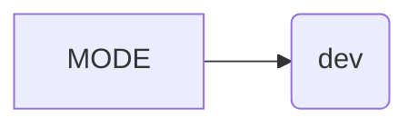

# <input code>

```python
## \file hypotez/src/bots/telegram/logger.py
# -*- coding: utf-8 -*-\
#! venv/Scripts/python.exe
#! venv/bin/python/python3.12

"""
.. module: src.bots.telegram.logger 
	:platform: Windows, Unix
	:synopsis: Модуль логгирования телеграм ботов

"""
MODE = 'dev'
```

# <algorithm>

Этот код представляет собой очень простой модуль, который определяет константу `MODE` с значением 'dev'.  Блок-схема в данном случае не нужна, так как нет циклов, условий или сложного логического ветвления.

# <mermaid>



# <explanation>

**Импорты:**

В данном коде отсутствуют импорты.  Это означает, что модуль `logger.py` не использует никаких других модулей или библиотек. Он просто определяет глобальную переменную.

**Классы:**

Нет определенных классов.

**Функции:**

Нет определенных функций.

**Переменные:**

`MODE`:  Это глобальная константа, хранящая строковое значение 'dev'.  Скорее всего, она будет использоваться где-то в другом коде проекта для выбора режима работы (например, для включения/отключения отладки или логгирования).  Её значение может влиять на поведение других частей проекта, связанных с логгированием ботов Telegram.

**Возможные ошибки или области для улучшений:**

* **Недостаточно информации:**  Код слишком прост и не содержит никакой практической логики логгирования.  В реальном проекте логгирование требует использования библиотек для записи логов (например, `logging`).
* **Неясная цель:** Значение `MODE = 'dev'` может быть использовано для выбора стратегии логгирования или конфигурации.  Необходимо добавить описание цели этого значения. Например, что будет происходить в режиме "dev" в отличии от "prod".
* **Отсутствие логгирования:** Не выполняется никакой операции логгирования. Для работы с логами нужно использовать библиотеку `logging`.

**Взаимосвязи с другими частями проекта:**

Вероятно, этот модуль `logger` будет импортирован и использован в других модулях, например, в модулях, отвечающих за создание и настройку ботов Telegram.  Это значит, что константа `MODE` будет использована в этих модулях для выбора режима логгирования. Например,  модуль `telegram_bot_handler.py` может импортировать `logger` и в зависимости от `MODE` использовать разные уровни логгирования, или разные лог файлы.