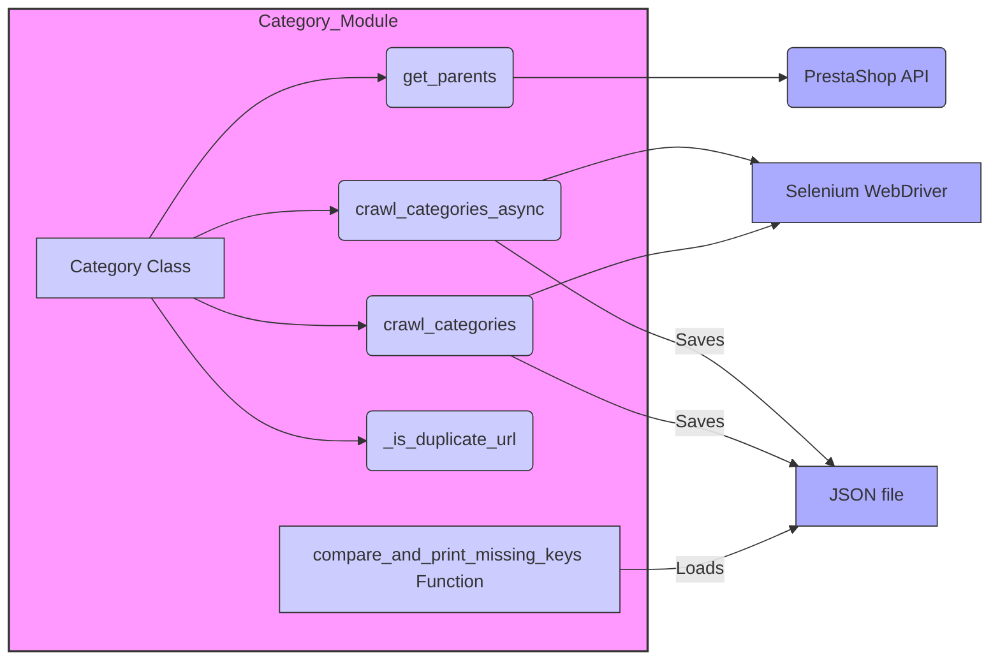

# Анализ модуля `src.category`

## <алгоритм>

**1. Инициализация объекта `Category`:**
   - Создается объект класса `Category`, который наследуется от `PrestaCategory`.
   - Принимает `api_credentials` для доступа к данным PrestaShop.
   - Пример: `category = Category(api_credentials={'api_key': 'your_api_key'})`

**2. Получение родительских категорий (`get_parents`):**
   - Принимает `id_category` (идентификатор категории) и `dept` (глубина).
   - Вызывает методы API PrestaShop для получения информации о родительских категориях.
   - Возвращает список родительских категорий.
   - Пример: `parents = category.get_parents(id_category=123, dept=2)`

**3. Асинхронный обход категорий (`crawl_categories_async`):**
   - Принимает URL категории (`url`), глубину обхода (`depth`), драйвер Selenium (`driver`), локатор для ссылок (`locator`), путь к файлу для сохранения (`dump_file`), ID категории по умолчанию (`default_category_id`) и опциональный словарь категории (`category`).
   - Асинхронно обходит страницы категорий, используя Selenium.
   - Находит ссылки на подкатегории, используя `locator`.
   - Рекурсивно вызывает себя для каждой найденной подкатегории, уменьшая глубину `depth` на 1.
   - Сохраняет структуру категорий (имя, URL, подкатегории) в словарь.
   - Возвращает обновленный словарь категорий.
   - Пример:
     ```python
     category_data = await category.crawl_categories_async(
         url='https://example.com/categories',
         depth=3,
         driver=driver_instance,
         locator='//a[@class="category-link"]',
         dump_file='categories.json',
         default_category_id=123
     )
     ```

**4. Синхронный обход категорий (`crawl_categories`):**
   - Аналогичен `crawl_categories_async`, но выполняется синхронно.
   - Принимает URL категории, глубину обхода, драйвер Selenium, локатор, путь к файлу, ID категории по умолчанию и словарь категорий (необязательно).
   - Обходит категории, используя Selenium.
   - Возвращает словарь категорий.
   - Пример: `category_data = category.crawl_categories(url, depth, driver, locator, dump_file, id_category_default, category)`

**5. Проверка дубликатов URL (`_is_duplicate_url`):**
   - Проверяет, существует ли URL уже в словаре категорий.
   - Возвращает `True`, если URL дублируется, и `False` в противном случае.
   - Пример: `is_duplicate = category._is_duplicate_url(category_dict, 'https://example.com/category1')`

**6. Сравнение и печать отсутствующих ключей (`compare_and_print_missing_keys`):**
   - Принимает словарь (`current_dict`) и путь к файлу (`file_path`).
   - Загружает данные из файла JSON.
   - Сравнивает ключи текущего словаря с ключами словаря из файла и выводит в консоль, какие ключи отсутствуют.
   - Пример: `compare_and_print_missing_keys(current_dict=category_data, file_path='saved_categories.json')`

## <mermaid>



### Объяснение `mermaid` диаграммы:

- **`Category_Module`**:  Обозначает модуль `src.category`, объединяя все его компоненты.
- **`Category Class`**: Представляет класс `Category`, главный компонент модуля.
- **`get_parents`**: Метод класса `Category`, отвечающий за получение родительских категорий. Зависит от `PrestaShop API`.
- **`crawl_categories_async`**: Асинхронный метод для обхода категорий, использует `Selenium WebDriver` и сохраняет результаты в `JSON file`.
- **`crawl_categories`**: Синхронный метод для обхода категорий, использует `Selenium WebDriver` и сохраняет результаты в `JSON file`.
- **`_is_duplicate_url`**: Метод класса `Category`, проверяет URL на дублирование.
- **`compare_and_print_missing_keys Function`**: Функция, сравнивающая данные и печатающая отсутствующие ключи, загружает данные из `JSON file`.
- **`PrestaShop API`**: Внешний API, используемый для получения данных о категориях.
- **`Selenium WebDriver`**: Внешний инструмент для управления браузером и обхода веб-страниц.
- **`JSON file`**: Файл для сохранения и загрузки данных о категориях.

## <объяснение>

### Импорты:

-   `requests`: Используется для HTTP-запросов, хотя явного использования в представленном коде не видно, вероятно используется внутри `PrestaCategory`.
-   `lxml`: Используется для парсинга HTML и XML.
-   `asyncio`: Используется для асинхронного программирования (для `crawl_categories_async`).
-   `selenium`: Используется для автоматизации браузера, для обхода веб-страниц категорий.
-   `src.endpoints.prestashop.PrestaShop`: Базовый класс для взаимодействия с API PrestaShop.
-   `src.endpoints.prestashop.PrestaCategory`: Класс, предоставляющий функциональность для работы с категориями PrestaShop.
-   `src.utils.jjson.j_loads`: Функция для загрузки данных из JSON файла.
-   `src.utils.jjson.j_dumps`: Функция для записи данных в JSON файл.
-   `src.logger.logger`: Модуль для логирования.

### Классы:

-   **`Category`**:
    -   **Роль**: Предназначен для управления категориями PrestaShop, включая обход страниц и управление иерархией.
    -   **Атрибуты**: Нет явно объявленных атрибутов, но наследует атрибуты от `PrestaCategory`.
    -   **Методы**:
        -   `__init__`: Инициализирует объект класса, принимая учетные данные API.
        -   `get_parents`: Возвращает список родительских категорий для заданной категории.
        -   `crawl_categories_async`: Асинхронно обходит страницы категорий, строит иерархию категорий.
        -   `crawl_categories`: Синхронно обходит страницы категорий, строит иерархию категорий.
        -   `_is_duplicate_url`: Проверяет, является ли URL дубликатом в словаре категорий.
    -   **Взаимодействие**: Наследуется от `PrestaCategory` (через `PrestaShop`), взаимодействует с Selenium для обхода веб-страниц, сохраняет и загружает данные из JSON.

### Функции:

-   **`compare_and_print_missing_keys`**:
    -   **Аргументы**:
        -   `current_dict`: Текущий словарь категорий.
        -   `file_path`: Путь к файлу для сравнения.
    -   **Возвращаемое значение**: Нет (выводит результаты сравнения в консоль).
    -   **Назначение**: Сравнивает ключи текущего словаря с ключами словаря из файла и печатает недостающие ключи.
    -   **Пример**: `compare_and_print_missing_keys(current_dict=category_data, file_path='saved_categories.json')`

### Переменные:

-   `api_credentials`: Словарь, содержащий учетные данные API для доступа к PrestaShop.
-   `id_category`: Идентификатор категории (целое число).
-   `dept`: Глубина иерархии категорий (целое число).
-   `url`: URL адрес веб-страницы категории (строка).
-   `depth`: Глубина обхода (целое число).
-   `driver`: Объект Selenium WebDriver для управления браузером.
-   `locator`: XPath-локатор для поиска ссылок на категории (строка).
-   `dump_file`: Путь к файлу для сохранения данных JSON (строка).
-   `default_category_id`: ID категории по умолчанию (целое число).
-   `category`: Словарь, представляющий иерархию категорий.
-   `current_dict`: Словарь для сравнения.
-   `file_path`: Путь к файлу для сравнения.

### Потенциальные ошибки и области для улучшения:

-   **Обработка ошибок**: Не хватает подробной обработки ошибок, например, при HTTP-запросах или взаимодействии с API PrestaShop.
-   **Асинхронность**: Использование `async` может стать более сложным для сопровождения.
-   **Логирование**: Использование `src.logger.logger` должно быть расширено для более детального логирования всех важных событий и ошибок.
-   **Обработка дубликатов URL**: Функция `_is_duplicate_url` может быть расширена для обработки случаев, когда URL дублируется, но с разными параметрами или якорями.
-   **Зависимость от Selenium**: Зависимость от Selenium делает код хрупким и зависит от структуры HTML. Возможно, стоит рассмотреть использование API PrestaShop, если это возможно, для более стабильного обхода категорий.
-   **Управление драйвером Selenium**: Код не показывает как создается и управляется драйвер Selenium. Нужно убедится, что он правильно закрывается после использования.

### Взаимосвязи с другими частями проекта:

-   **`src.endpoints.prestashop.PrestaShop` и `src.endpoints.prestashop.PrestaCategory`**: Используются для взаимодействия с API PrestaShop, определяя эндпоинты и структуру данных.
-   **`src.utils.jjson.j_loads` и `src.utils.jjson.j_dumps`**: Используются для сериализации и десериализации данных в формате JSON, обеспечивая хранение и загрузку данных о категориях.
-   **`src.logger.logger`**: Используется для логирования операций и ошибок, обеспечивая мониторинг работы модуля.

Таким образом, данный модуль `src.category` обеспечивает функциональность для работы с категориями PrestaShop, включая получение иерархии категорий и обход веб-страниц для сбора данных. Он опирается на другие модули проекта для взаимодействия с API, хранения данных и логирования.