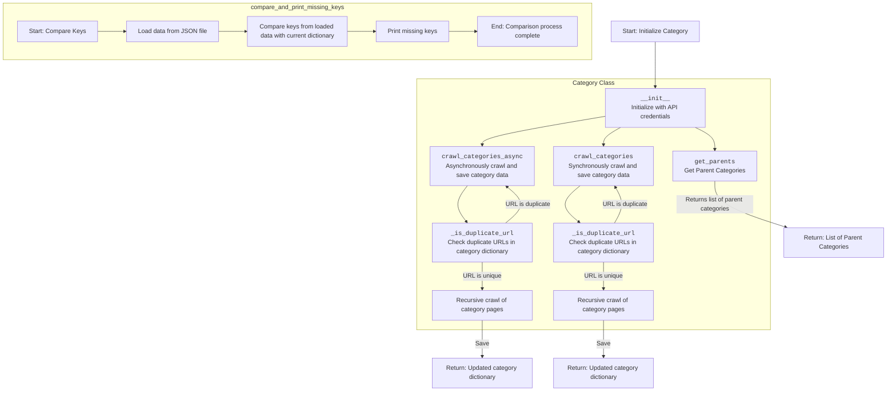
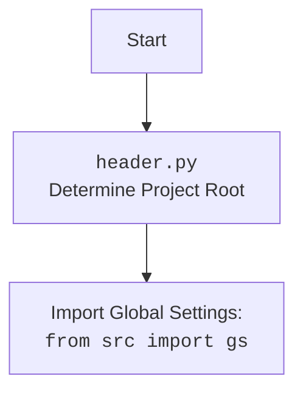

## Анализ кода `src/category/README.MD`

### 1. <алгоритм>

**Класс `Category`:**

1.  **`__init__(self, api_credentials, *args, **kwargs)` (Конструктор):**
    *   Принимает `api_credentials`, `*args`, и `**kwargs`.
    *   Инициализирует объект `Category`, передавая `api_credentials` родительскому классу `PrestaCategory`.
    *   `*args` и `**kwargs` не используются.

2.  **`get_parents(self, id_category, dept)`:**
    *   Принимает `id_category` (ID категории) и `dept` (глубина).
    *   Вызывает метод для получения родительских категорий из API PrestaShop.
    *   Возвращает список родительских категорий.
    *   **Пример:** `get_parents(id_category=123, dept=2)` может вернуть список типа `[{'id': 1, 'name': 'Root'}, {'id': 10, 'name': 'Category A'}]`.

3.  **`crawl_categories_async(self, url, depth, driver, locator, dump_file, default_category_id, category=None)`:**
    *   Принимает URL для обхода, глубину обхода `depth`, экземпляр `driver` Selenium, локатор `locator` для поиска ссылок на категории, путь к файлу `dump_file` для сохранения результатов, ID категории по умолчанию `default_category_id` и опциональный словарь `category`.
    *   Выполняет асинхронный обход страниц категорий, используя Selenium.
    *   Строит иерархический словарь, сохраняет данные в JSON файл.
    *   Рекурсивно обходит страницы.
    *   **Пример:** `crawl_categories_async(url='https://example.com/categories', depth=2, driver=driver, locator='//a[@class="category-link"]', dump_file='categories.json', default_category_id=1)`.

4.  **`crawl_categories(self, url, depth, driver, locator, dump_file, id_category_default, category={})`:**
    *   Принимает параметры аналогичные `crawl_categories_async`, но выполняет синхронный обход.
    *   Рекурсивно обходит страницы категорий, используя Selenium.
    *   Строит иерархический словарь, сохраняет данные в JSON файл.
    *   **Пример:** `crawl_categories(url='https://example.com/categories', depth=2, driver=driver, locator='//a[@class="category-link"]', dump_file='categories.json', id_category_default=1)`.

5.  **`_is_duplicate_url(self, category, url)`:**
    *   Принимает словарь `category` и `url`.
    *   Проверяет, существует ли `url` уже в словаре `category`.
    *   Возвращает `True`, если дубликат, иначе `False`.
    *   **Пример:** `_is_duplicate_url(category={'1': {'url': 'test'}}, url='test')` вернет `True`.

**Функция `compare_and_print_missing_keys(current_dict, file_path)`:**

1.  Принимает словарь `current_dict` и путь к файлу `file_path`.
2.  Загружает данные из JSON файла по пути `file_path`.
3.  Сравнивает ключи из `current_dict` с ключами, прочитанными из файла.
4.  Выводит на экран отсутствующие ключи.
5.  **Пример:** `compare_and_print_missing_keys(current_dict={'a': 1, 'b': 2}, file_path='test.json')`, где test.json содержит `{ "a": 1 }` выведет на экран ключ `b`.

### 2. <mermaid>

**Объяснение зависимостей:**

*   **`StartCategory`**: Начало процесса инициализации класса `Category`.
*   **`InitCategory`**: Конструктор класса `Category` инициализирует объект с API-ключами.
*   **`GetParents`**: Метод получения списка родительских категорий.
*    **`CrawlAsync`**: Асинхронный метод обхода категорий.
*    **`CrawlSync`**: Синхронный метод обхода категорий.
*    **`CheckDuplicateAsync` и `CheckDuplicateSync`**: Метод проверки дубликатов URL-адресов в рамках асинхронного и синхронного обхода.
*   **`CrawlRecursionAsync` и `CrawlRecursionSync`**: Рекурсивные методы для обхода страниц категорий.
*   **`EndCrawlAsync` и `EndCrawlSync`**: Конец методов обхода, возвращают обновленные словари.
*    **`StartCompare`**: Начало процесса сравнения ключей словарей.
*    **`LoadData`**: Загрузка данных из JSON файла.
*    **`CompareDict`**: Сравнение ключей загруженных данных со словарем.
*    **`PrintMissing`**: Печать недостающих ключей.
*    **`EndCompare`**: Конец процесса сравнения.
*   **`Category Class`**: Подграф, включающий методы класса `Category`.
*   **`compare_and_print_missing_keys`**: Подграф, описывающий функцию сравнения ключей.

**Объяснение `header.py`**

*   `Start`: Начало процесса.
*   `Header`:  Определение корневой директории проекта с помощью `header.py`.
*   `import`:  Импорт глобальных настроек из `src.gs`.

### 3. <объяснение>

**Импорты:**

*   `requests`: Библиотека для отправки HTTP-запросов, может использоваться для взаимодействия с API PrestaShop.
*   `lxml`: Библиотека для работы с XML и HTML, используется для парсинга веб-страниц, полученных от Selenium.
*   `asyncio`: Библиотека для асинхронного программирования, используется в `crawl_categories_async`.
*   `selenium`: Библиотека для автоматизации браузера, используется для навигации по веб-сайтам и парсинга динамического контента.
*   `src.endpoints.prestashop.PrestaShop`: Базовый класс для работы с PrestaShop API.
*   `src.endpoints.prestashop.PrestaCategory`: Класс для работы с категориями PrestaShop, от которого наследуется `Category`.
*   `src.utils.jjson.j_loads`: Функция для загрузки данных из JSON файлов.
*   `src.utils.jjson.j_dumps`: Функция для сохранения данных в JSON файлы.
*  `src.logger.logger`: Модуль для логирования событий и ошибок.

**Класс `Category`:**

*   **Роль:** Управляет категориями товаров, взаимодействуя с API PrestaShop и веб-сайтом.
*   **Атрибуты:** Наследует атрибуты от `PrestaCategory`, в том числе `api_credentials`,
*   **Методы:**
    *   `__init__`: Инициализирует объект, устанавливает связь с API PrestaShop.
    *   `get_parents`: Получает список родительских категорий для заданной категории.
    *   `crawl_categories_async`: Асинхронно обходит страницы категорий и строит их иерархическую структуру.
    *   `crawl_categories`: Синхронно обходит страницы категорий и строит их иерархическую структуру.
    *   `_is_duplicate_url`: Проверяет, является ли URL дубликатом в словаре категорий.

**Функция `compare_and_print_missing_keys`:**

*   **Роль:** Сравнивает ключи словаря с данными из файла, предназначен для отслеживания изменений в иерархии категорий.
*   **Аргументы:** Принимает словарь и путь к файлу.
*   **Возвращаемое значение:** Не возвращает значений, выводит на экран недостающие ключи.
*   **Использование:** Полезен для проверки целостности данных при обновлении категорий.

**Переменные:**

*   `api_credentials`: Словарь с ключами API для доступа к PrestaShop.
*   `url`: URL-адрес веб-страницы для обхода.
*   `depth`: Глубина рекурсивного обхода категорий.
*   `driver`: Экземпляр Selenium WebDriver.
*   `locator`: XPath-локатор для поиска ссылок на категории.
*   `dump_file`: Путь к файлу для сохранения данных.
*   `id_category_default`: ID категории по умолчанию.
*   `category`: Словарь для хранения иерархии категорий.
*   `current_dict`: Текущий словарь для сравнения.
*   `file_path`: Путь к файлу для сравнения.

**Потенциальные ошибки и области для улучшения:**

*   **Обработка ошибок:** Отсутствует явная обработка ошибок при работе с API и Selenium, а также при работе с файлами.
*   **Производительность:** Асинхронный обход может быть дополнительно оптимизирован для параллельной обработки нескольких URL.
*   **Универсальность:** Жестко заданные локаторы могут стать проблемой при изменении структуры сайта.
*   **Надежность:** Недостаточно тестов для обеспечения надежности работы.
*   **Безопасность:** Следует рассмотреть безопасную передачу api_credentials.

**Взаимосвязи с другими частями проекта:**

*   `src.endpoints.prestashop`: `Category` зависит от модулей для работы с PrestaShop API.
*   `src.utils.jjson`: использует функции `j_loads` и `j_dumps` для работы с JSON.
*   `src.logger`: используется для логирования событий.

**Цепочка взаимосвязей:**

`Category` -> `PrestaCategory` -> `PrestaShop` -> API PrestaShop
`Category` -> `src.utils.jjson` (работа с файлами JSON)
`Category` -> `selenium` (обход веб-страниц)
`Category` -> `src.logger` (логирование событий)

Этот анализ дает полное представление о структуре, функциях и зависимостях `src/category/README.MD`