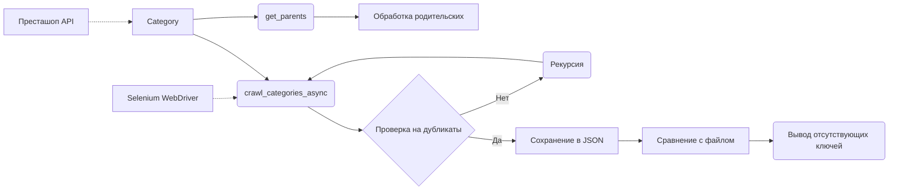

```MD
# Анализ кода модуля `src.category`

## <input code>

```rst
.. :module: src.category
```
# Модуль: Category

## Обзор

Модуль `Category` предоставляет функциональность для работы с категориями продуктов, в основном для PrestaShop. Он предлагает инструменты для взаимодействия с данными о категориях, включая сканирование страниц категорий и управление иерархической структурой категорий.

## Класс: `Category`

Класс `Category` наследуется от `PrestaCategory` и отвечает за обработку категорий продуктов, получение родительских категорий и рекурсивное сканирование страниц категорий.

### Конструктор: `__init__(self, api_credentials, *args, **kwargs)`

Инициализирует объект `Category`.

#### Аргументы:
- `api_credentials`: API-ключи для доступа к данным о категориях.
- `args`: Список аргументов переменной длины (не используется).
- `kwargs`: Словарь аргументов (не используется).

### Метод: `get_parents(self, id_category, dept)`

Получает список родительских категорий.

#### Аргументы:
- `id_category`: ID категории для получения родительских категорий.
- `dept`: Уровень глубины категории.

#### Возвращаемое значение:
- Список родительских категорий.

### Метод: `crawl_categories_async(self, url, depth, driver, locator, dump_file, default_category_id, category=None)`

Асинхронно сканирует категории, создавая иерархический словарь.

#### Аргументы:
- `url`: URL страницы категории.
- `depth`: Глубина рекурсивного сканирования.
- `driver`: Экземпляр Selenium WebDriver.
- `locator`: XPath локатор для ссылок на категории.
- `dump_file`: Путь к JSON-файлу для сохранения результатов.
- `default_category_id`: ID по умолчанию для категории.
- `category`: (Необязательно) Существующий словарь категории (по умолчанию `None`).

#### Возвращаемое значение:
- Обновленный или новый словарь категории.

### Метод: `crawl_categories(self, url, depth, driver, locator, dump_file, id_category_default, category={})`

Рекурсивно сканирует категории и создаёт иерархический словарь.

#### Аргументы:
- `url`: URL страницы для сканирования.
- `depth`: Глубина рекурсии.
- `driver`: Экземпляр Selenium WebDriver.
- `locator`: XPath локатор для нахождения ссылок на категории.
- `dump_file`: Файл для сохранения иерархического словаря.
- `id_category_default`: ID категории по умолчанию.
- `category`: Словарь категории (по умолчанию пустой).

#### Возвращаемое значение:
- Иерархический словарь категорий и их URL.

### Метод: `_is_duplicate_url(self, category, url)`

Проверяет, существует ли URL уже в словаре категории.

#### Аргументы:
- `category`: Словарь категории.
- `url`: URL для проверки.

#### Возвращаемое значение:
- `True`, если URL дублируется, `False` в противном случае.

## Функция: `compare_and_print_missing_keys(current_dict, file_path)`

Сравнивает текущий словарь с данными из файла и выводит отсутствующие ключи.

### Аргументы:
- `current_dict`: Словарь для сравнения.
- `file_path`: Путь к файлу с данными для сравнения.

## Пример использования


## Зависимости

- `requests`
- `lxml`
- `asyncio`
- `selenium`
- `src.endpoints.prestashop.PrestaShop`
- `src.endpoints.prestashop.PrestaCategory`
- `src.utils.jjson.j_loads`
- `src.utils.jjson.j_dumps`
- `src.logger.logger`


## <algorithm>

(Блок-схема - не представлена в формате markdown)

Алгоритм включает иерархическое сканирование категорий, включая рекурсивные вызовы метода `crawl_categories` (или `crawl_categories_async`).  Данные о категориях собираются, обрабатываются и сохраняются в иерархическом словаре.  Ключевые этапы:

1. Инициализация `Category` с API-ключами.
2. Вызов `get_parents` для получения родительских категорий.
3. Вызов `crawl_categories` (или `crawl_categories_async`) для рекурсивного сбора данных о категориях.
4. Проверка на дубликаты URL.
5. Сохранение результатов в JSON-файл.
6. Сравнение результатов с данными из другого файла и вывод отсутствующих ключей.

## <mermaid>



## <explanation>

**Импорты:**
Модуль `src.category` использует множество других модулей из пакета `src`.  Например, `src.endpoints.prestashop.PrestaShop` и `src.endpoints.prestashop.PrestaCategory` предположительно предоставляют API-интерфейсы для взаимодействия с данными PrestaShop.  `src.utils.jjson` содержит функции для работы с JSON (сериализация/десериализация). `src.logger.logger` – модуль для логирования.

**Классы:**
- `Category`:  Центральный класс, отвечающий за работу с категориями.  Наследует от `PrestaCategory`, что предполагает использование абстракции для работы с конкретными данными PrestaShop.  `api_credentials` хранит важные данные для авторизации. `crawl_categories_async` и `crawl_categories` реализуют логику сканирования, используя Selenium для парсинга данных, `get_parents` получает список родительских категорий.  `_is_duplicate_url` – вспомогательный метод для предотвращения дублирования данных.

**Функции:**
- `compare_and_print_missing_keys`:  Функция для сравнения данных из словаря и файла и вывода отсутствующих ключей.

**Переменные:**
Переменные (например, `url`, `depth`, `driver`, `locator`, `dump_file`) – это параметры, необходимые для работы методов класса `Category`, для указания URL-адресов, глубины сканирования, драйвера Selenium и т.д.

**Возможные ошибки и улучшения:**

* **Обработка ошибок:**  В коде отсутствует обработка возможных исключений, например, при сбоях в запросах к API или при работе с Selenium.  Необходима реализация обработки исключений для повышения стабильности кода.
* **Переменная `category`:**  Использование необязательного аргумента `category` в методе `crawl_categories_async` может привести к сложностям в понимании логики программы.
* **Модульная структура:**  Код может быть более структурирован, используя отдельные функции для отдельных задач (например, для извлечения данных из страницы).
* **Документация:**  Документация может быть дополнена более детальными примерами использования и описаниями методов.

**Связь с другими частями проекта:**
Модуль `src.category` тесно связан с модулями `src.endpoints.prestashop` (для взаимодействия с API PrestaShop) и `src.utils.jjson` (для работы с JSON), а также с  `src.logger` для логирования.  Без этих модулей `src.category` не сможет работать корректно.