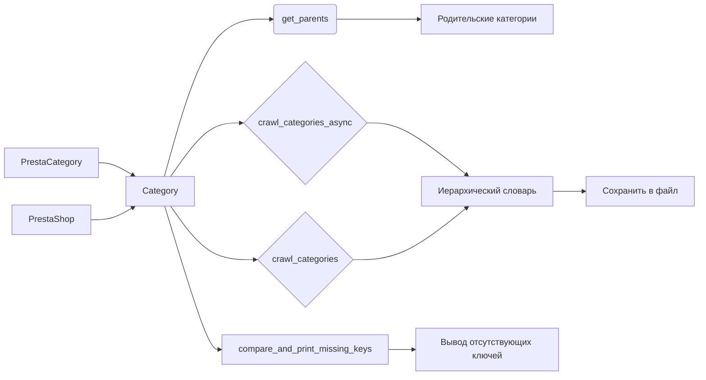

```MD
# Анализ кода модуля `src.category`

## <input code>

```rst
.. module: src.category
```
# Модуль: Category

## Обзор

Модуль `Category` предоставляет функциональность для работы с категориями продуктов, в основном для PrestaShop. Он предлагает инструменты для взаимодействия с данными категорий, включая сканирование страниц категорий и управление иерархической структурой категорий.

## Класс: `Category`

Класс `Category` наследуется от `PrestaCategory` и отвечает за обработку категорий продуктов, получение родительских категорий и рекурсивное сканирование страниц категорий.

### Конструктор: `__init__(self, api_credentials, *args, **kwargs)`

Инициализирует объект `Category`.

#### Аргументы:
- `api_credentials`: Кредиты API для доступа к данным категорий.
- `args`: Список аргументов переменной длины (не используется).
- `kwargs`: Словарь ключевых аргументов (не используется).

### Метод: `get_parents(self, id_category, dept)`

Получает список родительских категорий.

#### Аргументы:
- `id_category`: ID категории для получения родительских категорий.
- `dept`: Уровень глубины категории.

#### Возвращаемое значение:
- Список родительских категорий.

### Метод: `crawl_categories_async(self, url, depth, driver, locator, dump_file, default_category_id, category=None)`

Асинхронно сканирует категории, создавая иерархический словарь.

#### Аргументы:
- `url`: URL страницы категории.
- `depth`: Глубина рекурсии сканирования.
- `driver`: Экземпляр Selenium WebDriver.
- `locator`: XPath локетор для ссылок на категории.
- `dump_file`: Путь к JSON файлу для сохранения результатов.
- `default_category_id`: ID по умолчанию для категории.
- `category`: (Необязательно) Существующий словарь категории (по умолчанию None).

#### Возвращаемое значение:
- Обновленный или новый словарь категории.

### Метод: `crawl_categories(self, url, depth, driver, locator, dump_file, id_category_default, category={})`

Рекурсивно сканирует категории и строит иерархический словарь.

#### Аргументы:
- `url`: URL страницы для сканирования.
- `depth`: Глубина рекурсии.
- `driver`: Экземпляр Selenium WebDriver.
- `locator`: XPath локетор для нахождения ссылок на категории.
- `dump_file`: Файл для сохранения иерархического словаря.
- `id_category_default`: ID категории по умолчанию.
- `category`: Словарь категории (по умолчанию пустой).

#### Возвращаемое значение:
- Иерархический словарь категорий и их URL.

### Метод: `_is_duplicate_url(self, category, url)`

Проверяет, существует ли URL в словаре категорий.

#### Аргументы:
- `category`: Словарь категории.
- `url`: URL для проверки.

#### Возвращаемое значение:
- `True`, если URL дублируется, `False` в противном случае.

## Функция: `compare_and_print_missing_keys(current_dict, file_path)`

Сравнивает текущий словарь с данными из файла и выводит любые отсутствующие ключи.

### Аргументы:
- `current_dict`: Словарь для сравнения.
- `file_path`: Путь к файлу с данными для сравнения.


## Пример использования

```python
from src.category import Category

# Инициализация Category с API-кредитами
category = Category(api_credentials={'api_key': 'your_api_key'})

# Получение родителей категории
parents = category.get_parents(id_category=123, dept=2)

# Асинхронное сканирование категорий
category_data = await category.crawl_categories_async(
    url='https://example.com/categories',
    depth=3,
    driver=driver_instance,
    locator='//a[@class="category-link"]',
    dump_file='categories.json',
    default_category_id=123
)

# Сравнение текущих данных категории с файлом и вывод отсутствующих ключей
compare_and_print_missing_keys(current_dict=category_data, file_path='saved_categories.json')
```

## Зависимости

- `requests`
- `lxml`
- `asyncio`
- `selenium`
- `src.endpoints.prestashop.PrestaShop`
- `src.endpoints.prestashop.PrestaCategory`
- `src.utils.jjson.j_loads`
- `src.utils.jjson.j_dumps`
- `src.logger.logger`


## <mermaid>



## <explanation>

**Импорты:**
- Модули `requests`, `lxml`, `asyncio`, `selenium` обеспечивают базовые функции сетевого взаимодействия, парсинга XML/HTML, асинхронной обработки и работы с веб-драйверами.
- `src.endpoints.prestashop.PrestaShop` и `src.endpoints.prestashop.PrestaCategory` — это, вероятно, классы, предоставляющие доступ к API PrestaShop и конкретно к категории продуктов.
- `src.utils.jjson.j_loads` и `src.utils.jjson.j_dumps` — модули для сериализации/десериализации JSON данных.
- `src.logger.logger` — модуль для ведения журналов.

**Классы:**
- `Category`: Центральный класс модуля, взаимодействующий с API PrestaShop. Он имеет методы для получения родительских категорий, рекурсивного сканирования категорий, сохранения результатов и сравнения с другими данными. Он наследуется от `PrestaCategory`, что указывает на тесную интеграцию с API PrestaShop.

**Функции:**
- `compare_and_print_missing_keys`: Сравнивает текущие данные с данными из файла и выводит недостающие ключи. Эта функция позволяет отслеживать изменения в данных.

**Переменные:**
- `api_credentials`, `id_category`, `dept`, `url`, `depth`, `driver`, `locator`, `dump_file`, `default_category_id`:  Переменные, используемые для инициализации, работы с категориями и сканирования.

**Возможные ошибки и улучшения:**
- Отсутствие проверки валидности входных данных (например, правильность `url`, `id_category`).
- Не указано поведение при ошибках (например, HTTP ошибки, отсутствие доступа к API).
- Возможные проблемы производительности при рекурсивном сканировании глубоких категорий.
- Лучше было бы использовать try...except блоки для обработки возможных исключений (например, `requests.exceptions.RequestException`, `selenium.common.exceptions.WebDriverException`).
- Добавление логирования для отслеживания прогресса сканирования и ошибок.
- Модуль `src.category` тесно связан с `src.endpoints.prestashop` для работы с API.  Необходима тщательная документация на уровне пакета для понимания полного контекста.


**Взаимосвязи с другими частями проекта:**
Модуль `src.category` напрямую использует API Престашоп, указанный в `src.endpoints.prestashop`.  Он также полагается на другие служебные модули, такие как `src.utils.jjson`, для обработки JSON данных и `src.logger` для логирования. Это указывает на модульную архитектуру проекта, где `src.category` использует уже имеющиеся компоненты для достижения своих целей.