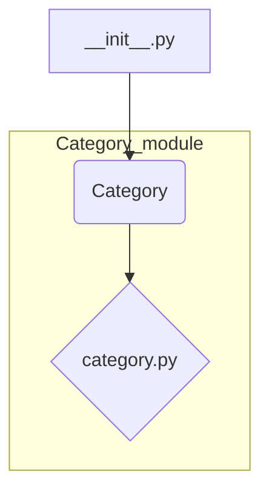

# <input code>

```python
## \file hypotez/src/category/__init__.py
# -*- coding: utf-8 -*-
#! venv/Scripts/python.exe
#! venv/bin/python/python3.12

"""
.. module: src.category 
	:platform: Windows, Unix
	:synopsis:

"""
MODE = 'dev'

from .category import Category
```

# <algorithm>

В данном файле `__init__.py` находится инициализирующая часть модуля `src.category`.  Алгоритм работы состоит из единственного шага:

1. Импортирует класс `Category` из файла `category.py` внутри текущей подпапки.


**Пример:**

Файл `category.py` (в подпапке `hypotez/src/category`) содержит определение класса `Category`. При выполнении кода из `__init__.py` будет доступен этот класс.


# <mermaid>



**Объяснение диаграммы:**

* `__init__.py`: Этот файл является инициализирующим для пакета `src.category`.
* `Category`:  Это класс, определенный в файле `category.py` и импортированный в `__init__.py`.
* `category.py`: Содержит определение класса `Category`.  Эта зависимость подразумевается, поскольку `__init__.py` импортирует `Category` из него.

# <explanation>

* **Импорты:**  `from .category import Category` импортирует класс `Category` из файла `category.py`, находящегося в той же директории.  Символ `.` перед `category` указывает, что Python должен искать модуль `category` в текущем пакете (`src.category`).  Это стандартная практика для организации модулей в Python пакетах.  Связь с другими частями проекта косвенная - `category.py` содержащий класс `Category`  должен существовать для корректной работы этого модуля.


* **Классы:**  Код импортирует класс `Category`. Подробное описание этого класса, его атрибутов и методов содержится в файле `category.py`, который не предоставляется в данном запросе.


* **Функции:**  В данном файле нет определений функций, только импорт.


* **Переменные:** `MODE = 'dev'` - переменная, хранящая строку 'dev'.  Она может использоваться для обозначения режима работы (например, разработки), но ее использование в текущем фрагменте кода не ясно без контекста остальной части проекта.


* **Возможные ошибки или улучшения:**


    * Отсутствие документации для `MODE`.
    * Неясно, используется ли `MODE`.
    * Необходимо просмотреть `category.py` для понимания полного контекста и структуры кода.

**Цепочка взаимосвязей:**

Файл `hypotez/src/category/__init__.py` импортирует класс `Category`, который, предположительно, используется в других частях проекта (например, `hypotez/src/main.py`) для работы с категориями.  Без доступа к `category.py` сложно дать более полное представление о взаимосвязях.  В дальнейшем, если `category.py` содержит функции и методы, будут прослеживаться и другие зависимости в проекте.