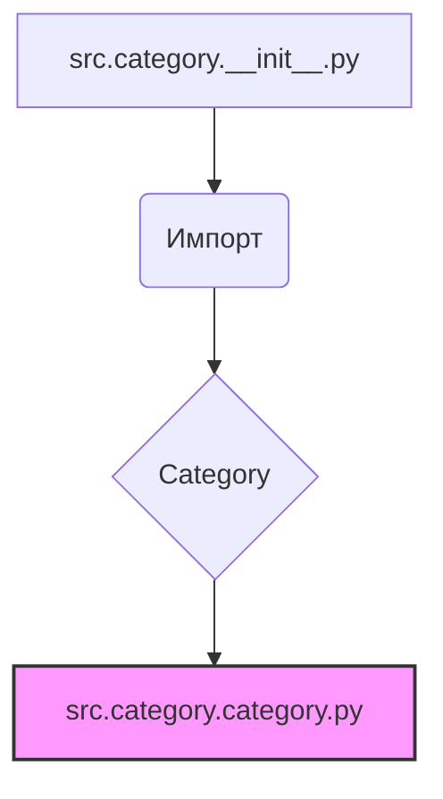

# <input code>

```python
## \file hypotez/src/category/__init__.py
# -*- coding: utf-8 -*-\
#! venv/Scripts/python.exe
#! venv/bin/python/python3.12

"""
.. module: src.category 
	:platform: Windows, Unix
	:synopsis:

"""
MODE = 'dev'

from .category import Category
```

# <algorithm>

Алгоритм работы представленного кода очень прост. Он импортирует класс `Category` из модуля `category.py` внутри пакета `src.category`.  Никаких вычислений или сложных операций здесь нет. Всё сводится к импорту.

**Пошаговая блок-схема:**

1. **Импорт:** Модуль `src.category.__init__.py` импортирует класс `Category` из модуля `src.category.category.py`.
   * **Пример:**  Предполагается, что `src.category.category.py` содержит определение класса `Category`.
2. **Инициализация:**  Переменной `MODE` присваивается строковое значение 'dev'.
   * **Пример:**  Эта переменная, скорее всего, используется для настройки поведения системы в различных режимах (например, разработки 'dev', производства 'prod').

**Перемещение данных:**

В этом случае данных как таковых нет.  Только ссылка на класс `Category`.

# <mermaid>



**Объяснение диаграммы:**

* `src.category.__init__.py` - текущий файл, который импортирует.
* `Импорт` - действие импорта класса `Category`.
* `Category` -  имя импортируемого класса.
* `src.category.category.py` - модуль, содержащий определение класса `Category`.
  Файл `src.category.category.py` выделен цветом, чтобы указать, что это отдельный модуль или файл, а не просто часть текущего `__init__.py`.

# <explanation>

* **Импорты:**
    * `from .category import Category`: Эта строка импортирует класс `Category` из модуля `category.py`, который находится в том же пакете (`src.category`).  Символ `.` указывает, что нужно искать импортируемый модуль в текущем пакете.  Это типичный способ организации Python-кода, позволяющий импортировать модули из текущей директории.

* **Классы:**
    * `Category`: Этот класс определен в файле `src.category.category.py` (который не показан).  Без доступа к этому файлу сложно определить его точную роль, атрибуты и методы.

* **Функции:**
    * Нет функций в данном `__init__.py`.

* **Переменные:**
    * `MODE = 'dev'`:  Эта переменная, скорее всего, используется для настройки режима работы (например, разработка, производство). Её значение 'dev' указывает на режим разработки.

* **Возможные ошибки или области для улучшений:**

    * **Отсутствие документации:**  В `src.category.category.py` желательно добавить полное описание класса `Category`, его методов и атрибутов.
    * **Сложные логические связи:**  Без доступа к `src.category.category.py` трудно судить о сложностях логики.

* **Взаимосвязи с другими частями проекта:**

    Без кода `src.category.category.py` нельзя точно сказать, как `Category` используется в других частях проекта.  Можно предположить, что он используется в других модулях для создания экземпляров, или для работы с данными.

**Дополнительные замечания:**
Строки `#! venv/Scripts/python.exe` и `#! venv/bin/python/python3.12` - это шебанги, указывающие интерпретатор Python для выполнения скрипта. Обычно они не нужны в современном Python.

В целом, `__init__.py` выполняет стандартную функцию инициализации для пакета `src.category`. Он подготавливает к использованию класс `Category` в других частях проекта.  Для более полного анализа требуется доступ к коду `src.category.category.py`.