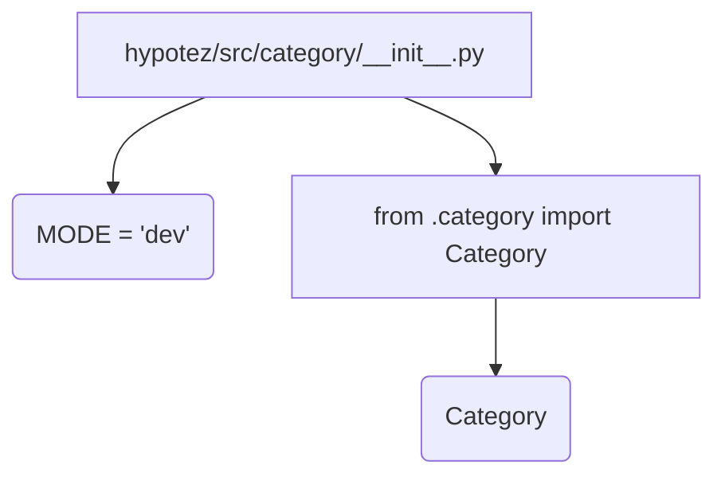

# <input code>

```python
## \file hypotez/src/category/__init__.py
# -*- coding: utf-8 -*-\
#! venv/Scripts/python.exe
#! venv/bin/python/python3.12

"""
.. module: src.category 
	:platform: Windows, Unix
	:synopsis:

"""
MODE = 'dev'

from .category import Category
```

# <algorithm>

Этот код представляет собой инициализационный модуль для пакета `src.category`. Он импортирует класс `Category` из подпапки `category`.  Алгоритм работы сводится к следующему:

1. **Определение константы `MODE`:** Устанавливает значение переменной `MODE` в строку 'dev'. Это, скорее всего, режим работы приложения, но без контекста проекта сложно сказать, какое значение она имеет.

2. **Импорт класса `Category`:** Импортирует класс `Category` из файла `category.py` в текущей подпапке.  Этот импорт делает класс `Category` доступным в других модулях, относящихся к категории.


# <mermaid>



**Описание диаграммы:**

* **A:** Модуль `hypotez/src/category/__init__.py`.
* **B:**  Переменная `MODE` инициализируется со значением 'dev'.
* **C:** Импортируется класс `Category` из подпапки `category`.
* **D:** Класс `Category`, находящийся в файле `category.py`.

**Зависимости:**

Код напрямую зависит от файла `category.py`, находящегося в подпапке `hypotez/src/category`.  Этот файл содержит определение класса `Category`, который импортируется.


# <explanation>

* **Импорты:**
    * `from .category import Category`:  Этот импорт подключает определение класса `Category` из файла `category.py`, находящегося в текущей директории (`.category`).  Это стандартный импорт внутри пакета Python.  Важно понимать, что импорт работает, так как директория `hypotez/src/category` содержит файл `category.py`.

* **Классы:**
    * `Category`: Определение этого класса содержится в файле `category.py`.  Без доступа к этому файлу невозможно проанализировать детали этого класса (атрибуты, методы и т.д.)  Дальнейшая информация требует анализа `category.py`.

* **Функции:**
    * Нет функций. В файле только импорт и константа.

* **Переменные:**
    * `MODE`:  Это константа со строковым значением. Вероятно, используется для определения режима работы приложения.  Без дополнительных контекстов значение этой переменной неясно.

* **Возможные ошибки или области для улучшений:**

    * **Отсутствие документации:** Файл `category/__init__.py` содержит только импорт и константу `MODE`, но без документации к классу `Category` трудно оценить назначение.
    * **Неясная функциональность константы `MODE`:** Без контекста, трудно понять роль этой константы в проекте.
    * **Нехватка данных о `category.py`:** Необходимо проанализировать файл `category.py` для полного понимания функциональности.

**Цепочка взаимосвязей:**

Файл `category/__init__.py` служит входом для доступа к классу `Category`.  Дальнейшее использование этого класса в других частях проекта будет зависеть от конкретных модулей, которые импортируют `Category`.  Без анализа этих других модулей, цепочка взаимосвязей остаётся неполной.