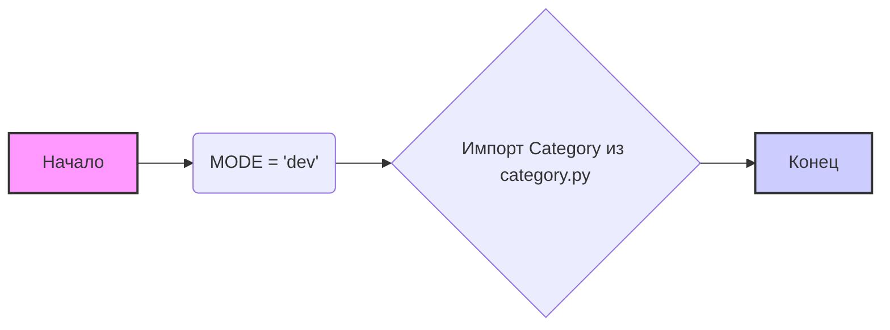

## Анализ кода `hypotez/src/category/__init__.py`

### <алгоритм>

1.  **Инициализация переменной `MODE`**: Устанавливается глобальная переменная `MODE` со значением `'dev'`. Это может указывать на то, что приложение находится в стадии разработки.
    *   Пример: `MODE = 'dev'`
2.  **Импорт класса `Category`**: Импортируется класс `Category` из модуля `category.py`, находящегося в той же директории. Этот класс, вероятно, используется для представления категорий.
    *   Пример: `from .category import Category`
3.  **Завершение**: После импорта и инициализации код готов к использованию класса `Category` в других частях проекта.

### <mermaid>

**Описание диаграммы `mermaid`**:

*   `A`: Начало выполнения скрипта.
*   `B`: Инициализация переменной `MODE` значением `'dev'`. Эта переменная, вероятно, используется для определения режима работы приложения.
*   `C`: Импорт класса `Category` из файла `category.py`, расположенного в текущем каталоге. Этот класс предположительно отвечает за представление и управление категориями.
*   `D`: Конец выполнения скрипта.

### <объяснение>

**Импорты**:

*   `from .category import Category`: Импортирует класс `Category` из модуля `category.py`, находящегося в той же директории. Это позволяет использовать класс `Category` в других модулях, импортирующих этот файл. Логика класса `Category` может быть связана с созданием, чтением, обновлением и удалением категорий.

**Переменные**:

*   `MODE = 'dev'`: Глобальная переменная `MODE`, установленная в значение `'dev'`, что указывает на режим разработки. Это может влиять на поведение приложения (например, логирование, вывод отладочной информации). Возможно, в других частях проекта проверяется значение этой переменной для настройки работы.

**Классы**:

*   `Category`: Класс, импортируемый из `category.py`. Его реализация не видна в данном коде, но предполагает наличие методов для работы с категориями (например, создание, удаление, редактирование).

**Функции**:

*   В данном коде функции отсутствуют.

**Цепочка взаимосвязей с другими частями проекта**:

1.  Модуль `src.category` представляет собой пакет, предназначенный для работы с категориями.
2.  Инициализация переменной `MODE` может влиять на поведение приложения в целом, в зависимости от того, как эта переменная используется в других частях проекта.
3.  Импорт класса `Category` позволяет использовать этот класс в других модулях проекта для создания объектов категорий и их управления.

**Потенциальные ошибки или области для улучшения**:

*   **Отсутствие комментариев**: Код содержит минимальное количество комментариев, что может затруднить его понимание.
*   **Неявное использование `MODE`**: Не ясно, в каких еще модулях используется переменная `MODE`. Стоит сделать использование более явным.
*   **Предположение о классе `Category`**: Код полагается на наличие класса `Category` в `category.py`, но не проверяет его существование или корректность, что может привести к ошибкам при запуске.

**Дополнительные замечания:**

*   `# -*- coding: utf-8 -*-` указывает на кодировку файла.
*   `#! venv/Scripts/python.exe` и `#! venv/bin/python/python3.12` являются shebang-строками для Unix-подобных и Windows систем, указывают интерпретатор Python для запуска скрипта.
*   Строка `"""..."""` является docstring модуля.