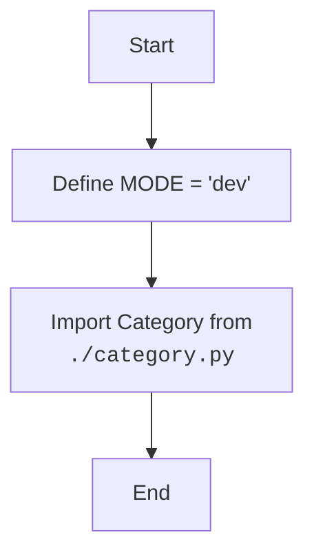

## Анализ кода `hypotez/src/category/__init__.py`

### <алгоритм>

1.  **Начало:** Исполнение файла `__init__.py` начинается.
2.  **Объявление `MODE`:** Определяется переменная `MODE` и ей присваивается строковое значение `'dev'`.
    *   **Пример:** `MODE = 'dev'` задает режим разработки.
3.  **Импорт `Category`:** Из модуля `category.py`, находящегося в той же директории, импортируется класс `Category`.
    *   **Пример:** `from .category import Category` импортирует класс `Category`.
4.  **Конец:** Завершение исполнения файла.

### <mermaid>

### <объяснение>

**Импорты:**

-   `from .category import Category`: Эта строка импортирует класс `Category` из модуля `category.py`, расположенного в той же директории, что и файл `__init__.py`. Точка `.` означает относительный импорт, что является стандартным способом импортирования модулей внутри пакета.  `Category` - это имя класса, которое становится доступным в текущем пространстве имен после импорта. Это позволяет использовать класс `Category`, не ссылаясь на него через имя модуля, в котором он находится.

**Переменные:**

-   `MODE = 'dev'`: Эта переменная устанавливает режим работы. Значение `'dev'` говорит о том, что код сейчас находится в режиме разработки. Вероятно, это значение будет использоваться для настройки поведения приложения, например, включать отладочную информацию или использовать тестовые базы данных.

**Файл `__init__.py`:**

-   Файл `__init__.py` в Python используется для обозначения директории как пакета. Он выполняется при импорте пакета и часто используется для инициализации пакета, импорта подмодулей и классов, а также для определения глобальных переменных пакета.
-   В данном случае файл инициализирует пакет `src.category` путем определения переменной `MODE` и импорта класса `Category`. Это позволяет другим модулям в проекте импортировать и использовать класс `Category` как `from src.category import Category`.

**Цепочка взаимосвязей:**

1.  **`src.category`:** Этот пакет теперь можно импортировать, и  он содержит класс `Category` и переменную `MODE`.
2.  **Другие части проекта:** Любой другой модуль в проекте, который импортирует пакет `src.category`, может использовать класс `Category` и переменную `MODE`.
3.  **`category.py`:** В файле `category.py` должен быть определен класс `Category`, который используется в  файле `__init__.py`.

**Потенциальные ошибки и области для улучшения:**

-   **Отсутствие комментариев:** Код относительно прост, но добавление комментариев к переменной `MODE`, например, `MODE = 'dev' # режим разработки`, помогло бы лучше понять его назначение при первом чтении.
-   **Потенциальная неиспользуемая переменная:** Если переменная `MODE` не используется где-либо в коде, то это может быть избыточным объявлением, и в этом случае ее следует убрать или использовать в дальнейшем.
-   **Отсутствие документации:** Хорошо бы добавить docstring для пакета, чтобы объяснить его назначение и использование.
-   **Обработка ошибок:** В коде нет обработки ошибок, что может быть потенциальной проблемой в более сложных проектах.

В целом, код выполняет свою задачу - инициализирует пакет и делает доступным класс `Category`.