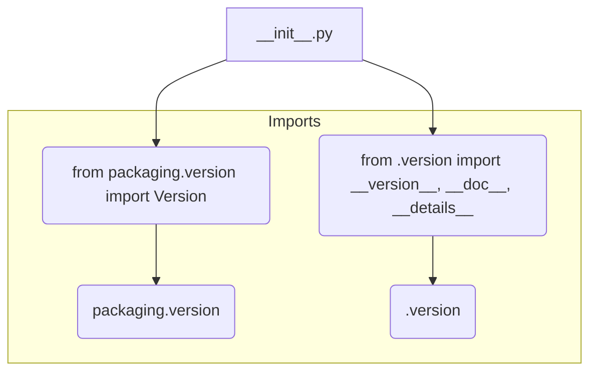

1. **<input code>**

```python
## \file hypotez/src/category/_examples/__init__.py
# -*- coding: utf-8 -*-
#! venv/Scripts/python.exe
#! venv/bin/python/python3.12

"""
.. module: src.category._examples 
	:platform: Windows, Unix
	:synopsis:

"""
MODE = 'dev'

"""
	:platform: Windows, Unix
	:synopsis:

"""


"""
	:platform: Windows, Unix
	:synopsis:

"""


"""
  :platform: Windows, Unix

"""
"""
  :platform: Windows, Unix
  :platform: Windows, Unix
  :synopsis:
"""MODE = 'dev'
  
""" module: src.category._examples """


""" @namespace src.category._examples """


""" """
...

from packaging.version import Version
from .version import __version__, __doc__, __details__
```

2. **<algorithm>**

Этот код представляет собой инициализационный файл для модуля `src.category._examples`.  Он не содержит логики обработки данных, а скорее служит для импорта и определения метаданных.  Поскольку он не содержит операторов цикла или условных операторов, алгоритм работы очень прост и сводится к импорту.

3. **<mermaid>**



4. **<explanation>**

* **Импорты**:
    * `from packaging.version import Version`: Импортирует класс `Version` из пакета `packaging.version`.  Этот пакет используется для работы с версиями программного обеспечения.  Связь с `src` - опосредованная через внешнюю библиотеку.  Импорт нужен для потенциальной работы с версиями.
    * `from .version import __version__, __doc__, __details__`: Импортирует переменные `__version__`, `__doc__`, и `__details__` из файла `version.py` в текущей подпапке (`./version.py`).  Этот файл, вероятно, содержит метаданные о версии, документации и других деталях модуля `src.category._examples`.  Связь - локальная, внутри проекта.


* **Классы**:  В коде нет определений классов.

* **Функции**: Нет определений функций.

* **Переменные**:
    * `MODE = 'dev'`:  Глобальная переменная, вероятно, задаёт режим работы модуля (например, 'dev', 'prod'). Значение  не используется в текущем файле, но может быть использовано в других файлах пакета.

* **Возможные ошибки или области для улучшений**:
    * **Документация**:  Неплохо было бы добавить более подробную документацию к переменной `MODE`.
    * **Неиспользуемые комментарии**:  Многие строки комментариев в стиле `"""..."""` не несут никакой практической пользы. Их можно удалить или переработать, если они не содержат важной информации о функциональности.
    * **Многократное определение MODE**: Переменная `MODE` определена несколько раз, что может вызывать путаницу.  Необходимо  оставить только одно определение.

* **Цепочка взаимосвязей**: Файл `__init__.py` в данном случае служит точкой входа и связующим элементом для модулей `src.category._examples`, в частности для файла `version.py`.


**Общее:**

Код представляет собой типичный __init__.py файл, необходимый для создания модуля Python. Он устанавливает импорт, который необходим для корректной работы других файлов в папке `src.category._examples`.  Важно отметить, что `__version__`, `__doc__`, и `__details__` предполагается хранятся в файле `version.py`, а не в `__init__.py`.  Это стандартная практика для структурирования модулей Python.  Несмотря на отсутствие значимых действий, этот файл играет важную роль в формировании пакета, и его логика является типовой.