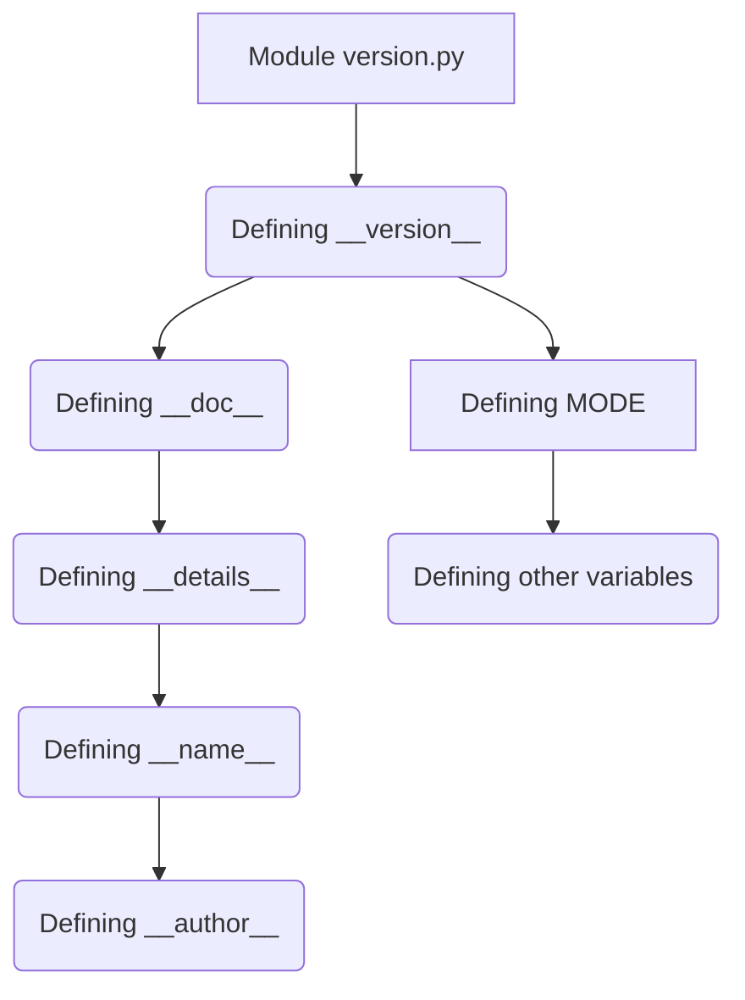

# <input code>

```python
## \file hypotez/src/category/_examples/version.py
# -*- coding: utf-8 -*-\
#! venv/Scripts/python.exe
#! venv/bin/python/python3.12

"""
.. module: src.category._examples 
	:platform: Windows, Unix
	:synopsis:

"""
MODE = 'dev'

"""
	:platform: Windows, Unix
	:synopsis:

"""


"""
	:platform: Windows, Unix
	:synopsis:

"""


"""
  :platform: Windows, Unix

"""
"""
  :platform: Windows, Unix
  :platform: Windows, Unix
  :synopsis:
"""MODE = 'dev'
  
""" module: src.category._examples """


""" @namespace src.category._examples """


"""
- `__version__`: This variable holds the version of the module or package.
- `__name__`: Contains the name of the module. If the script is being run directly, the value will be `"__main__"`.
- `__doc__`: The module's documentation string.
- `__details__`: This variable likely contains additional details about the module, but the exact purpose depends on the specific module or package.
- `__annotations__`: Contains type annotations for variables and functions in the module.
- `__author__`: The name(s) of the author(s) of the module.
"""
__name__:str
__version__="3.12.0.0.0.4"
__doc__:str
__details__:str="Details about version for module or class"
__annotations__

__author__='hypotez '
```

# <algorithm>

Этот код представляет собой определение модуля Python, вероятно, для версии или метаданных.  Алгоритм работы заключается в объявлении глобальных переменных, документировании модуля (и других элементов, вероятно, для внутреннего использования) и определении ключевых констант (например, `__version__`).  Нет явного цикла или итерации.

Пример: Этот код - часть более крупного проекта, где переменные `__version__`, `__doc__`, и другие, вероятно, используются для управления версиями, генерации документации, и/или других функций, связанных с сборкой, развертыванием или управлением проектом.


# <mermaid>




# <explanation>

Этот код определяет модуль Python, вероятно, относящийся к категории `hypotez/src/category/_examples`.  Он содержит переменные, которые используются для описания модуля, например, версия, документация и автор.  Важно отметить следующее:

* **Импорты:**  В данном коде нет импортов. Все переменные определяются внутри файла. Это типично для модулей, которые сами по себе содержат все необходимые данные.

* **Классы:**  В коде нет классов. Он содержит только глобальные переменные.

* **Функции:**  Нет функций.  Этот код содержит определения констант и атрибутов модуля.

* **Переменные:**
    * `MODE = 'dev'`: Глобальная переменная, хранящая строку 'dev', вероятно, для обозначения режима разработки.
    * `__version__ = "3.12.0.0.0.4"`:  Переменная, хранящая версию модуля.
    * `__doc__`, `__details__`, `__name__`, `__author__`, `__annotations__`:  Переменные, документирующие модуль.


**Возможные ошибки и области для улучшений:**

* **Неявные зависимости:** Код предполагает использование `#!` для указания интерпретатора. Это нестандартный способ и может не работать во всех средах.  Лучше использовать стандартный импорт.
* **Docstrings:** Документированные строки (`"""..."""`)  являются хорошей практикой, но они могли бы быть более информативными и соответствовать стандарту Sphinx или NumPy, если это ожидается.
* **Типизация:** Добавленная строка `__annotations__` - это намерение, но не реализовано. Типизация переменных, особенно, `__name__`, `__author__` и так далее,  может повысить читаемость и помочь в статических анализаторах.
* **Конвенции именования:** Использование `__version__` и т.д. - это стандарт в Python для внутренних атрибутов.


**Цепочка взаимосвязей с другими частями проекта:**

Этот файл, скорее всего, является частью структуры пакета `hypotez`.  Значения `__version__`, `__doc__`, и т.д. могут использоваться в системах управления версиями (например, `setuptools`), сборки документации, и в общем управлении проектом `hypotez`.  Важно, что он находится в подпапке `_examples`.  Это указывает на то, что он может быть частью учебной или демонстрационной части проекта, не являясь частью основных функциональных частей проекта.