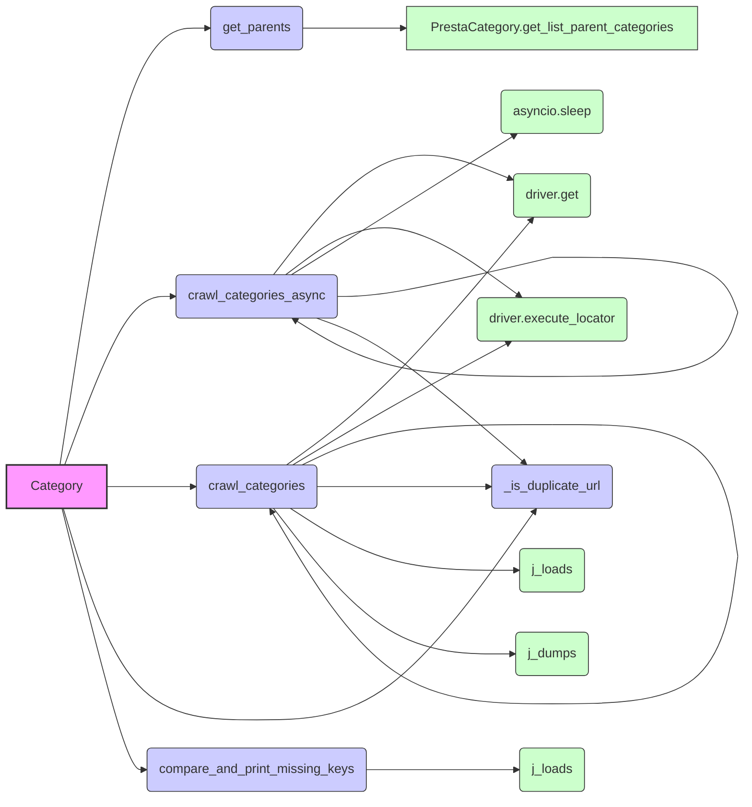

## Анализ кода `hypotez/src/category/category.py`

### 1. <алгоритм>

**1. Инициализация `Category`:**
   - Создается экземпляр класса `Category`, который наследуется от `PrestaCategory`.
   - Инициализация принимает `api_credentials` для доступа к данным PrestaShop.
   - Пример:
     ```python
     category_instance = Category(api_credentials={"api_key": "...", "url": "..."})
     ```

**2. Получение родительских категорий (`get_parents`):**
   - Метод `get_parents` вызывает метод `get_list_parent_categories` базового класса `PrestaCategory` для получения родительских категорий по `id_category`.
   - Пример:
     ```python
     parent_categories = category_instance.get_parents(id_category=123, dept=2)
     ```

**3. Асинхронный обход категорий (`crawl_categories_async`):**
   - Рекурсивно обходит категории, начиная с указанного `url`.
   - Использует `asyncio` для асинхронного выполнения.
   - Получает ссылки на категории, используя `driver.execute_locator` по `locator`.
   - Для каждой найденной ссылки рекурсивно вызывает `crawl_categories_async` с уменьшенной глубиной.
   - Создаёт структуру вложенных словарей с информацией о категориях, `url`, `name` и категориями prestashop, при этом проверяет дубликаты через `_is_duplicate_url`.
   - При каждой итерации глубина `depth` уменьшается на 1.
   - Пример:
     ```python
     # Предполагается, что driver - это экземпляр Selenium WebDriver
     # locator - это XPath локатор
     # dump_file - путь к файлу
     async def main():
         categories = await category_instance.crawl_categories_async(
             url="https://example.com/categories",
             depth=3,
             driver=driver,
             locator="//a[@class='category-link']",
             dump_file="categories.json",
             default_category_id=1,
         )
     asyncio.run(main())
     ```

**4. Синхронный обход категорий (`crawl_categories`):**
   - Рекурсивно обходит категории, начиная с указанного `url`.
   - Использует синхронные вызовы `driver.get` и `driver.execute_locator`.
   - Аналогично `crawl_categories_async`, но работает синхронно.
   - Записывает результат в `dump_file` с помощью `j_loads` и `j_dumps`, при этом проверяет дубликаты через `_is_duplicate_url`.
   - Пример:
     ```python
     categories = category_instance.crawl_categories(
         url="https://example.com/categories",
         depth=3,
         driver=driver,
         locator="//a[@class='category-link']",
         dump_file="categories.json",
         id_category_default=1,
     )
     ```

**5. Проверка дубликатов URL (`_is_duplicate_url`):**
   - Проверяет, существует ли указанный `url` в значениях словаря `category`.
   - Пример:
     ```python
     is_duplicate = category_instance._is_duplicate_url(category={"category1": {"url": "https://example.com"}}, url="https://example.com") # Вернет True
     is_duplicate = category_instance._is_duplicate_url(category={"category1": {"url": "https://example.com"}}, url="https://example.net") # Вернет False
     ```

**6. Сравнение и вывод отсутствующих ключей (`compare_and_print_missing_keys`):**
   - Загружает данные из `file_path` через `j_loads`.
   - Сравнивает ключи загруженных данных с ключами `current_dict`.
   - Выводит в консоль отсутствующие ключи.
   - Пример:
    ```python
        compare_and_print_missing_keys(
            current_dict={"key1": "value1", "key2": "value2"},
            file_path="data.json",
        )
     ```
    Если `data.json` содержит `{ "key1": "data", "key3": "data"}`, то будет выведено `key3`.

### 2. <mermaid>



**Зависимости:**

-   **`Category`** - Главный класс для работы с категориями, управляет логикой обхода и обработки категорий.
-   **`get_parents`** -  Метод, получающий список родительских категорий.
    -   Использует **`PrestaCategory.get_list_parent_categories`** из базового класса.
-   **`crawl_categories_async`** - Метод для асинхронного обхода категорий.
    -   Использует **`driver.get`** для загрузки веб-страниц.
    -   Использует **`driver.execute_locator`** для извлечения ссылок на категории.
    -   Использует **`asyncio.sleep`** для ожидания загрузки страниц.
     - Вызывает сам себя рекурсивно для обхода дочерних категорий
      - Использует **`_is_duplicate_url`** для проверки дубликатов.
-  **`crawl_categories`** - Метод для синхронного обхода категорий.
    -   Использует **`driver.get`** для загрузки веб-страниц.
    -   Использует **`driver.execute_locator`** для извлечения ссылок на категории.
    - Вызывает сам себя рекурсивно для обхода дочерних категорий.
    -   Использует **`_is_duplicate_url`** для проверки дубликатов.
    -   Использует **`j_loads`** для загрузки данных из JSON файла.
    -   Использует **`j_dumps`** для сохранения данных в JSON файл.
-   **`_is_duplicate_url`** - Метод для проверки, является ли URL дубликатом.
-   **`compare_and_print_missing_keys`** - Функция для сравнения ключей двух словарей и печати отсутствующих.
    -  Использует **`j_loads`** для загрузки данных из JSON файла.

### 3. <объяснение>

**Импорты:**

-   `asyncio`: Для асинхронного программирования, используется в `crawl_categories_async`.
-   `pathlib.Path`: Для работы с путями к файлам.
-   `os`: Для операций с файловой системой.
-   `typing.Dict`: Для типизации словарей.
-   `lxml.html`: Для работы с HTML.
-   `requests`: Для HTTP запросов.
-   `header`: Возможно, содержит заголовки для HTTP-запросов, но не используется в предоставленном коде.
-   `src.gs`: Вероятно, глобальные настройки или переменные.
-   `src.logger.logger`: Логгер для записи сообщений об ошибках и другой информации.
-   `src.utils.jjson`: Модуль для работы с JSON, с безопасной обработкой (вероятно, `j_loads` и `j_dumps` для безопасной сериализации и десериализации).
-   `src.endpoints.prestashop`: Содержит классы `PrestaShop` и `PrestaCategory` для взаимодействия с PrestaShop API.

**Классы:**

-   **`Category(PrestaCategory)`**:
    -   **Роль**: Обработчик категорий, наследуется от `PrestaCategory`, чтобы использовать общую логику для работы с API PrestaShop.
    -   **Атрибуты**:
        -   `credentials`: Словарь для хранения учетных данных API.
    -   **Методы**:
        -   `__init__(self, api_credentials, *args, **kwargs)`: Инициализирует объект категории, передавая `api_credentials` в конструктор базового класса `PrestaCategory`.
        -   `get_parents(self, id_category, dept)`: Получает список родительских категорий, используя метод `get_list_parent_categories` из `PrestaCategory`.
        -   `crawl_categories_async(self, url, depth, driver, locator, dump_file, default_category_id, category=None)`: Асинхронно обходит категории и строит иерархический словарь.
        -   `crawl_categories(self, url, depth, driver, locator, dump_file, id_category_default, category={})`: Синхронно обходит категории и строит иерархический словарь.
        -  `_is_duplicate_url(self, category, url)`: Проверяет, есть ли данный `url` в словаре категорий, чтобы избежать дублирования.
**Функции:**

-   **`compare_and_print_missing_keys(current_dict, file_path)`**:
    -   **Аргументы**:
        -   `current_dict`: Словарь для сравнения.
        -   `file_path`: Путь к файлу JSON, содержащему данные для сравнения.
    -   **Возвращаемое значение**: None
    -   **Назначение**: Сравнивает ключи `current_dict` с ключами данных, загруженных из `file_path`, и печатает в консоль отсутствующие ключи.

**Переменные:**

-   `api_credentials` (в `__init__`): Словарь, содержащий данные для доступа к API PrestaShop (например, API key, URL).
-   `id_category` (в `get_parents`): Идентификатор категории, для которой нужно получить родительские категории.
-   `dept` (в `get_parents`): Глубина категорий (не используется в текущей реализации метода `get_parents`).
-   `url` (в `crawl_categories_async`, `crawl_categories`): URL для обхода категорий.
-   `depth` (в `crawl_categories_async`, `crawl_categories`): Глубина рекурсии обхода категорий.
-   `driver` (в `crawl_categories_async`, `crawl_categories`): Экземпляр Selenium WebDriver для взаимодействия с веб-страницей.
-   `locator` (в `crawl_categories_async`, `crawl_categories`): XPath-локатор для поиска ссылок на категории.
-   `dump_file` (в `crawl_categories_async`, `crawl_categories`): Путь к файлу, куда сохраняются результаты обхода категорий.
-   `default_category_id` (в `crawl_categories_async`): Идентификатор категории по умолчанию.
-    `category` (в `crawl_categories_async`, `crawl_categories`): Словарь категорий.
-    `new_category` (в `crawl_categories_async`, `crawl_categories`): Словарь новой категории.
-    `category_links` (в `crawl_categories_async`, `crawl_categories`): Список кортежей, содержащий название категории и ссылку на неё.
-   `current_dict` (в `compare_and_print_missing_keys`): Словарь для сравнения ключей.
-   `file_path` (в `compare_and_print_missing_keys`): Путь к файлу для загрузки данных.

**Потенциальные ошибки и области для улучшения:**

-   **Обработка исключений**:
    -   В блоках `try...except` в `crawl_categories_async` и `crawl_categories` логируется ошибка, но возвращается текущая категория, что может привести к потере данных или неполному обходу. Было бы лучше, если бы при исключении выбрасывалось исключение, чтобы можно было корректно обработать ошибку на верхнем уровне.
-   **Синхронный и асинхронный обход**:
    -   Код предоставляет как синхронный (`crawl_categories`), так и асинхронный (`crawl_categories_async`) варианты обхода категорий, но их функциональность очень похожа. Можно было бы рассмотреть возможность объединения в один метод, используя `asyncio.iscoroutinefunction` для динамического выбора режима работы.
-   **Использование `j_loads` и `j_dumps`**:
    -   В `crawl_categories` используется `j_loads` для загрузки JSON и `j_dumps` для сохранения, что может быть неэффективным для больших файлов. Лучше  использовать потоковый ввод/вывод.
-   **Логирование**:
    -   Логирование ограничивается записью ошибок. Желательно добавить логгирование для более полной информации о процессе обхода категорий.
-   **`driver.wait(1)`**:
   -   В методе `crawl_categories` используется `driver.wait(1)`, что может быть неявным и не соответствовать реальному времени загрузки страницы. Стоит использовать явное ожидание для более надежной работы.
-   **Отсутствие явного ожидания:**
   -  Перед тем, как получить список категорий, было бы целесообразно использовать явное ожидание в методах `crawl_categories_async` и `crawl_categories`, чтобы убедиться, что нужный элемент появился на странице, вместо того, чтобы полагаться на фиксированное ожидание ( `await asyncio.sleep(1)`) или `driver.wait(1)`.
-  **Неиспользуемые аргументы**:
  -  В методе `__init__` есть неиспользуемые аргументы `*args` и `**kwargs`.

**Цепочка взаимосвязей с другими частями проекта:**

-   **`src.endpoints.prestashop.PrestaCategory`**: Используется для взаимодействия с PrestaShop API, что позволяет получать данные о категориях и их иерархии.
-   **`src.logger.logger`**: Используется для логирования событий (ошибок) при работе с категориями.
-   **`src.utils.jjson`**: Используется для работы с файлами JSON (загрузки и сохранения данных о категориях), обеспечивая безопасность при работе с данными.
-   **`src.gs`**: Может содержать настройки и переменные, используемые при работе с категориями.
-   **Selenium (через driver)**: Используется для эмуляции браузера и получения HTML-кода страниц, что позволяет парсить категории.

**В целом**, код предоставляет базовую логику для обхода категорий, но требует доработки в плане обработки исключений, эффективности работы с файлами JSON и гибкости (например, в плане явного ожидания и динамического выбора между асинхронным и синхронным обходом).