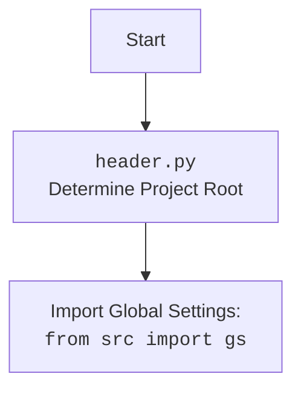

## АНАЛИЗ КОДА

### <алгоритм>

**1. Инициализация `Category`:**
   - Создается экземпляр класса `Category`, который наследуется от `PrestaCategory`.
   - Принимает `api_credentials` для доступа к данным категорий.

**2. Получение родительских категорий `get_parents`:**
   - Принимает `id_category` и `dept`.
   - Вызывает `get_list_parent_categories` из родительского класса `PrestaCategory` и возвращает список родительских категорий.

**3. Асинхронный обход категорий `crawl_categories_async`:**
   - Принимает `url`, `depth`, `driver`, `locator`, `dump_file`, `default_category_id`, `category` (необязательный).
   - **Начало:**
     - Если `category` не задан, создается новый словарь с начальными данными.
     - Если `depth` меньше или равно 0, возвращается текущий `category`.
   - **Обход страницы:**
     - Загружает страницу по `url` с помощью `driver.get(url)`.
     - Ждет 1 секунду для загрузки страницы.
     - Находит ссылки на категории, используя `driver.execute_locator(locator)`.
     - Если ссылки не найдены, регистрирует ошибку и возвращает текущий `category`.
   - **Рекурсивный обход:**
     - Для каждой найденной ссылки создается задача `self.crawl_categories_async` с уменьшенной глубиной (`depth - 1`).
     - Фильтрует дубликаты URL с помощью `_is_duplicate_url`.
     - Использует `asyncio.gather` для параллельного выполнения всех задач.
   - **Завершение:**
     - Возвращает обновленный `category`.
   - **Обработка ошибок:**
     - Если возникает ошибка, регистрирует ее и возвращает `category`.

**4. Синхронный обход категорий `crawl_categories`:**
   - Принимает те же параметры, что и `crawl_categories_async`, но без `async`.
   - **Начало:**
     - Если `depth` меньше или равно 0, возвращается текущий `category`.
   - **Обход страницы:**
     - Загружает страницу по `url` с помощью `driver.get(url)`.
     - Ждет 1 секунду для загрузки страницы.
     - Находит ссылки на категории, используя `driver.execute_locator(locator)`.
     - Если ссылки не найдены, регистрирует ошибку и возвращает текущий `category`.
   - **Рекурсивный обход:**
     - Для каждой найденной ссылки проверяется дубликат URL с помощью `_is_duplicate_url`.
     - Если не дубликат, создается новая категория и добавляется в словарь `category`.
     - Рекурсивно вызывает `self.crawl_categories` с уменьшенной глубиной (`depth - 1`).
   - **Объединение с сохраненными данными и сохранение:**
     - Загружает данные из `dump_file` с помощью `j_loads`.
     - Обновляет `category` с загруженными данными.
     - Сохраняет обновленный `category` в `dump_file` с помощью `j_dumps`.
   - **Завершение:**
     - Возвращает обновленный `category`.
   - **Обработка ошибок:**
      - Если возникает ошибка, регистрирует ее и возвращает `category`.

**5. Проверка дубликатов URL `_is_duplicate_url`:**
   - Принимает `category` и `url`.
   - Проверяет, существует ли `url` в словаре `category`.
   - Возвращает `True`, если URL дублируется, и `False` в противном случае.

**6. Сравнение словаря с данными файла `compare_and_print_missing_keys`:**
    - Принимает `current_dict` и путь к файлу `file_path`.
    - Загружает данные из `file_path` с помощью `j_loads`.
    - Проходит по ключам загруженных данных и печатает те, которых нет в `current_dict`.
    - Обрабатывает исключения при загрузке файла.

**Пример использования `crawl_categories`:**

   1. Вызов `crawl_categories` с начальным URL, глубиной, экземпляром `driver`, локатором, путем к файлу и ID категории по умолчанию.
   2. Функция получает URL и загружает страницу.
   3. Функция находит ссылки на категории на странице.
   4. Для каждой ссылки создается новый словарь категории.
   5. Если URL не является дубликатом, функция рекурсивно вызывается для новой категории с уменьшенной глубиной.
   6. Результаты обхода сохраняются в файл.
   7. При достижении глубины 0 или возникновении ошибки обход завершается.

### <mermaid>

```mermaid
flowchart TD
    subgraph category.py
    Start[Start] --> InitCategory[Init Category Object]
    InitCategory --> GetParents[get_parents]
    GetParents --> PrestaCategoryMethod[PrestaCategory.get_list_parent_categories]
    PrestaCategoryMethod --> ReturnParents[Return Parent Category List]
    InitCategory --> CrawlCategoriesAsync[crawl_categories_async]
    CrawlCategoriesAsync --> CheckDepthAsync{depth <= 0?}
    CheckDepthAsync -- Yes --> ReturnCategoryAsync[Return Category]
    CheckDepthAsync -- No --> GetPageAsync[driver.get(url)]
    GetPageAsync --> WaitAsync[asyncio.sleep(1)]
    WaitAsync --> FindLinksAsync[driver.execute_locator(locator)]
    FindLinksAsync --> CheckLinksAsync{Links Found?}
    CheckLinksAsync -- No --> ErrorLogAsync[logger.error]
    ErrorLogAsync --> ReturnCategoryAsync
    CheckLinksAsync -- Yes --> CreateTasksAsync[Create Tasks for each link]
    CreateTasksAsync --> FilterDuplicatesAsync[Filter Duplicates using _is_duplicate_url]
    FilterDuplicatesAsync --> GatherAsync[asyncio.gather(*tasks)]
    GatherAsync --> ReturnCategoryAsync
    GetPageAsync --> ExceptionHandlerAsync[Exception handling]
    ExceptionHandlerAsync --> ErrorLogAsync
    
    InitCategory --> CrawlCategories[crawl_categories]
    CrawlCategories --> CheckDepth{depth <= 0?}
    CheckDepth -- Yes --> ReturnCategory[Return Category]
    CheckDepth -- No --> GetPage[driver.get(url)]
    GetPage --> Wait[driver.wait(1)]
    Wait --> FindLinks[driver.execute_locator(locator)]
    FindLinks --> CheckLinks{Links Found?}
    CheckLinks -- No --> ErrorLog[logger.error]
    ErrorLog --> ReturnCategory
    CheckLinks -- Yes --> LoopThroughLinks[Loop through each link]
     LoopThroughLinks --> CheckDuplicate{_is_duplicate_url(url)}
     CheckDuplicate -- Yes --> NextLink[Next Link]
     CheckDuplicate -- No --> CreateCategory[Create New Category]
     CreateCategory --> RecursiveCall[crawl_categories (recursive)]
     RecursiveCall --> NextLink
     LoopThroughLinks --> SaveData[j_loads(dump_file), j_dumps(category, dump_file)]
     SaveData --> ReturnCategory
     GetPage --> ExceptionHandler[Exception handling]
     ExceptionHandler --> ErrorLog
    
     InitCategory --> IsDuplicateUrl[_is_duplicate_url]
     
     Start --> CompareAndPrint[compare_and_print_missing_keys]
     CompareAndPrint --> LoadFile[j_loads(file_path)]
     LoadFile --> CheckKeys[Check keys in file vs current dict]
      CheckKeys -- Missing key --> PrintMissingKey[Print missing key]
    end
    
    style Start fill:#f9f,stroke:#333,stroke-width:2px
    style ReturnParents fill:#ccf,stroke:#333,stroke-width:1px
    style ReturnCategoryAsync fill:#ccf,stroke:#333,stroke-width:1px
    style ReturnCategory fill:#ccf,stroke:#333,stroke-width:1px
```

**Объяснение `mermaid`:**

1. **`subgraph category.py`**: Определяет область диаграммы, относящуюся к файлу `category.py`.
2. **`Start`**: Начало выполнения программы.
3.  **`InitCategory`**: Инициализация объекта класса `Category`.
4.  **`GetParents`**: Вызов метода `get_parents` для получения списка родительских категорий.
5. **`PrestaCategoryMethod`**:  Вызов метода `get_list_parent_categories` из базового класса `PrestaCategory`.
6.  **`ReturnParents`**: Возвращение списка родительских категорий.
7. **`CrawlCategoriesAsync`**: Вызов асинхронного метода `crawl_categories_async` для обхода категорий.
8. **`CheckDepthAsync`**: Проверка глубины рекурсии в асинхронном обходе.
9. **`ReturnCategoryAsync`**: Возвращение категории из `crawl_categories_async`.
10. **`GetPageAsync`**: Загрузка страницы по URL в асинхронном обходе.
11. **`WaitAsync`**: Ожидание загрузки страницы в асинхронном обходе.
12. **`FindLinksAsync`**: Поиск ссылок на категории на странице в асинхронном обходе.
13. **`CheckLinksAsync`**: Проверка, найдены ли ссылки на категории в асинхронном обходе.
14. **`ErrorLogAsync`**: Логирование ошибки в асинхронном обходе.
15. **`CreateTasksAsync`**: Создание задач для рекурсивного обхода в асинхронном обходе.
16. **`FilterDuplicatesAsync`**: Фильтрация дубликатов URL в асинхронном обходе.
17. **`GatherAsync`**: Запуск задач параллельно в асинхронном обходе.
18. **`ExceptionHandlerAsync`**: Обработка исключений в асинхронном обходе.
19. **`CrawlCategories`**: Вызов синхронного метода `crawl_categories` для обхода категорий.
20. **`CheckDepth`**: Проверка глубины рекурсии в синхронном обходе.
21. **`ReturnCategory`**: Возвращение категории из `crawl_categories`.
22. **`GetPage`**: Загрузка страницы по URL в синхронном обходе.
23. **`Wait`**: Ожидание загрузки страницы в синхронном обходе.
24. **`FindLinks`**: Поиск ссылок на категории на странице в синхронном обходе.
25. **`CheckLinks`**: Проверка, найдены ли ссылки на категории в синхронном обходе.
26. **`ErrorLog`**: Логирование ошибки в синхронном обходе.
27. **`LoopThroughLinks`**: Итерация по каждой ссылке на категории.
28. **`CheckDuplicate`**: Проверка на дубликаты URL.
29. **`NextLink`**: Переход к следующей ссылке.
30. **`CreateCategory`**: Создание нового словаря категории.
31. **`RecursiveCall`**: Рекурсивный вызов метода `crawl_categories`.
32. **`SaveData`**: Загрузка и сохранение данных в файл.
33. **`ExceptionHandler`**: Обработка исключений в синхронном обходе.
34. **`IsDuplicateUrl`**:  Вызов функции `_is_duplicate_url` для проверки дубликатов URL.
35. **`CompareAndPrint`**: Вызов функции `compare_and_print_missing_keys` для сравнения и печати отсутствующих ключей.
36. **`LoadFile`**: Загрузка данных из файла.
37. **`CheckKeys`**: Проверка ключей в файле на наличие в текущем словаре.
38. **`PrintMissingKey`**: Печать отсутствующих ключей.
39. **Стили**:  Применяются стили для визуального выделения начала и завершения функций.

**Импортируемые зависимости в `mermaid`:**

-   **`PrestaCategory.get_list_parent_categories`**: Метод из родительского класса `PrestaCategory`, используется для получения списка родительских категорий.
-   **`driver.get(url)`**: Метод из Selenium WebDriver, используемый для загрузки веб-страницы по заданному URL.
-   **`driver.execute_locator(locator)`**: Метод из Selenium WebDriver, используемый для поиска элементов на веб-странице с помощью заданного локатора (например, XPath).
-   **`asyncio.sleep(1)`**: Функция из модуля `asyncio`, используемая для асинхронной задержки (ожидания).
-    **`asyncio.gather(*tasks)`**: Функция из модуля `asyncio`, используемая для параллельного выполнения асинхронных задач.
-   **`logger.error`**: Метод из модуля `src.logger.logger`, используемый для логирования ошибок.
-   **`_is_duplicate_url`**: Метод текущего класса, используемый для проверки наличия URL в словаре категорий.
-   **`j_loads(dump_file)`**: Функция из `src.utils.jjson`, используется для безопасной загрузки JSON данных из файла.
-   **`j_dumps(category, dump_file)`**: Функция из `src.utils.jjson`, используется для безопасного сохранения JSON данных в файл.


**Объяснение `header.py`:**

- **`Start`**: Начало работы модуля.
- **`Header`**: Модуль `header.py` определяет корень проекта.
- **`import`**: Импортирует глобальные настройки из `src.gs`, обеспечивая доступ к общим параметрам проекта.

### <объяснение>

**Импорты:**

-   `asyncio`: Модуль для асинхронного программирования. Используется для `crawl_categories_async`.
-   `pathlib`: Модуль для работы с файловыми путями.
-   `os`: Модуль для взаимодействия с операционной системой.
-   `typing.Dict`: Типизация для словарей.
-   `lxml.html`: Модуль для парсинга HTML.
-   `requests`: Модуль для отправки HTTP запросов (хотя в данном коде напрямую не используется).
-   `header`: Пользовательский модуль для определения корня проекта.
-   `src.gs`: Глобальные настройки проекта.
-   `src.logger.logger`: Модуль для логирования.
-   `src.utils.jjson`: Модуль для работы с JSON.
-   `src.endpoints.prestashop`: Модуль, содержащий классы для работы с PrestaShop, включая `PrestaShop` и `PrestaCategory`.

**Класс `Category`:**

-   Наследует от `PrestaCategory`, предоставляя методы для работы с категориями PrestaShop.
-   `credentials`: Атрибут для хранения учетных данных API.
-   `__init__`: Конструктор класса.
    -   Принимает `api_credentials` для аутентификации при работе с PrestaShop API.
    -   Инициализирует базовый класс `PrestaCategory`.
-   `get_parents`:
    -   Принимает `id_category` и `dept`.
    -   Вызывает `get_list_parent_categories` у родителя и возвращает список.
-   `crawl_categories_async`:
    -   Асинхронный метод для обхода категорий.
    -   Принимает `url`, `depth`, `driver` (Selenium WebDriver), `locator` (XPath), `dump_file` (путь к файлу для сохранения) и `default_category_id`.
    -   Создает иерархический словарь категорий.
    -   Использует `asyncio.gather` для параллельного обхода.
-   `crawl_categories`:
    -   Синхронный метод для обхода категорий.
    -   Принимает те же параметры, что и `crawl_categories_async`.
    -   Рекурсивно обходит категории и сохраняет результат в файл.
    -   Использует `j_loads` и `j_dumps` для безопасной работы с JSON.
-   `_is_duplicate_url`:
    -   Принимает `category` и `url`.
    -   Проверяет, существует ли `url` в словаре категорий.

**Функции:**

-   `compare_and_print_missing_keys`:
    -   Принимает `current_dict` и `file_path`.
    -   Загружает данные из файла с помощью `j_loads`.
    -   Сравнивает ключи и выводит те, которых нет в словаре.
    -   Обрабатывает ошибки загрузки файла.

**Переменные:**

-   `api_credentials`: Словарь, содержащий учетные данные для PrestaShop API.
-   `url`: URL страницы для обхода.
-   `depth`: Глубина рекурсивного обхода.
-   `driver`: Экземпляр Selenium WebDriver для управления браузером.
-   `locator`: XPath локатор для поиска ссылок на категории.
-   `dump_file`: Путь к файлу для сохранения результатов обхода.
-   `default_category_id`: ID категории по умолчанию.
-   `category`: Словарь, представляющий структуру категорий.

**Потенциальные ошибки и улучшения:**

-   Обработка ошибок в `crawl_categories_async` и `crawl_categories` может быть улучшена.
-   В `crawl_categories` используется синхронный `driver.wait(1)` который блокирует выполнение потока, рекомендуется использовать `asyncio.sleep(1)` в связке с `async` функциями.
-   В `crawl_categories` загрузка данных из файла происходит при каждом вызове функции. Это можно оптимизировать.
-   Метод `_is_duplicate_url` в цикле каждый раз генерирует генератор словаря. Рекомендуется создать `set` для более эффективной проверки.
-   Отсутствует асинхронная версия метода `compare_and_print_missing_keys`

**Взаимосвязи с другими частями проекта:**

-   Зависит от `header.py` для определения корня проекта.
-   Использует `src.gs` для доступа к глобальным настройкам.
-   Использует `src.logger.logger` для логирования событий и ошибок.
-   Использует `src.utils.jjson` для безопасной работы с JSON файлами.
-   Наследуется от `src.endpoints.prestashop.PrestaCategory` для работы с категориями PrestaShop.