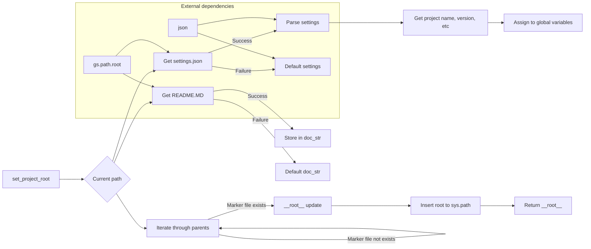

# <input code>

```python
## \file hypotez/src/category/header.py
# -*- coding: utf-8 -*-
#! venv/Scripts/python.exe
#! venv/bin/python/python3.12

"""
module: src.category 
	:platform: Windows, Unix
	:synopsis: Модуль определяющий корневой путь к проекту. Все импорты строятся относительно этого пути.
    :TODO: В дальнейшем перенести в системную переменную
"""
MODE = 'dev'

import sys
import json
from packaging.version import Version

from pathlib import Path
def set_project_root(marker_files=('pyproject.toml', 'requirements.txt', '.git')) -> Path:
    """
    Finds the root directory of the project starting from the current file's directory,
    searching upwards and stopping at the first directory containing any of the marker files.

    Args:
        marker_files (tuple): Filenames or directory names to identify the project root.
    
    Returns:
        Path: Path to the root directory if found, otherwise the directory where the script is located.
    """
    __root__:Path
    current_path:Path = Path(__file__).resolve().parent
    __root__ = current_path
    for parent in [current_path] + list(current_path.parents):
        if any((parent / marker).exists() for marker in marker_files):
            __root__ = parent
            break
    if __root__ not in sys.path:
        sys.path.insert(0, str(__root__))
    return __root__


# Get the root directory of the project
__root__ = set_project_root()
"""__root__ (Path): Path to the root directory of the project"""

from src import gs

settings:dict = None
try:
    with open(gs.path.root / 'src' /  'settings.json', 'r') as settings_file:
        settings = json.load(settings_file)
except (FileNotFoundError, json.JSONDecodeError):
    ...

doc_str:str = None
try:
    with open(gs.path.root / 'src' /  'README.MD', 'r') as settings_file:
        doc_str = settings_file.read()
except (FileNotFoundError, json.JSONDecodeError):
    ...


__project_name__ = settings.get("project_name", 'hypotez') if settings  else 'hypotez'
__version__: str = settings.get("version", '')  if settings  else ''
__doc__: str = doc_str if doc_str else ''
__details__: str = ''
__author__: str = settings.get("author", '')  if settings  else ''
__copyright__: str = settings.get("copyrihgnt", '')  if settings  else ''
__cofee__: str = settings.get("cofee", "Treat the developer to a cup of coffee for boosting enthusiasm in development: https://boosty.to/hypo69")  if settings else "Treat the developer to a cup of coffee for boosting enthusiasm in development: https://boosty.to/hypo69"
```

# <algorithm>

**Шаг 1:**  Функция `set_project_root` ищет корневую директорию проекта.

* **Вход:** Кортеж `marker_files` с файлами/директориями, которые указывают на корневую папку проекта.
* **Выход:** Путь к корневой папке проекта (`Path`).
* **Пример:** `marker_files = ('pyproject.toml', 'requirements.txt', '.git')`

**Шаг 2:** Получение текущего пути (`Path(__file__).resolve().parent`).

* **Вход:** Путь к текущему файлу.
* **Выход:** Текущий путь.

**Шаг 3:** Итерация по родительским директориям от текущего пути.

* **Вход:** Текущий путь.
* **Выход:** Корневой путь или текущий путь, если не найден корень.
* **Пример:** Если текущий путь `path/to/hypotez/src/category/header.py`, то цикл перебирает `path/to/hypotez/src/category`, `path/to/hypotez/src`, `path/to/hypotez`, ...

**Шаг 4:** Проверка существования файлов/папок в родительской директории.

* **Вход:** Родительская директория и кортеж `marker_files`.
* **Выход:** Признак наличия файла/папки в родительском каталоге.
* **Пример:** `(parent / marker).exists()` возвращает True, если файл или директория `marker` находится в `parent`, иначе False.


**Шаг 5:** Обновление корневого пути (`__root__`) при нахождении маркерного файла.

* **Вход:** Родительская директория, содержащая маркерный файл.
* **Выход:** Обновлённый корневой путь.

**Шаг 6:** Добавление корневого пути в `sys.path`.

* **Вход:** Корневой путь.
* **Выход:** Обновленный `sys.path`.
* **Пример:** Если `__root__` = '/path/to/project', то `sys.path.insert(0, str(__root__))` добавит его в начало пути поиска.

**Шаг 7:** Возвращение корневого пути.

* **Вход:** Корневой путь.
* **Выход:** Корневой путь.


**Шаг 8-10:** Чтение файлов `settings.json` и `README.MD`.
- Открытие файлов по пути, полученному из `gs.path.root`.
- Обработка исключений `FileNotFoundError` и `json.JSONDecodeError`.
- Сохранение данных в переменные `settings` и `doc_str`.

**Шаг 11:** Получение значений из `settings`, используя метод `get` с умолчаниями.
- Извлечение значений  `project_name`, `version`, `author`, `copyright`, `cofee` из словаря `settings`.
- Установление значений по умолчанию в случае отсутствия ключа в `settings`.

# <mermaid>




# <explanation>

**Импорты:**

* `sys`: модуль для доступа к системным переменным, в частности, для управления путем поиска модулей (`sys.path`).
* `json`: модуль для работы с JSON-форматом.
* `packaging.version`:  модуль для работы с версиями.
* `pathlib`: модуль для работы с путями к файлам, обеспечивая платформонезависимый подход.  Использование `Path` вместо `os.path` предпочтительнее для лучшей обработки путей в различных операционных системах.
* `src.gs`:  (Непосредственно в коде не определен) —  Предположительно, это модуль, содержащий константы или функции для работы с путями и настройками проекта.  Без доступа к `src.gs` сложно оценить его взаимодействие.  Предполагается, что этот модуль находится в папке `src` текущего проекта.


**Классы:**

Код не содержит классов.

**Функции:**

* `set_project_root(marker_files)`: Находит корневую директорию проекта, начиная с текущего файла и идя вверх по дереву директорий. Аргумент `marker_files` — кортеж имен файлов или директорий, которые указывают на корень проекта. Функция возвращает `Path` к корневой директории.  Использование аннотаций типов (`-> Path`) улучшает читаемость и помогает статической проверке кода.

**Переменные:**

* `__root__`: хранит путь к корневой директории проекта.
* `settings`: словарь, содержащий данные из файла `settings.json`.
* `doc_str`: строка, содержащая содержимое файла `README.MD`.
* `__project_name__`, `__version__`, `__doc__`, `__details__`, `__author__`, `__copyright__`, `__cofee__`: переменные, содержащие данные из файла настроек проекта, использующие `settings.get` для обработки отсутствия значений и установления значений по умолчанию.

**Возможные ошибки и улучшения:**

* **Обработка ошибок:**  Код использует `try...except` для обработки `FileNotFoundError` и `json.JSONDecodeError`, но не обрабатывает другие потенциальные ошибки, например, ошибки ввода-вывода. В некоторых случаях (особенно при работе с внешними ресурсами) целесообразно ввести более детальную диагностику ошибок, а не просто пропускать.
* **`gs.path.root`:**  непонятно, откуда берется значение `gs.path.root`.  Нужно обеспечить контекст и документацию для этого.  Без понимания `gs.path.root` нельзя проанализировать корректность и надежность пути к файлам.
* **Описательность переменных:** Имена переменных `__root__`, `settings`, `doc_str` и подобные — важные, но немного невнятные, возможно, добавить более конкретных названий для лучшей читаемости (например, `project_root`, `project_settings`, `readme_content`).


**Взаимосвязь с другими частями проекта:**

Модуль `header.py` является частью проекта, инициализируя все импорты относительно корневого пути проекта.  Он взаимодействует с `gs` (предполагаемое имя модуля), чтобы получить корневой путь, и с файлом `settings.json` и `README.MD`, чтобы инициализировать глобальные переменные.

**Общая оценка:** Код хорошо структурирован, читаем, и использует полезные инструменты, но может быть улучшен путем более детальной обработки ошибок и лучшей документации.