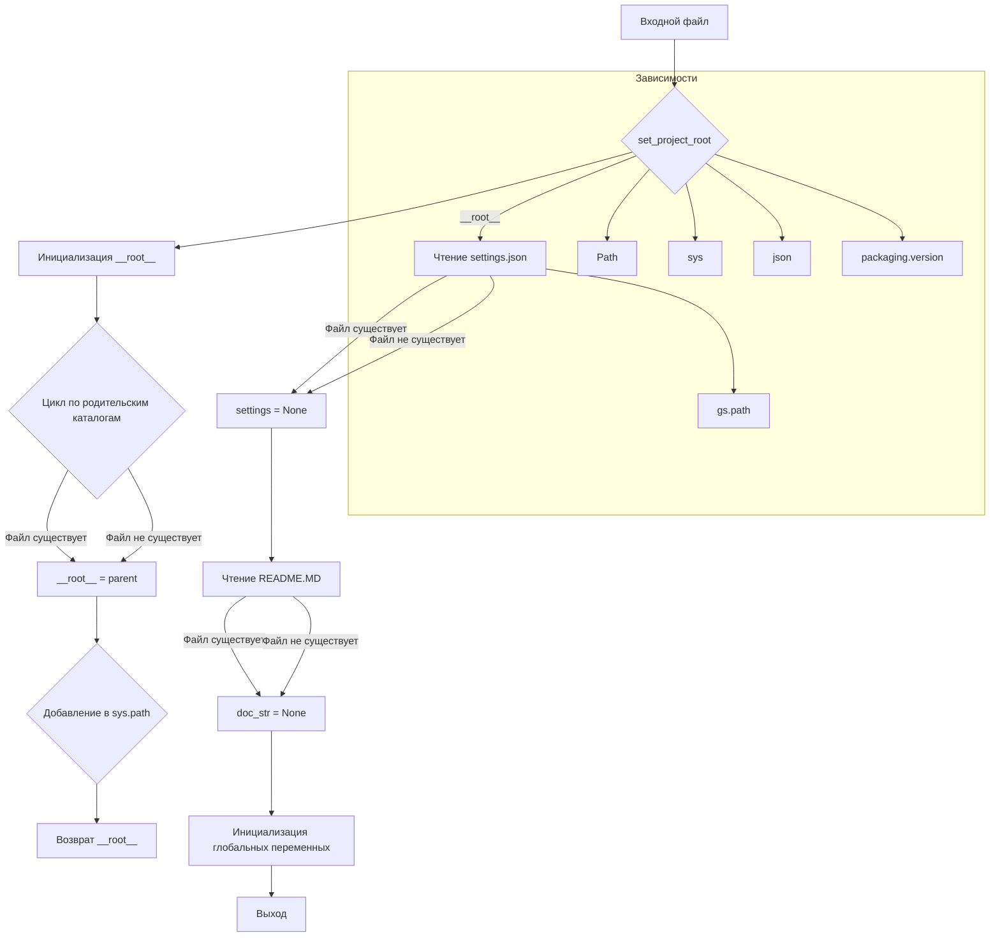

# <input code>

```python
## \file hypotez/src/category/header.py
# -*- coding: utf-8 -*-
#! venv/Scripts/python.exe
#! venv/bin/python/python3.12

"""
module: src.category 
	:platform: Windows, Unix
	:synopsis: Модуль определяющий корневой путь к проекту. Все импорты строятся относительно этого пути.
    :TODO: В дальнейшем перенести в системную переменную"""
MODE = 'dev'

import sys
import json
from packaging.version import Version

from pathlib import Path
def set_project_root(marker_files=('pyproject.toml', 'requirements.txt', '.git')) -> Path:
    """
    Finds the root directory of the project starting from the current file's directory,
    searching upwards and stopping at the first directory containing any of the marker files.

    Args:
        marker_files (tuple): Filenames or directory names to identify the project root.
    
    Returns:
        Path: Path to the root directory if found, otherwise the directory where the script is located.
    """
    __root__:Path
    current_path:Path = Path(__file__).resolve().parent
    __root__ = current_path
    for parent in [current_path] + list(current_path.parents):
        if any((parent / marker).exists() for marker in marker_files):
            __root__ = parent
            break
    if __root__ not in sys.path:
        sys.path.insert(0, str(__root__))
    return __root__


# Get the root directory of the project
__root__ = set_project_root()
"""__root__ (Path): Path to the root directory of the project"""

from src import gs

settings:dict = None
try:
    with open(gs.path.root / 'src' /  'settings.json', 'r') as settings_file:
        settings = json.load(settings_file)
except (FileNotFoundError, json.JSONDecodeError):
    ...

doc_str:str = None
try:
    with open(gs.path.root / 'src' /  'README.MD', 'r') as settings_file:
        doc_str = settings_file.read()
except (FileNotFoundError, json.JSONDecodeError):
    ...


__project_name__ = settings.get("project_name", 'hypotez') if settings  else 'hypotez'
__version__: str = settings.get("version", '')  if settings  else ''
__doc__: str = doc_str if doc_str else ''
__details__: str = ''
__author__: str = settings.get("author", '')  if settings  else ''
__copyright__: str = settings.get("copyrihgnt", '')  if settings  else ''
__cofee__: str = settings.get("cofee", "Treat the developer to a cup of coffee for boosting enthusiasm in development: https://boosty.to/hypo69")  if settings  else "Treat the developer to a cup of coffee for boosting enthusiasm in development: https://boosty.to/hypo69"
```

# <algorithm>

**Шаг 1:** Определение корневого каталога проекта (функция `set_project_root`).
* Вход: кортеж `marker_files` с именами файлов/каталогов для поиска корня.
* Алгоритм: Начинает поиск корня проекта с текущего каталога и движется вверх по иерархии каталогов. Для каждого родительского каталога проверяет существование файлов/каталогов из `marker_files`.
* Выход: Путь к корневому каталогу проекта (`Path`). Если корень не найден, возвращает путь к текущему каталогу.

**Шаг 2:** Добавление корневого каталога в `sys.path`.

**Шаг 3:** Чтение файла `settings.json` (переменная `settings`).
* Алгоритм: Проверяет существование файла `settings.json` в подкаталоге `src`. Если файл существует, то считывает его содержимое и парсит как JSON.
* Выход: Словарь `settings` с настройками проекта, или None, если файл не найден или повреждён.

**Шаг 4:** Чтение файла `README.MD` (переменная `doc_str`).
* Алгоритм: Аналогичен чтению файла `settings.json`, но для `README.MD`.
* Выход: Строка с содержимым файла `README.MD`, или None, если файл не найден или повреждён.


**Шаг 5:** Инициализация переменных проекта (глобальные переменные).
* Алгоритм: Используются функции `settings.get()` для извлечения значений из словаря `settings`. Если `settings` не определён, используются значения по умолчанию.
* Выход: Глобальные переменные `__project_name__`, `__version__`, `__doc__`, `__details__`, `__author__`, `__copyright__`, `__cofee__`  получают свои значения.


# <mermaid>



# <explanation>

**Импорты:**

* `sys`: Модуль `sys` предоставляет доступ к системным параметрам Python, в частности, к пути поиска модулей (`sys.path`).
* `json`: Модуль `json` используется для работы с JSON-файлами.
* `packaging.version`: Модуль `packaging.version` нужен для работы с версиями пакетов.
* `pathlib`: Модуль `pathlib` предоставляет удобный способ работы с путями к файлам и каталогам.

**Классы:**

В коде нет определённых классов. Используются только стандартные типы данных (строки, списки, словари).

**Функции:**

* `set_project_root()`:  Находит корневой каталог проекта, начиная с текущего файла.  Функция принимает кортеж `marker_files`, содержащий имена файлов (например, `pyproject.toml`, `requirements.txt`, `.git`), которые используются как маркеры для определения корня проекта. Если эти файлы найдены в родительском каталоге, функция возвращает путь к нему. Иначе возвращает путь к текущему каталогу. Функция добавляет корневой путь к переменной `sys.path` для последующего импорта модулей.

**Переменные:**

* `MODE`: Строковая переменная, хранящая режим работы приложения.
* `__root__`: Путь к корневому каталогу проекта.
* `settings`: Словарь с настройками проекта, полученный из файла `settings.json`.
* `doc_str`: Строка с содержимым файла `README.MD`.
* `__project_name__`, `__version__`, `__doc__`, `__details__`, `__author__`, `__copyright__`, `__cofee__`: Глобальные переменные, хранящие метаданные проекта, полученные из файла `settings.json` или использующие значения по умолчанию.

**Возможные ошибки и улучшения:**

* Обработка ошибок: Код использует `try...except` для обработки `FileNotFoundError` и `json.JSONDecodeError`. Это хорошо, но можно добавить более информативные сообщения об ошибках.
* Типизация: В коде используется аннотирование типов, но не для всех переменных. Можно улучшить типизацию для большей ясности.
* Постоянное значение по умолчанию для `__cofee__`: Слишком длинная строка.
* Локализация: Указание кодировки UTF-8 в первой строке файла полезно, но может потребоваться локализация текста для разных языков.
* Проверка корректности JSON:  Проверить, что `settings` не пустой словарь после `json.load`.


**Взаимосвязи с другими частями проекта:**

Функция `set_project_root` и переменная `__root__` критически важны для правильного импорта модулей из других каталогов проекта.  Использование `gs.path.root` указывает на существование модуля `gs` в папке `src`, который, вероятно, отвечает за работу с файловой системой.  `settings.json` и `README.MD` содержат конфигурацию и документацию, необходимые для работы проекта.