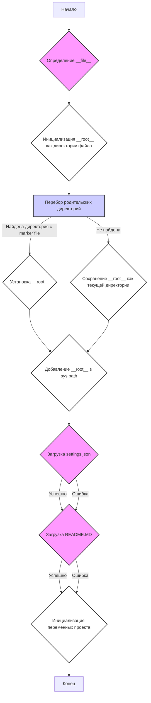

## <алгоритм>
1. **Инициализация**:
   - Задается переменная `MODE` со значением `'dev'`.
   - Импортируются необходимые модули: `sys`, `json`, `Version` из `packaging.version`, `Path` из `pathlib`.

2. **Функция `set_project_root`**:
   - Принимает кортеж `marker_files` (по умолчанию `('pyproject.toml', 'requirements.txt', '.git')`) для определения корневой директории проекта.
   - Определяет абсолютный путь к директории, в которой находится текущий файл.
   - Инициализирует переменную `__root__` как текущий путь.
   - Перебирает текущий путь и все родительские пути.
   - Проверяет, существует ли в текущем пути любой из `marker_files`. Если да, то устанавливает текущий путь в качестве корневого (`__root__`) и прерывает цикл.
      - Пример: Если текущий файл находится в `/home/user/project/src/category/header.py`, а файл `pyproject.toml` находится в `/home/user/project`, то `/home/user/project` будет определена как корневая директория.
   - Если путь `__root__` не входит в `sys.path`, добавляет его в начало.
   - Возвращает `__root__` (путь к корневой директории проекта).

3. **Установка корневой директории**:
   - Вызывается `set_project_root()` и результат сохраняется в `__root__`.
    
4. **Загрузка настроек из `settings.json`**:
   - Инициализируется переменная `settings` как `None`.
   - Пытается открыть файл `settings.json`, который находится в `src/settings.json` относительно корневой директории проекта.
   - Загружает JSON из файла в переменную `settings`.
      - Пример: Если `__root__` равен `/home/user/project`, то файл будет искаться по пути `/home/user/project/src/settings.json`.
   - Если возникает ошибка `FileNotFoundError` или `json.JSONDecodeError`, блок `try` переходит в `except` и не выполняет никаких действий.

5. **Загрузка документации из `README.MD`**:
   - Инициализируется переменная `doc_str` как `None`.
   - Пытается открыть файл `README.MD`, который находится в `src/README.MD` относительно корневой директории проекта.
   - Читает содержимое файла в переменную `doc_str`.
     - Пример: Если `__root__` равен `/home/user/project`, то файл будет искаться по пути `/home/user/project/src/README.MD`.
   - Если возникает ошибка `FileNotFoundError` или `json.JSONDecodeError`, блок `try` переходит в `except` и не выполняет никаких действий.

6. **Инициализация переменных проекта**:
   - Инициализируется переменная `__project_name__` - имя проекта, значение берется из `settings.get("project_name")`, если `settings` существует, иначе по умолчанию `hypotez`.
   - Инициализируется переменная `__version__` - версия проекта, значение берется из `settings.get("version")`, если `settings` существует, иначе пустая строка.
   - Инициализируется переменная `__doc__` - документация проекта, значение берется из `doc_str`, если `doc_str` существует, иначе пустая строка.
   - Инициализируется переменная `__details__` как пустая строка.
   - Инициализируется переменная `__author__` - автор проекта, значение берется из `settings.get("author")`, если `settings` существует, иначе пустая строка.
   - Инициализируется переменная `__copyright__` - копирайт проекта, значение берется из `settings.get("copyrihgnt")`, если `settings` существует, иначе пустая строка.
   - Инициализируется переменная `__cofee__` - сообщение о возможности угостить разработчика кофе, значение берется из `settings.get("cofee")`, если `settings` существует, иначе значение по умолчанию: `"Treat the developer to a cup of coffee for boosting enthusiasm in development: https://boosty.to/hypo69"`.

## <mermaid>

**Анализ зависимостей в mermaid:**

- `A` - `K`:  Отражает начало и конец работы скрипта.
- `B` : Представляет процесс получения пути к текущему файлу (`__file__`). 
- `C`:  Инициализирует переменную `__root__` как путь к директории, где находится текущий файл.
- `D`:  Осуществляет перебор родительских директорий для поиска `marker_files`.
- `E`:  Устанавливает переменную `__root__` как найденную директорию.
- `F`: Добавляет корневую директорию проекта в `sys.path`, чтобы обеспечить правильную работу импортов.
- `G`:  В случае отсутствия `marker_files`, сохраняет текущую директорию как корень проекта.
- `H`:  Загрузка настроек из файла `settings.json`.
- `I`:  Загрузка документации из файла `README.MD`.
- `J`: Инициализация переменных проекта на основе загруженных данных.

Диаграмма показывает последовательность выполнения программы, начиная с определения корневой директории проекта, загрузки настроек и документации и заканчивая инициализацией переменных. Диаграмма отражает логический поток данных и ветвление, когда происходит поиск корневой директории.
## <объяснение>

### Импорты:

- `sys`: Модуль `sys` используется для добавления корневой директории проекта в список путей поиска модулей (`sys.path`), что позволяет импортировать модули из проекта, даже если скрипт запускается не из корневой директории. Это важно для корректной работы импортов в рамках проекта.
- `json`: Модуль `json` используется для чтения файла `settings.json` в формате JSON, где хранятся настройки проекта.
- `packaging.version.Version`:  Импортируется класс `Version`, но он не используется напрямую в этом коде. Возможно, его использование планировалось, но не было реализовано.
- `pathlib.Path`: Модуль `pathlib` и класс `Path` используются для работы с путями к файлам и директориям в объектно-ориентированном стиле, что упрощает работу с файловой системой.

### Классы:
- В данном коде нет определения пользовательских классов. Используется класс `Path` из модуля `pathlib`.

### Функции:
- `set_project_root(marker_files: tuple = ('pyproject.toml', 'requirements.txt', '.git')) -> Path:`:
  - **Аргументы**:
     - `marker_files`: кортеж с именами файлов или директорий, которые используются для определения корневой директории проекта. По умолчанию это `('pyproject.toml', 'requirements.txt', '.git')`.
  - **Возвращаемое значение**:
     - `Path`: объект `pathlib.Path`, представляющий путь к корневой директории проекта.
  - **Назначение**:
     - Функция находит корневую директорию проекта, начиная с директории, где находится текущий файл. Она поднимается вверх по дереву директорий, пока не найдет директорию, содержащую один из `marker_files`.
  - **Пример**:
      - Если текущий файл находится в `/home/user/project/src/category/header.py`, а файл `pyproject.toml` находится в `/home/user/project`, то вызов `set_project_root()` вернет объект `Path('/home/user/project')`.

### Переменные:

- `MODE`: Глобальная переменная, установленная в `'dev'`, предположительно для определения режима работы приложения (разработка).
- `__root__`: Глобальная переменная типа `pathlib.Path`, которая хранит путь к корневой директории проекта. Она инициализируется результатом вызова функции `set_project_root()`.
- `settings`: Глобальная переменная типа `dict`, предназначенная для хранения настроек проекта, прочитанных из файла `settings.json`.
- `doc_str`: Глобальная переменная типа `str`, предназначенная для хранения содержимого файла `README.MD`.
- `__project_name__`: Глобальная переменная типа `str`, содержащая имя проекта. Получает значение из `settings.json` или значение по умолчанию 'hypotez'.
- `__version__`: Глобальная переменная типа `str`, содержащая версию проекта. Получает значение из `settings.json` или пустую строку.
- `__doc__`: Глобальная переменная типа `str`, содержащая документацию проекта. Получает значение из переменной `doc_str` или пустую строку.
- `__details__`: Глобальная переменная типа `str`, содержащая дополнительные сведения о проекте.  Инициализируется пустой строкой.
- `__author__`: Глобальная переменная типа `str`, содержащая автора проекта. Получает значение из `settings.json` или пустую строку.
- `__copyright__`: Глобальная переменная типа `str`, содержащая информацию о копирайте проекта. Получает значение из `settings.json` или пустую строку.
- `__cofee__`: Глобальная переменная типа `str`, содержащая предложение поддержать разработчика. Получает значение из `settings.json` или значение по умолчанию.

### Потенциальные ошибки и области для улучшения:
- **Обработка ошибок при загрузке файлов**: В коде используется `try-except` для обработки `FileNotFoundError` и `json.JSONDecodeError`, но блок `except` является пустым. В реальном приложении было бы полезно добавить логирование ошибки или установить значения по умолчанию для `settings` и `doc_str`.
- **Отсутствие проверок**: Код не проверяет типы данных при чтении из `settings.json`.
- **Жестко заданные пути к файлам**: Пути к `settings.json` и `README.MD` заданы как `'src' / 'settings.json'` и `'src' / 'README.MD'`. Возможно, стоит сделать их более гибкими (например, вынести в переменные или передавать в качестве параметров).
- **Зависимость от структуры проекта**: Логика `set_project_root` предполагает определенную структуру проекта. Если файлы `marker_files` находятся в других местах, то функция не найдет корень проекта.
- **Неиспользуемый импорт**: Импортируется класс `packaging.version.Version`, но он не используется в коде.

### Взаимосвязь с другими частями проекта:
- Этот модуль является центральным для всего проекта, так как он определяет корневую директорию и настраивает пути поиска модулей.
- Все остальные модули проекта, предположительно, используют переменную `__root__` для определения путей к ресурсам и другим модулям.
- Данные из `settings.json`, загруженные в переменную `settings`, используются для настройки приложения.
- Содержимое из `README.MD` используется как описание проекта.

Этот модуль выступает в роли конфигурационного центра, определяющего общую среду выполнения для всего проекта.