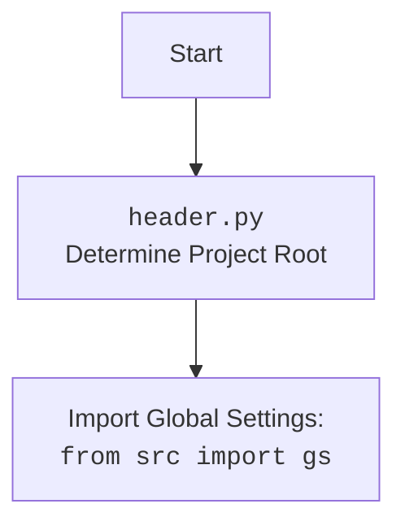

## <алгоритм>

1. **Инициализация:**
   - Объявляется глобальная переменная `MODE` со значением 'dev'.
   - Импортируются необходимые модули: `sys`, `json`, `packaging.version.Version`, `pathlib.Path`.
2. **Определение корня проекта (`set_project_root`)**:
   - Функция `set_project_root` принимает кортеж `marker_files` (по умолчанию `('__root__')`).
   - Устанавливает начальный путь `current_path` как родительский каталог текущего файла.
   - Инициализирует `__root__` значением `current_path`.
   - Проходит по всем родительским каталогам `current_path`, включая сам `current_path`.
     - Для каждого родительского каталога `parent` проверяется, существует ли в нем какой-либо из файлов или каталогов, указанных в `marker_files`.
     - Если такой файл/каталог найден, `__root__` обновляется и цикл прерывается.
   - Если `__root__` нет в `sys.path`, добавляет его в начало.
   - Возвращает `__root__` - путь к корню проекта.
    - *Пример:* 
        - Если `marker_files` =  (`__root__`,), то поиск будет идти вверх по дереву каталогов, пока не найдет файл или папку с именем `__root__`. 
        - Если структура каталогов такая: `dir1/dir2/dir3/header.py`, и файл `__root__` находится в `dir1`, то `set_project_root()` вернет путь к `dir1`. 
3. **Установка переменной `__root__`**:
   - Вызывается `set_project_root()` для определения и присвоения значения переменной `__root__`.
4. **Импорт глобальных настроек**:
    - Импортируется `gs` из модуля `src`, предположительно содержащего пути.
5. **Загрузка настроек из `settings.json`:**
    - Инициализируется переменная `settings` значением `None`.
    - Пытается открыть файл `settings.json`, находящийся в каталоге `src` относительно корня проекта.
    - Если открытие прошло успешно, то загружает JSON данные в переменную `settings`.
    - Если происходит ошибка `FileNotFoundError` или `json.JSONDecodeError`, то переменная `settings` остается `None`.
    - *Пример:*
        - Если файл `settings.json` содержит `{"project_name": "my_project", "version": "1.0.0"}`, то `settings` будет словарем `{"project_name": "my_project", "version": "1.0.0"}`.
6. **Загрузка документации из `README.MD`:**
    - Инициализируется переменная `doc_str` значением `None`.
    - Пытается открыть файл `README.MD`, находящийся в каталоге `src` относительно корня проекта.
    - Если открытие прошло успешно, то считывает содержимое файла в переменную `doc_str`.
    - Если происходит ошибка `FileNotFoundError` или `json.JSONDecodeError`, то переменная `doc_str` остается `None`.
7. **Инициализация глобальных переменных:**
    - Инициализирует `__project_name__` значением из ключа `"project_name"` в словаре `settings`, если `settings` не `None`, иначе `'hypotez'`.
    - Инициализирует `__version__` значением из ключа `"version"` в словаре `settings`, если `settings` не `None`, иначе `''`.
    - Инициализирует `__doc__` значением `doc_str`, если `doc_str` не `None`, иначе `''`.
    - Инициализирует `__details__` значением `''`.
    - Инициализирует `__author__` значением из ключа `"author"` в словаре `settings`, если `settings` не `None`, иначе `''`.
    - Инициализирует `__copyright__` значением из ключа `"copyrihgnt"` в словаре `settings`, если `settings` не `None`, иначе `''`.
    - Инициализирует `__cofee__` значением из ключа `"cofee"` в словаре `settings`, если `settings` не `None`, иначе `"Treat the developer to a cup of coffee for boosting enthusiasm in development: https://boosty.to/hypo69"`.

## <mermaid>
```mermaid
flowchart TD
    Start --> SetProjectRoot[set_project_root(marker_files='__root__') <br> Determine Project Root];
    SetProjectRoot -->  FindRoot[Find Project Root Directory];
    FindRoot --> CheckMarker[Check for '__root__' file/dir in current dir and parents]
    CheckMarker -- Found --> UpdateRoot[Update project root to parent directory]
    CheckMarker -- Not found --> NextParent[Move to next parent directory]
    NextParent --> CheckMarker
    CheckMarker -- Last Parent --> UseCurrentRoot[Use current directory as root]
    UseCurrentRoot --> AddToSysPath[Add root directory to sys.path]
    UpdateRoot --> AddToSysPath
    AddToSysPath --> RootVariable[Set global __root__ variable]
     RootVariable --> ImportGS[Import Global Settings: <br><code>from src import gs</code>]
    ImportGS --> LoadSettings[Load settings from settings.json]
    LoadSettings -- Success --> LoadDoc[Load documentation from README.MD]
    LoadSettings -- Failure --> LoadDoc
    LoadDoc -- Success --> SetGlobalVars[Set global vars: __project_name__, __version__, etc.]
    LoadDoc -- Failure --> SetGlobalVars
    SetGlobalVars --> End
```


## <объяснение>

### Импорты:
- **`sys`**: Используется для добавления пути к корню проекта в `sys.path`, что позволяет импортировать модули из этого каталога.
- **`json`**: Используется для чтения настроек проекта из `settings.json`.
- **`packaging.version.Version`**: Не используется в текущем коде, но импортируется. Возможно, планируется использовать для работы с версиями проекта в будущем.
- **`pathlib.Path`**: Используется для работы с путями к файлам и каталогам, обеспечивает кроссплатформенность.
- **`src.gs`**: Предполагается, что `gs` содержит глобальные настройки проекта, включая пути к файлам и каталогам.

### Классы:
- **Отсутствуют**: В данном коде нет классов.

### Функции:
- **`set_project_root(marker_files=('__root__')) -> Path`**:
  - **Аргументы**: 
      - `marker_files` (tuple): Кортеж строк, представляющих имена файлов или каталогов, которые используются для идентификации корневого каталога проекта. По умолчанию `('__root__')`.
  - **Возвращает**: 
      - `Path`: Объект `pathlib.Path`, представляющий путь к корню проекта.
  - **Назначение**: 
    - Находит корневой каталог проекта, начиная с текущего каталога и поднимаясь вверх по дереву каталогов.
    - Поиск прекращается при обнаружении файла/каталога, указанного в `marker_files`.
    - Добавляет путь к корню проекта в `sys.path`.
  - **Пример**:
    - Если структура каталогов проекта: `/project/src/category/header.py` и в `/project` есть файл `__root__`, то вызов `set_project_root()` вернет `Path('/project')`.
 

### Переменные:
- **`MODE`**: (str): Строка, определяющая режим работы приложения, по умолчанию `dev`.
- **`__root__`**: (pathlib.Path):  Глобальная переменная, хранящая путь к корню проекта. Инициализируется результатом работы функции `set_project_root()`.
- **`settings`**: (dict): Словарь, хранящий настройки проекта, загруженные из `settings.json`.  Может быть `None` в случае ошибок при загрузке.
- **`doc_str`**: (str): Строка, хранящая содержимое файла `README.MD`.  Может быть `None` в случае ошибок при загрузке.
- **`__project_name__`**: (str): Имя проекта, загруженное из settings.json или 'hypotez' по умолчанию.
- **`__version__`**: (str): Версия проекта, загруженная из settings.json или '' по умолчанию.
- **`__doc__`**: (str): Строка, содержащая документацию проекта из `README.MD` или '' по умолчанию.
- **`__details__`**: (str): Строка для деталей проекта, пока пустая.
- **`__author__`**: (str): Имя автора проекта, загруженное из settings.json или '' по умолчанию.
- **`__copyright__`**: (str): Информация об авторских правах, загруженная из settings.json или '' по умолчанию.
- **`__cofee__`**: (str): Призыв к поддержке разработчика, загруженный из settings.json или дефолтное сообщение.

### Объяснение:

- Модуль `header.py` является центральным для определения корня проекта и загрузки основных настроек.
- Функция `set_project_root` обеспечивает гибкий способ определения корня, позволяя разработчику устанавливать любой файл/каталог как маркер.
- Добавление пути к корню проекта в `sys.path` позволяет импортировать другие модули проекта относительно корня.
- Загрузка настроек из `settings.json` позволяет гибко управлять параметрами проекта.
- Загрузка документации из `README.MD` позволяет хранить информацию о проекте в одном месте.
- Все глобальные переменные, определенные в конце файла, позволяют получить доступ к основным данным о проекте из других модулей.

### Возможные улучшения:
- Обработка ошибок: В блоках `try...except` не выполняется никаких действий при ошибке. Было бы полезно добавить логирование или выдавать более информативные сообщения об ошибках.
- Отсутствие обработки ошибок в set_project_root: Если маркерные файлы не найдены то будет возвращен путь к текущему файлу, что не всегда корректно. 
- Добавить `typing` для `settings` и других переменных, чтобы улучшить читаемость кода и упростить отладку.
- Использовать `os.path` вместо pathlib.Path.
- Указать более четкое назначение переменной `MODE`.
- Проверка на валидность полученных данных из `settings.json`.
- Возможно, стоит добавить возможность задавать путь к `settings.json` и `README.MD` через переменные окружения.

### Цепочка взаимосвязей:

- `header.py` --> `src.gs` (пути к файлам и каталогам).
- `header.py` <-- `settings.json` (настройки проекта).
- `header.py` <-- `README.MD` (документация проекта).
- Другие модули проекта импортируют `__root__`, `__project_name__`, `__version__`, `__doc__` и т.д. из `header.py` для работы с проектом.
-  Все остальные модули в проекте зависят от `header.py`, так как именно он определяет корневой каталог и предоставляет основные настройки.