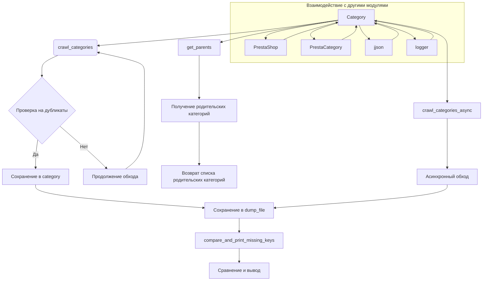

```MD
# <input code>

```rst
.. module: src.category
```
# Модуль: Category

## Обзор

Модуль `Category` предоставляет функциональность для работы с категориями товаров, в первую очередь для PrestaShop. Он предлагает инструменты для взаимодействия с данными категорий, включая обход страниц категорий и управление иерархической структурой категорий.

## Класс: `Category`

Класс `Category` наследует от `PrestaCategory` и отвечает за обработку категорий товаров, получение родительских категорий и рекурсивный обход страниц категорий.

### Конструктор: `__init__(self, api_credentials, *args, **kwargs)`

Инициализирует объект `Category`.

#### Аргументы:
- `api_credentials`: Учетные данные API для доступа к данным категорий.
- `args`: Список аргументов переменной длины (не используется).
- `kwargs`: Ключевые аргументы (не используется).

### Метод: `get_parents(self, id_category, dept)`

Получает список родительских категорий.

#### Аргументы:
- `id_category`: ID категории, для которой нужно получить родительские категории.
- `dept`: Уровень глубины категории.

#### Возвращает:
- Список родительских категорий.

### Метод: `crawl_categories_async(self, url, depth, driver, locator, dump_file, default_category_id, category=None)`

Асинхронно обходит категории, строя иерархический словарь.

#### Аргументы:
- `url`: URL страницы категории.
- `depth`: Глубина рекурсии обхода.
- `driver`: Экземпляр Selenium WebDriver.
- `locator`: XPath локатор для ссылок на категории.
- `dump_file`: Путь к файлу JSON для сохранения результатов.
- `default_category_id`: ID категории по умолчанию.
- `category`: (Необязательно) Существующий словарь категории (по умолчанию=None).

#### Возвращает:
- Обновленный или новый словарь категорий.

### Метод: `crawl_categories(self, url, depth, driver, locator, dump_file, id_category_default, category={})`

Рекурсивно обходит категории и строит иерархический словарь.

#### Аргументы:
- `url`: URL страницы для обхода.
- `depth`: Глубина рекурсии.
- `driver`: Экземпляр Selenium WebDriver.
- `locator`: XPath локатор для поиска ссылок на категории.
- `dump_file`: Файл для сохранения иерархического словаря.
- `id_category_default`: ID категории по умолчанию.
- `category`: Словарь категории (по умолчанию пустой).

#### Возвращает:
- Иерархический словарь категорий и их URL.

### Метод: `_is_duplicate_url(self, category, url)`

Проверяет, существует ли URL в словаре категорий.

#### Аргументы:
- `category`: Словарь категорий.
- `url`: URL для проверки.

#### Возвращает:
- `True`, если URL является дубликатом, иначе `False`.

## Функция: `compare_and_print_missing_keys(current_dict, file_path)`

Сравнивает текущий словарь с данными из файла и выводит отсутствующие ключи.

### Аргументы:
- `current_dict`: Словарь для сравнения.
- `file_path`: Путь к файлу, содержащему данные для сравнения.

## Пример использования

```python
from src.category import Category

# Инициализация Category с учетными данными API
category = Category(api_credentials={'api_key': 'your_api_key'})

# Получение родительских категорий
parents = category.get_parents(id_category=123, dept=2)

# Асинхронный обход категорий
category_data = await category.crawl_categories_async(
    url='https://example.com/categories',
    depth=3,
    driver=driver_instance,
    locator='//a[@class="category-link"]',
    dump_file='categories.json',
    default_category_id=123
)

# Сравнение текущих данных категорий с файлом и вывод отсутствующих ключей
compare_and_print_missing_keys(current_dict=category_data, file_path='saved_categories.json')
```

## Зависимости

- `requests`
- `lxml`
- `asyncio`
- `selenium`
- `src.endpoints.prestashop.PrestaShop`
- `src.endpoints.prestashop.PrestaCategory`
- `src.utils.jjson.j_loads`
- `src.utils.jjson.j_dumps`
- `src.logger.logger`
```

# <algorithm>

**Шаг 1:** Инициализация объекта `Category`. (Принимаются учетные данные API)
**Шаг 2:** (get_parents) Поиск родительских категорий по ID.
**Шаг 3:** (crawl_categories_async/crawl_categories) Рекурсивный обход страниц категорий, получая ссылки на дочерние категории.
**Шаг 4:** (crawl_categories_async/crawl_categories) Сохранение данных в иерархический словарь `category`. (Проверка на дубликаты с помощью `_is_duplicate_url`)
**Шаг 5:** Сохранение результата в `dump_file` в формате JSON.
**Шаг 6:** (compare_and_print_missing_keys) Сравнение данных `category` со значениями из `saved_categories.json` и вывод отсутствующих ключей.

**Пример (crawl_categories):**
- Вход: URL родительской категории, глубина рекурсии.
- Выход: Иерархический словарь категорий, содержащий ID, название и URL каждой категории.
- Перемещение данных:  Объект `driver` используется для парсинга страницы. Результаты из `driver` передаются в `crawl_categories_async` и рекурсивно в последующие вызовы.

# <mermaid>



**Подключаемые зависимости:**
- `PrestaShop`: модуль для взаимодействия с API PrestaShop.
- `PrestaCategory`: класс для работы с категориями в PrestaShop.
- `jjson`: модуль для работы с JSON (сериализация/десериализация).
- `logger`: модуль для логирования.
- `requests`: для HTTP-запросов.
- `lxml`: для работы с XML.
- `asyncio`: для асинхронного программирования.
- `selenium`: для управления браузером и веб-скрейпинга.


# <explanation>

**Импорты:**
- `src.endpoints.prestashop.PrestaShop`, `src.endpoints.prestashop.PrestaCategory`:  Связаны с API и моделью данных PrestaShop.  Обеспечивают взаимодействие с внешней системой управления магазином.
- `src.utils.jjson.j_loads`, `src.utils.jjson.j_dumps`:  Утилиты для работы с JSON. Эти функции используются для сериализации и десериализации данных.
- `src.logger.logger`:  Модуль для логирования, важная часть для отладки и мониторинга.
- `requests`, `lxml`, `asyncio`, `selenium`: стандартные библиотеки для работы с сетью, веб-парсингом, асинхронным кодом и управлением браузером.  Они используются для выполнения HTTP-запросов, обработки XML-данных, асинхронного кода и работы с сайтом, соответственно.


**Классы:**
- `Category`: Центральный класс, отвечающий за взаимодействие с категориями. Наследует от `PrestaCategory`, что указывает на зависимость от модели данных PrestaShop.  Этот класс имеет методы для получения родительских категорий и рекурсивного обхода категорий, а также для асинхронной обработки.


**Функции:**
- `crawl_categories_async`: Асинхронный обход, получает данные и сохраняет в виде иерархического словаря.
- `crawl_categories`: Синхронный вариант, аналогичный предыдущей функции.
- `compare_and_print_missing_keys`: Сравнение словаря с файлом и вывод отсутствующих ключей.


**Переменные:**
- `api_credentials`: Учетные данные для доступа к API PrestaShop.
- `driver`: Экземпляр WebDriver для управления Selenium.
- `url`, `depth`, `locator`, `dump_file`, `default_category_id`: аргументы для управления процессом обхода и сохранения данных.

**Возможные ошибки/улучшения:**
- Отсутствие проверки валидности `api_credentials`.
- Недостаточная обработка ошибок при парсинге и сохранении данных.
- Отсутствие кэширования данных (повторяющиеся запросы к сайту).
- Можно добавить обработку исключений (например, `NoSuchElementException` при поиске элементов на странице).
- Лучше использовать try-except блоки для обработки потенциальных ошибок парсинга.


**Цепочка взаимосвязей:**
Код модуля `Category` напрямую зависит от `PrestaShop` и `PrestaCategory` для доступа к данным API. `Category` использует модуль `jjson` для работы с JSON-данными.  Для отображения результатов и записи в файл используется `logger`.  Для веб-скрейпинга используется `selenium`.  Все эти компоненты находятся в `src`-дереве проекта.