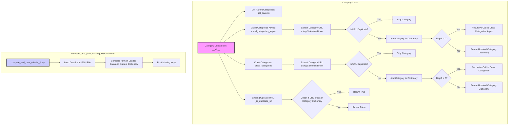

## <алгоритм>

### Класс `Category`

1.  **Инициализация `__init__`**:
    *   Принимает `api_credentials` для доступа к API.
    *   Инициализирует объект, наследуя от `PrestaCategory`.
    *   Пример:
        ```python
        category = Category(api_credentials={'api_key': 'your_api_key'})
        ```
2.  **Получение родительских категорий `get_parents`**:
    *   Принимает `id_category` (ID целевой категории) и `dept` (глубина).
    *   Использует API для получения родительских категорий до заданной глубины.
    *   Возвращает список родительских категорий.
    *   Пример:
        ```python
        parents = category.get_parents(id_category=123, dept=2)
        ```
3.  **Асинхронный обход категорий `crawl_categories_async`**:
    *   Принимает `url` (URL страницы категорий), `depth` (глубина обхода), `driver` (Selenium WebDriver), `locator` (XPath для ссылок на категории), `dump_file` (файл для сохранения), `default_category_id` (ID категории по умолчанию), и необязательный `category` (словарь категорий).
    *   Начинает обход с указанной глубины.
    *   Для каждой найденной категории:
        *   Извлекает URL категории.
        *   Если URL не дублируется, добавляет категорию в словарь.
        *   Рекурсивно вызывает себя для дочерних категорий, уменьшая глубину.
    *   Возвращает словарь категорий.
    *   Пример:
        ```python
        category_data = await category.crawl_categories_async(
            url='https://example.com/categories',
            depth=3,
            driver=driver_instance,
            locator='//a[@class="category-link"]',
            dump_file='categories.json',
            default_category_id=123
        )
        ```
4.  **Рекурсивный обход категорий `crawl_categories`**:
    *   Принимает те же аргументы, что и `crawl_categories_async`, но выполняет синхронный обход.
    *   Имеет ту же логику, что и `crawl_categories_async`, но использует рекурсию напрямую без `async`.
    *   Возвращает словарь категорий.
5.  **Проверка дубликата URL `_is_duplicate_url`**:
    *   Принимает `category` (словарь категорий) и `url` для проверки.
    *   Проверяет, существует ли URL в словаре.
    *   Возвращает `True`, если дубликат, иначе `False`.
    *   Пример:
        ```python
        is_duplicate = category._is_duplicate_url(category_dict, 'https://example.com/category1')
        ```

### Функция `compare_and_print_missing_keys`

1.  Принимает `current_dict` (текущий словарь) и `file_path` (путь к файлу JSON).
2.  Загружает данные из файла JSON.
3.  Сравнивает ключи `current_dict` с ключами из файла.
4.  Выводит ключи, которые есть в файле, но отсутствуют в `current_dict`.
5.  Пример:
    ```python
    compare_and_print_missing_keys(current_dict=category_data, file_path='saved_categories.json')
    ```

## <mermaid>



### Объяснение зависимостей `mermaid`:

*   **`Category Class`**:
    *   `__init__`: Конструктор класса `Category`.
    *   `get_parents`: Метод для получения родительских категорий.
    *   `crawl_categories_async`: Асинхронный метод обхода категорий.
    *   `crawl_categories`: Синхронный метод обхода категорий.
    *   `_is_duplicate_url`: Метод для проверки дублирования URL.
    *   `Extract Category URL using Selenium Driver`: Этап извлечения URL-адреса категории, используя Selenium WebDriver.
    *   `Is URL Duplicate?`: Проверяет, является ли URL дубликатом.
    *   `Skip Category`: Пропускает категорию, если она дублируется.
    *   `Add Category to Dictionary`: Добавляет категорию в словарь.
    *   `Depth > 0?`: Проверяет, является ли глубина обхода больше нуля.
    *   `Recursive Call to Crawl Categories Async`: Рекурсивный вызов для асинхронного метода.
     *   `Recursive Call to Crawl Categories`: Рекурсивный вызов для синхронного метода.
    *   `Return Updated Category Dictionary`: Возвращает обновленный словарь категорий.
    *   `Check if URL exists in Category Dictionary`: Проверяет, существует ли URL в словаре.
    *   `Return True/False`: Возвращает результат проверки.
*   **`compare_and_print_missing_keys Function`**:
    *   `compare_and_print_missing_keys`: Функция для сравнения и вывода отсутствующих ключей.
    *   `Load Data from JSON File`: Этап загрузки данных из файла JSON.
    *   `Compare keys of Loaded Data and Current Dictionary`: Этап сравнения ключей загруженных данных и текущего словаря.
    *   `Print Missing Keys`: Этап вывода отсутствующих ключей.

## <объяснение>

### Импорты:

*   `src.endpoints.prestashop.PrestaShop`: Базовый класс для взаимодействия с PrestaShop API. Предоставляет функциональность для отправки запросов и получения данных.
*   `src.endpoints.prestashop.PrestaCategory`: Класс, наследующий от `PrestaShop`, специализируется на работе с категориями PrestaShop. Предоставляет методы для запросов связанных с категориями.
*   `src.utils.jjson.j_loads`: Функция для загрузки данных из JSON-файла.
*   `src.utils.jjson.j_dumps`: Функция для преобразования данных в JSON-формат и их сохранения.
*   `src.logger.logger`: Модуль для логирования действий.
*   `requests`: Библиотека для отправки HTTP-запросов.
*    `lxml`: Библиотека для парсинга HTML и XML.
*   `asyncio`: Библиотека для асинхронного программирования.
*   `selenium`: Библиотека для автоматизации браузера.

### Класс `Category`:

*   **Роль**: Управляет категориями товаров, предоставляя методы для обхода и обработки иерархической структуры категорий.
*   **Атрибуты**:
    *   Наследует атрибуты от `PrestaCategory`, включая учетные данные API.
*   **Методы**:
    *   `__init__(self, api_credentials, *args, **kwargs)`:
        *   Инициализирует объект `Category` с переданными учетными данными API.
        *   Наследуется от `PrestaCategory`, предоставляя доступ к API.
    *   `get_parents(self, id_category, dept)`:
        *   Получает список родительских категорий для заданной категории, основываясь на глубине.
        *   Использует API `PrestaShop` для получения данных.
        *   Возвращает список ID родительских категорий.
    *   `crawl_categories_async(self, url, depth, driver, locator, dump_file, default_category_id, category=None)`:
        *   Асинхронно обходит категории, начиная с заданного URL и глубины.
        *   Использует `Selenium WebDriver` для управления браузером и навигации.
        *   `locator` - это XPath для поиска ссылок на категории.
        *   Сохраняет результаты в JSON-файл.
        *    Строит иерархический словарь категорий.
    *   `crawl_categories(self, url, depth, driver, locator, dump_file, id_category_default, category={})`:
        *   Синхронно обходит категории, начиная с заданного URL и глубины.
        *   Использует `Selenium WebDriver` для управления браузером и навигации.
        *   `locator` - это XPath для поиска ссылок на категории.
        *   Сохраняет результаты в JSON-файл.
        *   Строит иерархический словарь категорий.
    *   `_is_duplicate_url(self, category, url)`:
        *   Проверяет, есть ли указанный URL в словаре категорий, для избежания повторной обработки.

### Функция `compare_and_print_missing_keys`:

*   **Аргументы**: `current_dict` (текущий словарь) и `file_path` (путь к файлу JSON).
*   **Назначение**: Сравнивает текущий словарь с данными, загруженными из файла, и выводит отсутствующие ключи.
*   **Пример**: Полезно для отслеживания изменений в структуре данных и выявления отсутствующих категорий после их обновления или модификации.

### Переменные:

*   `api_credentials`: Словарь с учетными данными для API `PrestaShop`.
*   `id_category`: ID категории.
*   `dept`: Глубина иерархии категорий.
*   `url`: URL страницы категорий.
*   `depth`: Глубина обхода категорий.
*   `driver`: Экземпляр `Selenium WebDriver` для управления браузером.
*   `locator`: XPath-локатор для поиска ссылок на категории.
*   `dump_file`: Путь к файлу для сохранения данных.
*   `default_category_id`: ID категории по умолчанию.
*   `category`: Словарь категорий.
*   `current_dict`: Текущий словарь для сравнения.
*   `file_path`: Путь к файлу для сравнения.

### Взаимосвязи с другими частями проекта:

*   Класс `Category` зависит от `src.endpoints.prestashop.PrestaCategory` для доступа к данным категорий `PrestaShop`.
*   Использует `src.utils.jjson` для сохранения и загрузки данных категорий в JSON-формате.
*   Модуль логирования `src.logger.logger` для отслеживания процесса.
*   Использует `selenium` для взаимодействия с браузером и сбора данных.
*   Использует `asyncio` для асинхронного обхода категорий.

### Потенциальные ошибки и области для улучшения:

*   **Обработка ошибок**: Необходимо добавить более надежную обработку исключений при запросах API и во время работы с `Selenium WebDriver`.
*   **Динамические локаторы**: Локаторы XPath могут быть нестабильными, лучше использовать более надежные и гибкие способы поиска элементов, например CSS-селекторы или id.
*   **Оптимизация производительности**: При обходе большого количества категорий асинхронный подход может улучшить производительность.
*   **Модульность**: Разбить `crawl_categories_async` на более мелкие функции.

Этот подробный анализ кода и его взаимосвязей предоставляет полное представление о функциональности модуля `Category`.