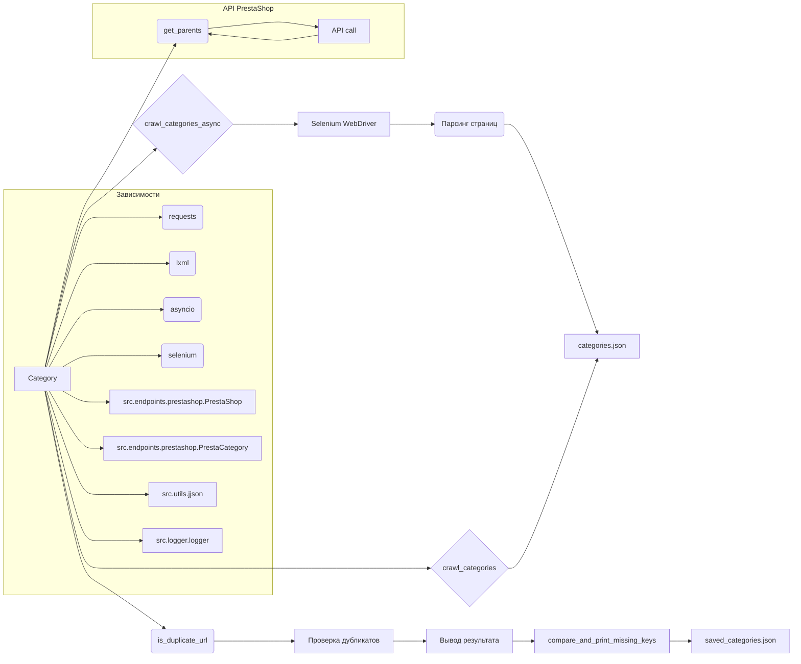

# <input code>

```rst
.. :module: src.category
```
# Модуль: Category

## Обзор

Модуль `Category` предоставляет функциональность для работы с категориями товаров, в первую очередь для PrestaShop. Он предлагает инструменты для взаимодействия с данными категорий, включая обход страниц категорий и управление иерархической структурой категорий.

## Класс: `Category`

Класс `Category` наследует от `PrestaCategory` и отвечает за обработку категорий товаров, получение родительских категорий и рекурсивный обход страниц категорий.

### Конструктор: `__init__(self, api_credentials, *args, **kwargs)`

Инициализирует объект `Category`.

#### Аргументы:
- `api_credentials`: Учетные данные API для доступа к данным категорий.
- `args`: Список аргументов переменной длины (не используется).
- `kwargs`: Ключевые аргументы (не используется).

### Метод: `get_parents(self, id_category, dept)`

Получает список родительских категорий.

#### Аргументы:
- `id_category`: ID категории, для которой нужно получить родительские категории.
- `dept`: Уровень глубины категории.

#### Возвращает:
- Список родительских категорий.

### Метод: `crawl_categories_async(self, url, depth, driver, locator, dump_file, default_category_id, category=None)`

Асинхронно обходит категории, строя иерархический словарь.

#### Аргументы:
- `url`: URL страницы категории.
- `depth`: Глубина рекурсии обхода.
- `driver`: Экземпляр Selenium WebDriver.
- `locator`: XPath локатор для ссылок на категории.
- `dump_file`: Путь к файлу JSON для сохранения результатов.
- `default_category_id`: ID категории по умолчанию.
- `category`: (Необязательно) Существующий словарь категории (по умолчанию=None).

#### Возвращает:
- Обновленный или новый словарь категорий.

### Метод: `crawl_categories(self, url, depth, driver, locator, dump_file, id_category_default, category={})`

Рекурсивно обходит категории и строит иерархический словарь.

#### Аргументы:
- `url`: URL страницы для обхода.
- `depth`: Глубина рекурсии.
- `driver`: Экземпляр Selenium WebDriver.
- `locator`: XPath локатор для поиска ссылок на категории.
- `dump_file`: Файл для сохранения иерархического словаря.
- `id_category_default`: ID категории по умолчанию.
- `category`: Словарь категории (по умолчанию пустой).

#### Возвращает:
- Иерархический словарь категорий и их URL.

### Метод: `_is_duplicate_url(self, category, url)`

Проверяет, существует ли URL в словаре категорий.

#### Аргументы:
- `category`: Словарь категорий.
- `url`: URL для проверки.

#### Возвращает:
- `True`, если URL является дубликатом, иначе `False`.

## Функция: `compare_and_print_missing_keys(current_dict, file_path)`

Сравнивает текущий словарь с данными из файла и выводит отсутствующие ключи.

### Аргументы:
- `current_dict`: Словарь для сравнения.
- `file_path`: Путь к файлу, содержащему данные для сравнения.

## Пример использования

```python
from src.category import Category

# Инициализация Category с учетными данными API
category = Category(api_credentials={'api_key': 'your_api_key'})

# Получение родительских категорий
parents = category.get_parents(id_category=123, dept=2)

# Асинхронный обход категорий
category_data = await category.crawl_categories_async(
    url='https://example.com/categories',
    depth=3,
    driver=driver_instance,
    locator='//a[@class="category-link"]',
    dump_file='categories.json',
    default_category_id=123
)

# Сравнение текущих данных категорий с файлом и вывод отсутствующих ключей
compare_and_print_missing_keys(current_dict=category_data, file_path='saved_categories.json')
```

## Зависимости

- `requests`
- `lxml`
- `asyncio`
- `selenium`
- `src.endpoints.prestashop.PrestaShop`
- `src.endpoints.prestashop.PrestaCategory`
- `src.utils.jjson.j_loads`
- `src.utils.jjson.j_dumps`
- `src.logger.logger`
```

# <algorithm>

Алгоритм работы кода заключается в итеративном сборе данных о категориях товаров с сайта PrestaShop.

1. **Инициализация:** Создается объект `Category` с учетными данными API.
2. **Получение родительских категорий (get_parents):**  Функция получает родительские категории для заданного `id_category`.  
   *Пример:*  `get_parents(id_category=123, dept=2)` получит 2 уровня родительских категорий для категории с ID 123.  
3. **Асинхронный обход категорий (crawl_categories_async):**  Функция асинхронно обходит категории на сайте, используя Selenium WebDriver.  
   *Пример:* `crawl_categories_async` загружает страницу `https://example.com/categories`, парсит ссылки на дочерние категории и сохраняет их вместе с иерархией в `categories.json`.
   *Данные передаются:*  `url`, `depth`, `driver`, `locator` передаются для асинхронной работы и получения информации с веб-сайта.
4. **Рекурсивный обход категорий (crawl_categories):** Функция рекурсивно обходит категории, создавая иерархический словарь.  
   *Пример:* `crawl_categories`  загружает список дочерних категорий, обходит каждую из них, повторяя шаг 3.
   *Данные передаются:*  Рекурсивно переданный словарь `category` и дополнительные аргументы для настройки.
5. **Проверка на дубликаты (is_duplicate_url):** Функция проверяет, не дублируются ли URL-адреса категорий.
   *Пример:* `_is_duplicate_url` проверяет, есть ли уже такой URL в `category`.
6. **Сравнение данных (compare_and_print_missing_keys):** Функция сравнивает полученный словарь с данными из файла и выводит отсутствующие ключи.
   *Пример:* `compare_and_print_missing_keys` сравнивает `category_data` с `saved_categories.json` и выводит список ключей, которые есть в первом, но отсутствуют во втором.

В итоге, код собирает иерархию категорий с сайта, сохраняет ее в JSON-файл и сравнивает ее с предыдущей версией, выявляя изменения.

# <mermaid>



*Описание диаграммы:*
Диаграмма показывает основные функции и классы модуля `Category` и их взаимосвязи.  Стрелки показывают, как данные передаются и обрабатываются.  Главная функция `Category` вызывается методами `get_parents`, `crawl_categories_async`, `crawl_categories` и `is_duplicate_url` .  Важные зависимости от других модулей (`requests`, `lxml`,  `src.endpoints.prestashop` и др.) также представлены.  Функция `compare_and_print_missing_keys` используется для сравнения данных с сохраненными результатами.


# <explanation>

**Импорты:**

Код импортирует необходимые библиотеки, такие как `requests` для работы с API, `lxml` для парсинга HTML, `asyncio` для асинхронных операций, `selenium` для работы с веб-драйвером, и классы из `src.endpoints.prestashop` для взаимодействия с PrestaShop API,  `src.utils.jjson` для работы с JSON и `src.logger.logger` для логирования.  Это указывает на структурированную архитектуру приложения с модулями для различных задач (API взаимодействие, парсинг данных, логирование).

**Классы:**

- `Category`: Главный класс для работы с категориями.  Наследует от `PrestaCategory`, что подразумевает использование функциональности, специфичной для работы с категориями PrestaShop (возможно, для доступа к API).  Методы `get_parents`, `crawl_categories_async`, `crawl_categories`, `_is_duplicate_url` — важные функции для обработки и получения данных о категориях.

**Функции:**

- `get_parents`: Получает родительские категории для заданной категории по её ID.
- `crawl_categories_async` и `crawl_categories`: Рекурсивно обходят категории на сайте, собирая иерархическую структуру.  `crawl_categories_async` реализует асинхронную обработку для повышения производительности.  Они принимают параметры для URL, глубины обхода, веб-драйвера, локатора для поиска категорий и т.д., что позволяет настраивать процесс сбора данных.
- `_is_duplicate_url`: Проверяет, встречался ли данный URL уже в списке, предотвращая дублирование.
- `compare_and_print_missing_keys`: Сравнивает текущий словарь категорий с данными из файла и выводит отсутствующие ключи, что позволяет обнаружить изменения в данных.

**Переменные:**

Переменные, такие как `api_credentials`, `url`, `depth`, `driver`, `locator`, `dump_file`, `default_category_id`, содержат данные, необходимые для работы с API и сбора данных.

**Возможные ошибки и улучшения:**

- **Обработка исключений:**  Необходимо добавить обработку исключений (например, `try...except` блоки) для ситуаций, когда страница не найдена, API недоступен или возникают другие ошибки. Это сделает код более надежным.
- **Время ожидания:**  Важно добавить `sleep` для предотвращения перегрузки сервера и обработки ошибок со стороны сервера.
- **Параллелизм:** Для более быстрого сбора данных можно использовать больше потоков (asyncio.gather) для одновременной обработки множества запросов.
- **Документация:**  Документация должна содержать информацию о типах возвращаемых значений и специфике работы с PrestaShop API.


В целом, код хорошо структурирован и демонстрирует понимание принципов работы с API и парсинга.  Он эффективно использует асинхронную обработку и рекурсию для сбора и обработки данных.  Указанные улучшения повысят устойчивость и эффективность приложения.