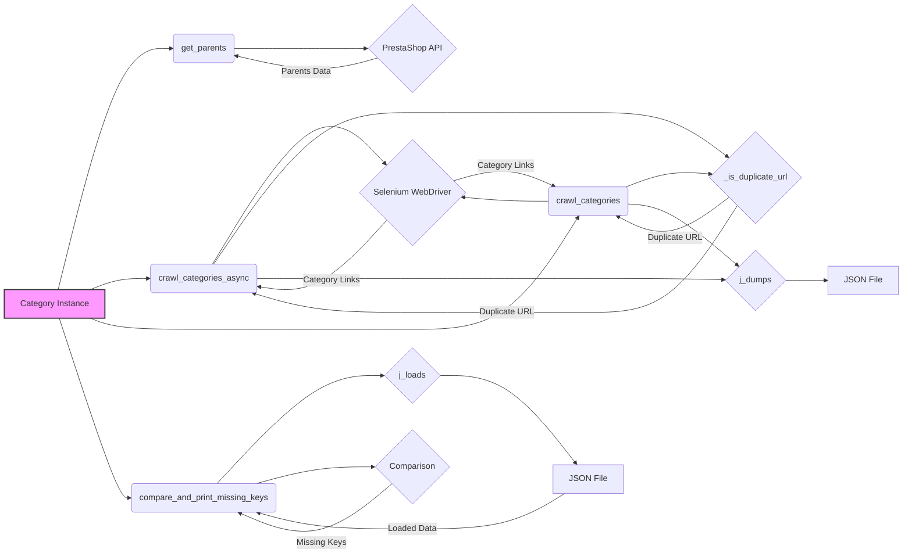

## <алгоритм>

**1. Инициализация класса `Category`:**

   - Создается экземпляр класса `Category`, унаследованный от `PrestaCategory`. 
   - Принимает `api_credentials` для доступа к API PrestaShop.

   *Пример:*
   ```python
   category_instance = Category(api_credentials={'api_key': 'your_api_key'})
   ```

**2. Метод `get_parents` (Получение родительских категорий):**

   - Принимает `id_category` (ID текущей категории) и `dept` (уровень глубины).
   - Использует API PrestaShop для получения родительских категорий текущей. 
   - Возвращает список родительских категорий.
   
   *Пример:*
   ```
   parents = category_instance.get_parents(id_category=123, dept=2)
   ```

**3. Метод `crawl_categories_async` (Асинхронный обход категорий):**

   - Принимает `url` (URL страницы категории), `depth` (максимальная глубина обхода), `driver` (экземпляр Selenium WebDriver), `locator` (XPath-локатор ссылок на категории), `dump_file` (путь к файлу для сохранения), `default_category_id` (ID категории по умолчанию), и необязательный параметр `category` (существующий словарь категорий).
   - Запускает асинхронный обход страниц, используя Selenium для получения динамического контента.
   - На каждой итерации:
      - Ищет ссылки на категории, используя предоставленный `locator` и `driver`.
      - Для каждой найденной ссылки:
        - Проверяет, не является ли URL дубликатом (с помощью метода `_is_duplicate_url`).
        - Если нет дубликата:
           - Добавляет URL в словарь категорий, рекурсивно вызывая `crawl_categories_async` для подкатегорий.
      - Сохраняет иерархический словарь в JSON файл (используя `j_dumps`).
   - Возвращает обновленный словарь категорий.

   *Пример:*
    ```python
    category_data = await category_instance.crawl_categories_async(
        url='https://example.com/categories',
        depth=3,
        driver=driver_instance,
        locator='//a[@class="category-link"]',
        dump_file='categories.json',
        default_category_id=123
    )
    ```

**4. Метод `crawl_categories` (Синхронный обход категорий):**

   - Принимает те же параметры, что и `crawl_categories_async`, за исключением того, что выполняется синхронно.
   - Процесс обхода аналогичен `crawl_categories_async`, но выполняется без использования асинхронности.
   - Рекурсивно обходит страницы категорий, заполняя иерархический словарь.

   *Пример:*
     ```python
     category_data = category_instance.crawl_categories(
         url='https://example.com/categories',
         depth=3,
         driver=driver_instance,
         locator='//a[@class="category-link"]',
         dump_file='categories.json',
         id_category_default=123
     )
     ```

**5. Метод `_is_duplicate_url` (Проверка дубликата URL):**

   - Принимает словарь `category` и `url` для проверки.
   - Проверяет наличие `url` в словаре, возвращая `True`, если URL дублируется, иначе `False`.

**6. Функция `compare_and_print_missing_keys` (Сравнение словарей):**

   - Принимает `current_dict` (словарь для сравнения) и `file_path` (путь к файлу JSON).
   - Загружает данные из JSON-файла (`j_loads`).
   - Сравнивает ключи загруженного словаря с ключами `current_dict`.
   - Выводит недостающие ключи.

   *Пример:*
    ```python
     compare_and_print_missing_keys(current_dict=category_data, file_path='saved_categories.json')
    ```

## <mermaid>



**Описание зависимостей в диаграмме:**

- **`Category Instance`**: Экземпляр класса `Category`, используемый для вызова методов.
- **`get_parents`**: Метод для получения родительских категорий.
- **`PrestaShop API`**: API PrestaShop для получения данных о категориях.
- **`crawl_categories_async`**: Метод для асинхронного обхода категорий.
- **`Selenium WebDriver`**: Инструмент для автоматизации браузера, используется для извлечения динамических данных.
- **`_is_duplicate_url`**: Метод для проверки дубликатов URL.
- **`j_dumps`**: Функция для сохранения словаря в JSON-файл.
- **`JSON File`**: Файл для сохранения иерархии категорий.
- **`crawl_categories`**: Метод для синхронного обхода категорий.
- **`compare_and_print_missing_keys`**: Функция для сравнения словарей и вывода отсутствующих ключей.
- **`j_loads`**: Функция для загрузки данных из JSON-файла.
- **`Comparison`**: Процесс сравнения ключей.

## <объяснение>

**Импорты:**

-   `src.endpoints.prestashop.PrestaShop`: Класс для взаимодействия с API PrestaShop.
-   `src.endpoints.prestashop.PrestaCategory`: Класс для работы с категориями PrestaShop.
-   `src.utils.jjson.j_loads`: Функция для загрузки данных из JSON-файла.
-   `src.utils.jjson.j_dumps`: Функция для сохранения данных в JSON-файл.
-   `src.logger.logger`: Модуль для логирования событий.

**Классы:**

-   **`Category`**:
    -   **Роль**: Предоставляет функционал для обхода и управления категориями товаров, ориентированный на PrestaShop.
    -   **Атрибуты**: Наследуется от `PrestaCategory` и не имеет собственных атрибутов, помимо тех, что унаследованы.
    -   **Методы**:
        -   `__init__(self, api_credentials, *args, **kwargs)`: Конструктор класса, инициализирует с учетными данными API.
        -   `get_parents(self, id_category, dept)`: Получает список родительских категорий.
        -   `crawl_categories_async(self, url, depth, driver, locator, dump_file, default_category_id, category=None)`: Асинхронно обходит страницы категорий, строя иерархический словарь.
        -   `crawl_categories(self, url, depth, driver, locator, dump_file, id_category_default, category={})`: Синхронно обходит страницы категорий, строя иерархический словарь.
        -   `_is_duplicate_url(self, category, url)`: Проверяет, является ли URL дубликатом.
    -   **Взаимодействие**: Взаимодействует с API PrestaShop (`PrestaCategory`), Selenium WebDriver для обхода страниц, и `j_loads`/`j_dumps` для работы с JSON.

**Функции:**

-   **`compare_and_print_missing_keys(current_dict, file_path)`**:
    -   **Аргументы**: `current_dict` (словарь для сравнения) и `file_path` (путь к файлу).
    -   **Возвращает**: Ничего.
    -   **Назначение**: Сравнивает ключи словаря с ключами из JSON файла и выводит отсутствующие.
    -   **Пример**:
        ```python
        compare_and_print_missing_keys(current_dict={'key1': 'value1'}, file_path='data.json')
        ```
        Где `data.json` содержит `{"key1": "value2", "key2": "value3"}`. Будет выведено: `{'key2'}`.

**Переменные:**

-   `api_credentials`: Словарь с учетными данными для доступа к API PrestaShop.
-   `id_category`: ID текущей категории.
-   `dept`: Глубина дерева категорий.
-   `url`: URL страницы категории.
-   `depth`: Максимальная глубина обхода.
-   `driver`: Экземпляр Selenium WebDriver.
-   `locator`: XPath-локатор для ссылок на категории.
-   `dump_file`: Путь к файлу JSON для сохранения.
-   `default_category_id`: ID категории по умолчанию.
-   `category`: Словарь категорий.
-   `current_dict`: Словарь, переданный для сравнения в `compare_and_print_missing_keys`.
-   `file_path`: Путь к файлу JSON для сравнения в `compare_and_print_missing_keys`.

**Потенциальные ошибки и области для улучшения:**

1.  **Обработка исключений**: В методах `crawl_categories_async` и `crawl_categories` не хватает обработки исключений, например, `TimeoutException` при загрузке страницы или ошибках парсинга.
2.  **Логирование**: Недостаточно логирования, что может усложнить отладку.
3.  **Обработка динамического контента**: При обходе категорий через Selenium нет явной обработки ситуаций с задержкой загрузки элементов (необходим `WebDriverWait`).
4.  **Рекурсия**: В `crawl_categories` рекурсивный вызов без явного ограничения максимальной глубины, что может привести к переполнению стека.
5.  **Сохранение данных**: В коде не предусмотрена проверка сохранения файла и обработка исключений связанных с этим (дисковое пространство, права доступа).
6.  **Дубликаты категорий**: Если URL меняются (например, `?page=2`), нужно иметь механизм для их обработки, чтобы избежать дубликатов в словаре.
7.  **Параметризация**: XPath-локатор жёстко задан, что ограничивает гибкость.
8.  **Асинхронность**: В  `crawl_categories_async` стоит использовать `async with` для работы с WebDriver.

**Взаимосвязь с другими частями проекта:**

-   Модуль `src.category` зависит от `src.endpoints.prestashop` для взаимодействия с API PrestaShop.
-   Использует утилиты `src.utils.jjson` для работы с JSON.
-   Зависит от `src.logger.logger` для логирования (хотя явно не используется).
-   Для динамического скрапинга используется `selenium`, что является внешней зависимостью.

В целом, модуль предоставляет основу для работы с категориями PrestaShop, но требует доработки для обеспечения надежности и гибкости.