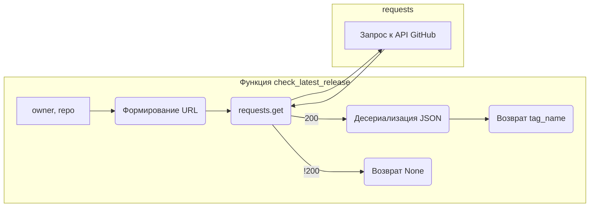

```MD
# Анализ кода check_release.py

## <input code>

```python
## \file hypotez/src/check_release.py
# -*- coding: utf-8 -*-
#! venv/Scripts/python.exe
#! venv/bin/python/python3.12

"""
.. module: src 
	:platform: Windows, Unix
	:synopsis:

"""
MODE = 'dev'


import requests
from src.logger import logger

def check_latest_release(owner: str, repo: str):
    """Check the latest release version of a GitHub repository.

    Args:
        owner (str): The owner of the repository.
        repo (str): The name of the repository.

    Returns:
        str: The latest release version if available, else None.
    """
    url = f'https://api.github.com/repos/{owner}/{repo}/releases/latest'
    response = requests.get(url)

    if response.status_code == 200:
        latest_release = response.json()
        return latest_release['tag_name']
    else:
        #logger.error(f"Error fetching data: {response.status_code}")
        #TODO: Код не проверен
        return 
```

## <algorithm>

**Шаг 1:** Функция `check_latest_release` принимает два аргумента: `owner` (владелец репозитория) и `repo` (имя репозитория).

**Шаг 2:** Строится URL для запроса к API GitHub.

**Шаг 3:** Используя `requests.get`, выполняется GET запрос к API GitHub.

**Шаг 4:** Проверяется код ответа. Если код 200 (успешный запрос), то:

    **Шаг 4.1:** Десериализуется JSON ответ в переменную `latest_release`.

    **Шаг 4.2:** Возвращается значение `tag_name` из ответа.

**Шаг 5:** В противном случае (код ответа не 200):

    **Шаг 5.1:** (Закомментировано) Логируется ошибка.

    **Шаг 5.2:** Возвращается `None`.


**Пример:**

Если `owner` = "owner_name" и `repo` = "repo_name", то URL будет:
`https://api.github.com/repos/owner_name/repo_name/releases/latest`


```mermaid
graph TD
    A[check_latest_release(owner, repo)] --> B{Формирование URL};
    B --> C[requests.get(URL)];
    C -- статус 200 --> D[Десериализация ответа];
    D --> E[Возврат latest_release['tag_name']];
    C -- статус != 200 --> F[Возврат None];
    F --> G[Возврат];
    E --> G;
```


## <mermaid>



## <explanation>

**Импорты:**

- `requests`: Библиотека для работы с HTTP запросами. Она используется для получения данных с API GitHub.
- `src.logger`: Модуль `logger`, вероятно, для логирования ошибок и информации. (Этот импорт подразумевает, что `logger` определён в `src/logger.py`)


**Классы:**

- Нет классов в приведённом коде.

**Функции:**

- `check_latest_release(owner: str, repo: str)`:
    - Принимает имя владельца репозитория (`owner`) и имя репозитория (`repo`) в качестве строк.
    - Формирует URL для запроса к API GitHub.
    - Выполняет GET запрос к указанному URL.
    - Проверяет код ответа. Если 200, возвращает значение `tag_name` из ответа. В противном случае, возвращает `None`.

**Переменные:**

- `MODE`: Строковая переменная, хранящая значение 'dev'. Вероятно, используется для настройки режима работы приложения.
- `url`: Строковая переменная, содержащая сформированный URL запроса.
- `response`: Объект `Response` из библиотеки `requests`, содержащий ответ от API GitHub.
- `latest_release`:  Словарь, содержащий данные о последней версии релиза, полученные из ответа.


**Возможные ошибки и улучшения:**

- **Обработка ошибок:**  В коде есть закомментированный блок `logger.error`, но обработка ошибок неполная.  Необходимо более полное обращение с исключениями:
    - `requests.exceptions.RequestException`:  Обработка ошибок при запросе (например, сетевые ошибки, ошибки подключения).
    - Обработка ситуаций, когда ответ от API не содержит ключа `tag_name`.
- **Детализация логирования:** Заменённый комментарий должен быть развёрнут: `logger.error(f"Ошибка при получении данных: {response.status_code}, {response.text}")`.
- **Обработка временных проблем:** Полезно добавить обработку ситуаций, когда API недоступен или задержка высокая. (использование таймаутов, повторных попыток)
- **Документация:** Не хватает пояснений в коде о том, что конкретно делает функция.

**Взаимосвязь с другими частями проекта:**

Функция `check_latest_release` взаимодействует с `src/logger` для логирования. Она, вероятно, используется в других частях проекта для получения информации о версиях репозиториев.  Подключение к API GitHub происходит через функцию `requests.get()`.