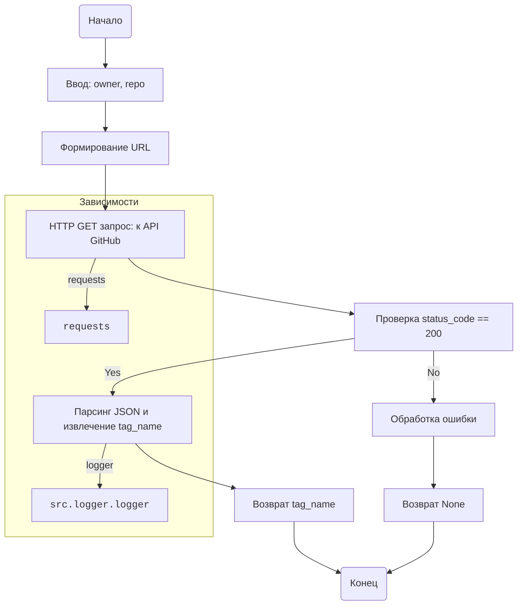

## <алгоритм>

1. **Начало**: Функция `check_latest_release` принимает два строковых аргумента: `owner` (владелец репозитория) и `repo` (название репозитория).
   * Пример: `owner = "octocat", repo = "Spoon-Knife"`

2. **Формирование URL**: Строится URL для запроса к API GitHub, используя переданные значения `owner` и `repo`.
    * Пример: `url = "https://api.github.com/repos/octocat/Spoon-Knife/releases/latest"`

3. **HTTP GET запрос**: Выполняется HTTP GET запрос к сформированному URL с использованием библиотеки `requests`.
    * Пример: `response = requests.get("https://api.github.com/repos/octocat/Spoon-Knife/releases/latest")`

4. **Проверка статуса ответа**: Проверяется HTTP статус код ответа от сервера.
    * Пример: Если `response.status_code` равен `200`, то переходим к шагу 5. Иначе - к шагу 6.

5. **Извлечение версии**: Если статус код `200` (OK), ответ парсится как JSON и извлекается значение `tag_name` из полученного JSON. Это значение является тегом последней версии релиза.
    * Пример: Если `response.json()` возвращает `{'tag_name': 'v1.0.0', ...}`, то возвращается строка `v1.0.0`.

6. **Обработка ошибки**: Если статус код не `200`, то это ошибка. Функция возвращает `None`. В коде есть закомментированная строка с логированием ошибки и `TODO` - код не проверен.
   * Пример: Если `response.status_code` равен `404`, возвращается `None`.

7. **Конец**: Функция возвращает строку с тегом последней версии (например, "v1.0.0") или `None`, если произошла ошибка.

## <mermaid>

**Объяснение зависимостей `mermaid`:**

*   `requests`: Библиотека `requests` используется для выполнения HTTP GET запроса к API GitHub.
*   `src.logger.logger`: Библиотека `src.logger.logger` используется для логирования ошибок, хотя в предоставленном коде она закомментирована.

## <объяснение>

**Импорты:**

*   `requests`: Эта библиотека используется для отправки HTTP-запросов. В данном коде она используется для выполнения GET-запроса к API GitHub, чтобы получить информацию о последнем релизе репозитория.
*   `from src.logger.logger import logger`: Этот импорт предназначен для использования логгера из модуля `logger`, который находится в пакете `src`. Логгер используется для записи информации о работе программы, включая ошибки. В предоставленном коде он не используется (закомментирован).

**Переменные:**

*   `MODE`: Глобальная переменная, устанавливающая режим работы приложения. В коде присвоено значение `'dev'`.
*  `owner` (str):  Владелец репозитория.
*  `repo` (str):  Название репозитория.
*  `url` (str):  Строка, представляющая URL-адрес запроса к API GitHub.
*  `response` (requests.Response): Объект, представляющий ответ от сервера на HTTP-запрос.
*   `latest_release` (dict): Словарь, содержащий информацию о последнем релизе в формате JSON.

**Функции:**

*   `check_latest_release(owner: str, repo: str) -> str | None`:
    *   **Аргументы**:
        *   `owner` (str): Строка, представляющая владельца репозитория на GitHub.
        *   `repo` (str): Строка, представляющая название репозитория на GitHub.
    *   **Возвращаемое значение**:
        *   Строка, содержащая название тега последней версии релиза (например, "v1.0.0"), если запрос успешен.
        *   `None`, если запрос не успешен или возникла ошибка.
    *   **Назначение**: Функция отправляет HTTP GET запрос к API GitHub, чтобы получить информацию о последнем релизе указанного репозитория. Если запрос успешен, она возвращает название тега последнего релиза.

**Потенциальные ошибки и области для улучшения:**

1.  **Обработка ошибок**:
    *   В текущем коде есть только общая обработка ошибки (проверка `status_code` не равного `200`),  но не детализирована обработка конкретных ошибок, таких как: сетевые проблемы, неверный формат ответа от сервера или отсутствие нужного ключа в JSON ответе.
    *   Закомментированная строка `logger.error(f"Error fetching data: {response.status_code}")` указывает на то, что в будущем может быть добавлено логирование ошибок.
    *   Необходимо добавить более подробное логирование и обработку различных ошибок.
2.  **Отсутствие проверки входных данных**:
    *   Нет проверки на то, что аргументы `owner` и `repo` не пустые строки или имеют правильный формат.
3.  **`TODO`**:
     *  В коде есть комментарий `TODO: Код не проверен`, что указывает на то, что функция требует тестирования.
4.  **Возможные сетевые проблемы**:
    *   Код не обрабатывает сетевые ошибки, такие как таймауты соединения или проблемы с DNS.
    *   Необходимо добавить обработку исключений, связанных с сетевыми запросами (`requests.exceptions`).
5.  **Отсутствие обработки лимитов запросов API GitHub**:
    *   API GitHub имеет лимиты на количество запросов, которые можно сделать в определенный период времени.
    *   Необходимо добавить обработку случаев, когда приложение достигло лимита запросов, и использовать задержки перед повторным запросом.
6. **Глобальная переменная MODE:**
    * Глобальные переменные могут привести к непредсказуемому поведению приложения. Лучше избегать их использования.

**Взаимосвязь с другими частями проекта:**

*   Этот модуль, вероятно, предназначен для проверки наличия новых релизов в репозиториях, которые используются в проекте. Он может быть частью более крупной системы автоматизации сборки или проверки обновлений.
*   Код импортирует `logger`, предполагая наличие модуля логирования в пакете `src`. Это указывает на то, что данный модуль является частью более крупного проекта, который использует собственный подход к логированию.
* Функция `check_latest_release` может быть использована в другом модуле для сравнения локальной версии с последней версией, доступной на GitHub.