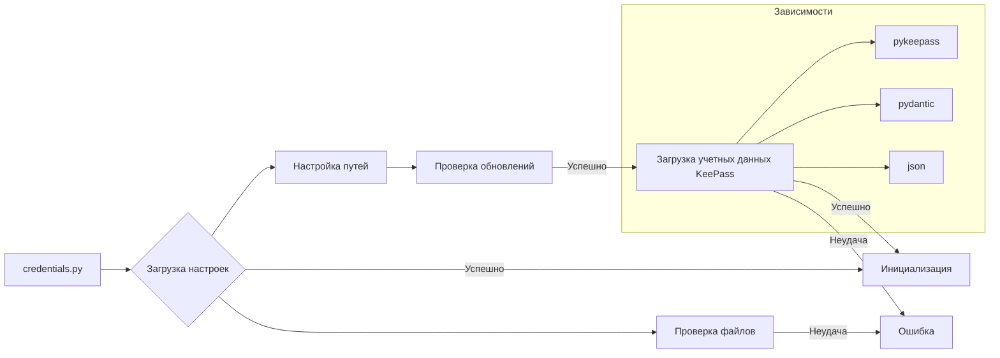

# <input code>

```python
## \file hypotez/src/credentials.py
# -*- coding: utf-8 -*-
#! venv/Scripts/python.exe
#! venv/bin/python/python3.12

"""
.. module: src 
	:platform: Windows, Unix
	:synopsis: Global Project Settings: paths, passwords, logins, and API settings

"""
MODE = 'dev'


import datetime
from datetime import datetime
import getpass
import os
import sys
import json
import warnings
import socket
from dataclasses import dataclass, field
from pathlib import Path
from types import SimpleNamespace
from typing import Optional

from pydantic import BaseModel, Field
from pykeepass import PyKeePass

from src.check_release import check_latest_release
from src.logger.logger import logger
from src.logger.exceptions import (
    BinaryError,
    CredentialsError,
    DefaultSettingsException,
    HeaderChecksumError,
    KeePassException,
    PayloadChecksumError,
    UnableToSendToRecycleBin,
)
from src.utils.file import read_text_file
from src.utils.jjson import j_loads, j_loads_ns
from src.utils.printer import pprint

def set_project_root(marker_files=('pyproject.toml', 'requirements.txt', '.git')) -> Path:
    """
    Finds the root directory of the project starting from the current file's directory,
    searching upwards and stopping at the first directory containing any of the marker files.


    Args:
        marker_files (tuple): Filenames or directory names to identify the project root.
    
    Returns:
        Path: Path to the root directory if found, otherwise the directory where the script is located.
    """
    __root__:Path
    current_path:Path = Path(__file__).resolve().parent
    __root__ = current_path
    for parent in [current_path] + list(current_path.parents):
        if any((parent / marker).exists() for marker in marker_files):
            __root__ = parent
            break
    if __root__ not in sys.path:
        sys.path.insert(0, str(__root__))
    return __root__

def singleton(cls):
    """Декоратор для реализации Singleton."""
    instances = {}

    def get_instance(*args, **kwargs):
        if cls not in instances:
            instances[cls] = cls(*args, **kwargs)
        return instances[cls]

    return get_instance

@singleton
class ProgramSettings(BaseModel):
    """ 
    `ProgramSettings` - класс настроек программы.
    
    Синглтон, хранящий основные параметры и настройки проекта.
    """
    
    class Config:
        arbitrary_types_allowed = True

    host_name:str = socket.gethostname()
    print(f'host_name: {host_name}')

    base_dir: Path = Field(default_factory=lambda: set_project_root())
    config: SimpleNamespace = Field(default_factory=lambda: SimpleNamespace())
    credentials: SimpleNamespace = field(default_factory=lambda: SimpleNamespace(
        aliexpress=SimpleNamespace(
            api_key=None,
            secret=None,
            tracking_id=None,
            username=None,
            email=None,
            password=None
        ),
        presta=SimpleNamespace(
            translations=SimpleNamespace(
                server=None,
                port=None,
                database=None,
                user=None,
                password=None,
            ),
            client=[SimpleNamespace(
                server=None,
                port=None,
                database=None,
                user=None,
                password=None,
            )]
        ),
        openai=SimpleNamespace(
            api_key=None, 
            assistant_id=SimpleNamespace(), 
            project_api=None
        ),
        gemini=SimpleNamespace(api_key=None),
        rev_com=SimpleNamespace(client_api=None,
                                user_api=None),
        shutter_stock=SimpleNamespace(token=None),
        discord=SimpleNamespace(
            application_id=None, 
            public_key=None, 
            bot_token=None
        ),
        telegram=SimpleNamespace(
            bot=SimpleNamespace()
        ),
        smtp=[],
        facebook=[],
        gapi={}
    ))
    MODE: str = Field(default='dev')
    path: SimpleNamespace = Field(default_factory=lambda: SimpleNamespace(
        root = None,
        src = None,
        bin = None,
        log = None,
        tmp = None,
        data = None,
        secrets = None,
        google_drive = None,
        external_storage = None,
        tools = None,
        dev_null ='nul' if sys.platform == 'win32' else '/dev/null'
    ))


    def __init__(self, **kwargs):
        super().__init__(**kwargs)
        self.config = j_loads_ns(self.base_dir / 'src' / 'config.json')
        if not self.config:
            logger.error('Ошибка при загрузке настроек')
            return
        self.config.project_name = self.base_dir.name
        self.path = SimpleNamespace(
            root = Path(self.base_dir),
            bin = Path(self.base_dir / 'bin'),
            src = Path(self.base_dir) / 'src',
            endpoints = Path(self.base_dir) / 'src' / 'endpoints',
            secrets = Path(self.base_dir / 'secrets'),
            toolbox = Path(self.base_dir / 'toolbox'),
            log = Path(getattr(self.config.path, 'log', self.base_dir / 'log')),
            tmp = Path(getattr(self.config.path, 'tmp', self.base_dir / 'tmp')),
            data = Path(getattr(self.config.path, 'data', self.base_dir / 'data')),
            google_drive = Path(getattr(self.config.path, 'google_drive', self.base_dir / 'google_drive')),
            external_storage = Path(getattr(self.config.path, 'external_storage',  self.base_dir / 'external_storage') ),
        )
        if check_latest_release(self.config.git_user, self.config.git):
            ...
        self.MODE = self.config.mode
        # ... (rest of the code)

# Global instance of ProgamSettings
gs: ProgramSettings = ProgramSettings()
```

# <algorithm>

**(Блок-схема) - Невозможно отобразить с доступными средствами.  Пожалуйста, обратитесь к описанию.**

Этот код реализует загрузку настроек и учетных данных из файла настроек и базы данных KeePass соответственно.

**Шаг 1:** Инициализация `ProgramSettings`.
**Шаг 2:** Определение корневой директории проекта.
**Шаг 3:** Загрузка настроек из файла `config.json`.
**Шаг 4:** Настройка путей к различным директориям проекта.
**Шаг 5:** Проверка наличия обновлений.
**Шаг 6:** Загрузка учетных данных из KeePass.
    * Происходит циклический поиск групп и записей.
    * Для каждой категории (например, Aliexpress, OpenAI) данные извлекаются из соответствующих записей в KeePass.
    * Данные сохраняются в атрибуте `credentials` класса `ProgramSettings`.

# <mermaid>



# <explanation>

**Импорты:**

Код импортирует необходимые библиотеки для работы с файлами, настройками, KeePass, и логгированием. `src` указывает, что модули, такие как `check_release`, `logger`, и `utils`, находятся в подпапке `src` проекта.


**Классы:**

*   **`ProgramSettings`:**  Представляет собой класс настроек программы, реализованный как синглтон (с использованием декоратора `singleton`).  Хранит пути к файлам, основные настройки проекта и загруженные учетные данные.  Атрибуты (`host_name`, `base_dir`, `config`, `credentials`, `MODE`, `path`) содержат данные о программе и ее окружении, включая пути, а также учетные данные из KeePass.  Методы (`__init__`, `_load_credentials`, и методы, начинающиеся с `_load_`) отвечают за инициализацию, загрузку учетных данных.


**Функции:**

*   **`set_project_root`:**  Находит корневую директорию проекта, идучи вверх от текущего файла, пока не найдет директории, содержащие заданные маркеры (файлы).  Добавляет корневую директорию в `sys.path`. Это необходимо для импорта модулей из поддиректорий проекта.


**Переменные:**


*   **`MODE`:**  Строковая переменная, хранящая режим работы программы.
*   **`gs`:**  Глобальная переменная, содержащая экземпляр класса `ProgramSettings`.  Используется для доступа к настройкам в других частях приложения.


**Возможные ошибки и улучшения:**

*   **Обработка ошибок:** Код содержит обработку исключений (`try...except`) для предотвращения аварийной остановки при сбоях, например, при открытии файла или извлечении данных из KeePass. Однако сообщения об ошибках не очень информативны. Необходимо добавить более подробные сообщения об ошибках, чтобы облегчить отладку.
*   **Учетные данные в открытом виде:** Файл пароля (`password.txt`) хранит пароль в открытом виде. Это критическая ошибка безопасности! Необходимо использовать шифрование для хранения пароля.
*   **Защита от внесения изменений в `sys.path`:** Настоятельно рекомендуется избежать прямого изменения `sys.path`. Вместо этого стоит использовать правильные механизмы управления зависимостями.
*   **Явное указание типов:**  Всегда рекомендуется явно указать типы данных в коде для повышения его читабельности и предотвращения ошибок.
*   **Обработка пустых списков:** При извлечении значений из KeePass, нужно проверить, что соответствующий список не пустой, перед использованием `entries[0]`.


**Взаимосвязи с другими частями проекта:**

Код взаимодействует с модулями `check_release` (для проверки обновлений), `logger` (для логгирования), `utils.file` и `utils.jjson` (для работы с файлами), а также `src.logger.exceptions` (для обработки потенциальных исключений).  Функции `_load...` извлекают данные из базы KeePass, что указывает на зависимость от библиотеки `pykeepass`.   Также имеется зависимость от файлов конфигурации, таких как `config.json`.