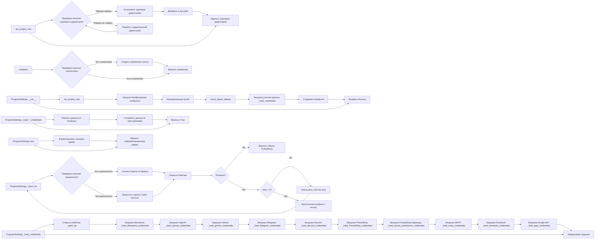

## Анализ кода `src/credentials.md`

### <алгоритм>
1. **`set_project_root(marker_files)`**:
   - **Вход**: Список `marker_files` (файлов-маркеров).
   - **Начало**: Устанавливает текущий путь к директории, где находится файл.
   - **Цикл**: Проходит по текущему пути и его родительским директориям.
     - **Проверка**: Для каждой директории проверяет, существует ли хотя бы один из `marker_files` в этой директории.
     - **Найдено**: Если маркер найден, устанавливает эту директорию в качестве корневой и выходит из цикла.
   - **Не Найдено**: Если цикл завершается без нахождения маркера, корневой директорией остается путь, где был запущен скрипт.
   - **Добавление в `sys.path`**: Если корневой путь отсутствует в `sys.path`, он добавляется в начало.
   - **Выход**: Возвращает корневой путь проекта.

   *Пример:*
    - `marker_files` = `('pyproject.toml', 'requirements.txt', '.git')`
    - Текущий путь: `/home/user/my_project/src/credentials.py`
    - `pyproject.toml` существует в `/home/user/my_project`, тогда функция возвратит `/home/user/my_project`.

2.  **`singleton(cls)`**:
     - **Вход**: Класс `cls`, который необходимо сделать синглтоном.
     - **Создание экземпляра**: При первом вызове создаёт экземпляр класса `cls` и сохраняет его.
     - **Возврат экземпляра**: При последующих вызовах возвращает сохранённый экземпляр, не создавая новый.

    *Пример:*
     - Применение декоратора `@singleton` к классу `ProgramSettings`.
     - Первый вызов `ProgramSettings()` создаёт экземпляр.
     - Второй вызов `ProgramSettings()` возвращает тот же самый экземпляр.

3.  **`ProgramSettings.__init__(self, **kwargs)`**:
    - **Вход**: Аргументы `kwargs` (используются для передачи параметров).
    - **Установка базовой директории**: Вызывает `set_project_root` для определения корневой директории и сохраняет её в атрибуте `base_dir`.
    - **Загрузка конфигурации**: Загружает конфигурацию из `config.json`, используя `j_loads_ns`.
    - **Инициализация путей**: Создает `SimpleNamespace` для хранения путей проекта, включая директории логов, временных файлов и т.д.
    - **Проверка версии**: Вызывает `check_latest_release` для проверки наличия новой версии (здесь не показано).
    - **Загрузка учетных данных**: Вызывает `_load_credentials`, загружает данные из `credentials.kdbx` файла.
    -  **Инициализация атрибутов**: Создаёт атрибуты `host_name`, `MODE` и `path`, а также  `credentials` и `config`.

    *Пример:*
      - Создание экземпляра `ProgramSettings()`.
      - Загрузка `config.json` и сохранение настроек в `self.config`.
      - Загрузка учетных данных из `credentials.kdbx` и сохранение их в `self.credentials`.

4. **`ProgramSettings._load_credentials(self)`**:
    - **Открытие KeePass**: Вызывает метод `_open_kp` для открытия KeePass базы данных.
    - **Загрузка учетных данных**: Вызывает методы `_load_*_credentials` для загрузки конкретных учетных данных (aliexpress, openai, telegram, и т.д.) из KeePass базы данных.

    *Пример:*
     - Открытие KeePass базы данных с `credentials.kdbx`.
     - Загрузка учетных данных AliExpress из группы `suppliers/aliexpress/api`.
     - Загрузка учетных данных OpenAI из группы `openai`.
    
5. **`ProgramSettings._open_kp(self, retry)`**:
    - **Вход**: `retry` - количество попыток.
    - **Цикл**: Выполняет попытки открытия KeePass базы данных, если произошла ошибка.
    - **Попытка открытия**: Пытается открыть KeePass базу данных, используя пароль из файла `password.txt` (если существует) или запрашивает ввод пароля через консоль.
        - **Успех**: Возвращает объект `PyKeePass`.
        - **Ошибка**: Обрабатывает исключения, уменьшает счетчик `retry`, выводит сообщение об ошибке и делает повторную попытку.
    - **Максимальное кол-во попыток**: Если количество попыток исчерпано, выводит критическую ошибку и завершает программу.
     
     *Пример:*
       - Первая попытка открытия с паролем из `password.txt`
       - Если пароль неверный или не найден, то запрашивает ввод пароля через консоль.
       - Если произошла ошибка (например, неверный пароль), и `retry` еще не исчерпано, то происходит повторная попытка.

6.  **`ProgramSettings._load_*_credentials(self, kp)`**:
     - **Вход**: `kp` - объект `PyKeePass`.
     - **Извлечение данных**: Извлекает соответствующие записи из базы данных KeePass в соответствии с предопределенными путями (например, `suppliers/aliexpress/api` для Aliexpress) и сохраняет их в атрибутах объекта `self.credentials` (например, `self.credentials.aliexpress.api_key`).
      - Для каждого типа учетных данных, извлекаются необходимые значения (например: `api_key`, `secret`, `token` и т.д.) и сохраняются в `self.credentials`.
     - **Выход**: Возвращает `bool`: `True` если данные загружены, иначе `False`.

     *Пример:*
       - `_load_aliexpress_credentials` извлекает данные из группы `suppliers/aliexpress/api` и сохраняет их как `self.credentials.aliexpress.api_key`, `self.credentials.aliexpress.secret` и т.д.
       - `_load_openai_credentials` извлекает данные из группы `openai` и сохраняет их как `self.credentials.openai.api_key`, `self.credentials.openai.assistant_id`.

7. **`ProgramSettings.now(self)`**:
    - **Вход**: Нет
    - **Форматирование времени**: Использует `datetime.datetime.now()` и форматирует текущее время в строку, используя формат, указанный в `self.config.datetime_format`.
    - **Выход**: Возвращает текущую строку времени в отформатированном виде.

    *Пример:*
     - `self.config.datetime_format` = `%Y-%m-%d %H:%M:%S`.
     - Функция возвращает `2024-01-15 14:30:00` (пример).

### <mermaid>

**Объяснение зависимостей `mermaid`:**

-   **`set_project_root`**: 
    -   Функция `set_project_root` не имеет прямых зависимостей, кроме стандартных библиотек Python (`Path`, `sys`).
    -   Предназначена для поиска корневой директории проекта.

-   **`singleton`**:
    -   Декоратор `singleton` не имеет зависимостей от других модулей.
    -   Применяется для гарантирования создания только одного экземпляра класса.

-   **`ProgramSettings.__init__`**: 
    -   Зависит от `set_project_root` для определения корневой директории.
    -   Использует `j_loads_ns` (предположительно, из `src.utils`) для загрузки конфигурации из `config.json`.
    -   Зависит от `_load_credentials` для загрузки данных из `credentials.kdbx`.

-   **`ProgramSettings._load_credentials`**:
    -   Зависит от `_open_kp` для открытия KeePass базы данных.
    -   Зависит от множества функций `_load_*_credentials`, каждая из которых отвечает за загрузку конкретных учетных данных из KeePass.

-   **`ProgramSettings._open_kp`**:
     -  Зависит от `PyKeePass` для работы с KeePass базой данных.
     -  Использует `getpass.getpass()` для запроса ввода пароля в консоли.

-   **`ProgramSettings._load_*_credentials`**:
    -   Зависит от `PyKeePass` и использует его для извлечения данных из базы данных KeePass.
    -   Загружает данные и сохраняет их в объект `self.credentials`.

-   **`ProgramSettings.now`**:
    -   Зависит от `datetime` для получения текущего времени и его форматирования.
    -   Использует формат даты/времени, заданный в конфигурации (`self.config.datetime_format`).

### <объяснение>

#### Импорты:
-   **`sys`**: Используется для доступа к некоторым переменным и функциям, взаимодействующим с интерпретатором Python. В данном случае используется для добавления пути к корневой директории проекта в `sys.path`.
-   **`getpass`**:  Используется для безопасного ввода пароля через консоль, чтобы пароль не отображался на экране.
-   **`pathlib.Path`**:  Используется для работы с путями к файлам и директориям, упрощая операции с файловой системой.
-   **`PyKeePass`**: Используется для работы с файлами KeePass (.kdbx), позволяет загружать, извлекать и изменять данные.
-   **`datetime`**: Используется для работы с датой и временем, в частности для получения текущего времени.
-   **`types.SimpleNamespace`**: Используется для создания простых объектов, которые могут иметь произвольные атрибуты. В коде используется для хранения конфигурации и учетных данных.
-   **`src.utils.j_loads_ns`**: Используется для загрузки JSON-файла в объект SimpleNamespace. Это кастомная функция, определенная в модуле `src.utils`, которая упрощает работу с конфигурационными файлами.
-   **`src.utils.logger`**: Используется для логирования сообщений в консоль, что помогает отслеживать ход выполнения программы и находить ошибки.

#### Классы:

-   **`ProgramSettings`**:
    -   **Роль**: Является основным классом для управления настройками программы и учетными данными. Этот класс использует шаблон Singleton.
    -   **Атрибуты**:
        -   `host_name` (str): Имя хоста.
        -   `base_dir` (Path): Корневая директория проекта.
        -   `config` (SimpleNamespace): Настройки проекта из `config.json`.
        -   `credentials` (SimpleNamespace): Учетные данные из `credentials.kdbx`.
        -    `MODE` (str): Режим работы проекта (dev, prod и т.д.)
        -    `path` (SimpleNamespace): Пути к директориям проекта.
    -   **Методы**:
        -   `__init__(self, **kwargs)`: Конструктор класса, загружает конфигурацию, инициализирует пути, загружает учетные данные.
        -   `_load_credentials(self)`: Загружает все учетные данные из KeePass базы данных.
        -    `_open_kp(self, retry)`: Открывает базу данных KeePass, используя пароль из файла или консоли.
        -   `_load_*_credentials(self, kp)`: Методы для загрузки учетных данных для конкретных сервисов (например, Aliexpress, OpenAI, Telegram и т.д.).
        -   `now(self)`: Возвращает текущее время в заданном формате.
    -   **Взаимодействие**:
        -   Использует `set_project_root` для определения корневой директории проекта.
        -   Использует `j_loads_ns` для загрузки конфигурации.
        -   Использует `PyKeePass` для работы с базой данных KeePass.
        -   Использует глобальную переменную `gs` для доступа из других модулей.
    -   **Singleton:** Класс реализует шаблон Singleton через декоратор `@singleton`, гарантируя, что существует только один экземпляр класса `ProgramSettings` в приложении.

#### Функции:
-   **`set_project_root(marker_files)`**:
    -   **Аргументы**: `marker_files` - кортеж с именами файлов-маркеров.
    -   **Возвращает**: `Path` - путь к корневой директории проекта.
    -   **Назначение**: Определяет корневую директорию проекта, начиная с текущей директории и поднимаясь вверх по иерархии директорий до нахождения одного из маркеров.
    -   **Пример**: `set_project_root(marker_files=('pyproject.toml', 'requirements.txt'))` вернёт путь к директории содержащей `pyproject.toml` или `requirements.txt`, а также добавить путь в `sys.path`, если он там отсутствует.
-    **`singleton(cls)`**:
     -   **Аргументы**: `cls` - класс, к которому применяется декоратор.
     -   **Возвращает**: Функция, которая управляет созданием экземпляра класса.
     -   **Назначение**: Реализует шаблон проектирования Singleton, гарантируя, что у класса будет только один экземпляр.
     -    **Пример**: `@singleton` применяется к классу `ProgramSettings`.

#### Переменные:

-   `__root__` (Path): Переменная для хранения корневой директории проекта.
-   `current_path` (Path): Переменная для хранения текущей директории, где расположен файл.
-   `password` (str): Пароль для открытия базы данных KeePass.
-   `retry` (int): Счетчик оставшихся попыток открытия базы данных KeePass.
-   `kp` (PyKeePass): Объект для работы с базой данных KeePass.
-   `gs` (ProgramSettings): Глобальный экземпляр класса `ProgramSettings`, доступный из других модулей.

#### Потенциальные ошибки и области для улучшения:

1.  **Хранение пароля в `password.txt`**:
    -   **Проблема**: Хранение пароля в файле `password.txt` в открытом виде является серьезной уязвимостью.
    -   **Решение**: Необходимо заменить этот метод более безопасным хранением паролей, например, использовать хранилище секретов (secret manager) или переменные окружения.
2.  **Обработка исключений**:
    -   **Проблема**: В блоке `except` часто используется `...` в качестве заглушки, что может затруднить отладку и понимание причины ошибки.
    -   **Решение**: Улучшить обработку исключений, добавляя конкретные сообщения об ошибках в лог.
3.  **Множество `_load_*_credentials` методов**:
    -   **Проблема**: Большое количество методов для загрузки различных учетных данных увеличивает сложность кода.
    -   **Решение**: Рассмотреть возможность параметризации или применения паттернов проектирования (например, Factory) для упрощения загрузки различных типов учетных данных.
4.  **Использование глобальной переменной `gs`**:
    -   **Проблема**: Глобальные переменные могут затруднить отслеживание зависимостей и усложнить модульное тестирование.
    -   **Решение**: Рассмотреть возможность использования Dependency Injection для передачи экземпляра `ProgramSettings` в необходимые модули.

#### Цепочка взаимосвязей:

1.  `set_project_root` определяет корневую директорию, которая используется при инициализации `ProgramSettings`.
2.  `ProgramSettings` использует `j_loads_ns` для загрузки конфигурации из `config.json`.
3.  `ProgramSettings` использует `PyKeePass` через метод `_open_kp` для открытия базы данных `credentials.kdbx`.
4.  `ProgramSettings` использует методы `_load_*_credentials` для загрузки конкретных учетных данных из KeePass.
5.  Глобальная переменная `gs` является экземпляром `ProgramSettings`, который позволяет получить доступ к конфигурации и учетным данным из других модулей.
6. Другие части проекта импортируют `gs` для доступа к настройкам и учетным данным.
7.  `ProgramSettings.now` использует `datetime` для работы со временем.