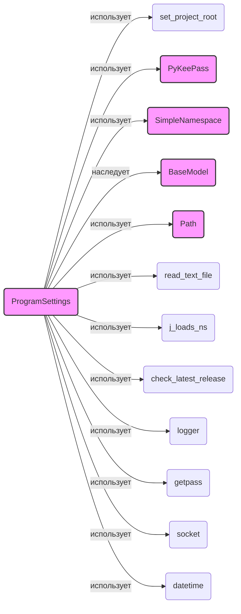

## Анализ кода `hypotez/src/credentials.py`

### 1. <алгоритм>

**1. `set_project_root(marker_files)`:**

   - **Вход**: `marker_files` (кортеж строк, например: `('pyproject.toml', 'requirements.txt', '.git')`).
   - **Действие**:
     - Получает абсолютный путь к директории, где находится текущий файл (`__file__`).
     - Проходит вверх по дереву директорий, начиная с текущей.
     - Проверяет, существует ли в каждой директории любой из файлов или директорий из `marker_files`.
     - Если такой файл найден, директория считается корнем проекта.
   - **Выход**: `Path` (путь к корню проекта).

   **Пример**:
   - Если `hypotez/src/credentials.py` находится в директории `hypotez/src`, и в директории `hypotez` есть файл `pyproject.toml`, то функция вернет путь к директории `hypotez`.
   - Если ни один из файлов маркеров не найден, то функция вернет путь к директории `hypotez/src`.

**2. `singleton(cls)`:**
   - **Вход:** `cls` (класс, для которого применяется декоратор).
   - **Действие:**
     - Создается словарь `instances` для хранения экземпляров класса.
     - Внутренняя функция `get_instance` проверяет, существует ли уже экземпляр класса в `instances`.
     - Если нет, создается новый экземпляр и сохраняется в `instances`.
     - Возвращается всегда один и тот же экземпляр класса.
   - **Выход:** `get_instance` (функция, которая возвращает экземпляр класса).
   **Пример:**
      - `@singleton` применяется к классу `ProgramSettings`, гарантируя, что только один экземпляр этого класса будет создан в течении времени жизни программы.

**3. `ProgramSettings` (класс):**
   - **Инициализация:**
     - Устанавливает `host_name` через `socket.gethostname()`.
     - Устанавливает `base_dir` с помощью `set_project_root()`.
     - Инициализирует вложенные SimpleNamespace для хранения настроек и учетных данных (credentials)
     - Устанавливает пути (path) к директориям проекта, загружая их из `config.json` если есть или задавая значения по умолчанию.
     - Проверяет наличие обновлений на GitHub.
     - Добавляет пути к бинарным файлам в `sys.path`.
     - Загружает учетные данные через `_load_credentials()`.

   - **`_load_credentials()`:**
     - Открывает базу данных KeePass (`_open_kp()`).
     - Загружает учетные данные для различных сервисов, используя соответствующие методы `_load_*_credentials()`.
   - **`_open_kp(retry)`:**
      - **Вход:** `retry` - количество попыток открытия KeePass.
      - **Действие:**
        - Читает пароль от KeePass из файла `password.txt`, если он есть, или запрашивает пароль у пользователя.
        - Пытается открыть базу данных KeePass.
        - При неудаче уменьшает количество попыток и повторяет попытку, либо завершает работу программы.
      - **Выход:** Экземпляр `PyKeePass` или `None`.
   - **`_load_*_credentials(kp)` (методы):**
     - **Вход**: Экземпляр `PyKeePass`.
     - **Действие**:
       - Находит нужные записи в KeePass по пути.
       - Извлекает учетные данные из кастомных свойств записей.
       - Сохраняет учетные данные в атрибутах `self.credentials`.
     - **Выход**: `bool` (успех или неудача).
   - **`now` (свойство):**
     - **Действие**: Возвращает текущее время в формате, указанном в `config.timestamp_format`.
   - **Общая схема**:
      - Инициализация `ProgramSettings` -> вызов `set_project_root` -> загрузка `config.json` -> инициализация путей -> проверка обновлений -> открытие KeePass -> загрузка credentials.

**Примеры вызова и потока данных:**

```mermaid
graph LR
    A[Начало работы программы] --> B(Создание экземпляра ProgramSettings)
    B --> C{set_project_root()}
    C --> D{Определение base_dir}
    D --> E{Загрузка config.json}
    E --> F{Инициализация path}
    F --> G{Проверка обновлений check_latest_release}
    G --> H{Инициализация системных путей sys.path}
    H --> I{_load_credentials()}
    I --> J{_open_kp()}
    J --> K{Загрузка данных из KeePass}
    K --> L{Загрузка credentials}
    L --> M[ProgramSettings инициализирован]
    M --> N{Дальнейшая работа программы}
    
   subgraph set_project_root
    C --> C1[Получение пути к текущему файлу]
    C1 --> C2[Поиск маркеров в родительских каталогах]
    C2 --> C3[Возврат пути к корневой директории]
    end
    subgraph ProgramSettings
        B --> B1[host_name = socket.gethostname()]
        B1 --> B2[base_dir = set_project_root()]
        B2 --> B3[Инициализация credentials]
        B3 --> B4[Инициализация path]
        B4 --> B5[проверка обновлений]
        B5 --> B6[добавление путей]
        B6 --> B7[загрузка creds]
        end

   subgraph _load_credentials
        I --> I1[_open_kp()]
        I1 --> I2[_load_aliexpress_credentials()]
        I2 --> I3[_load_openai_credentials()]
        I3 --> I4[_load_gemini_credentials()]
        I4 --> I5[_load_discord_credentials()]
        I5 --> I6[_load_telegram_credentials()]
        I6 --> I7[_load_PrestaShop_credentials()]
        I7 --> I8[_load_smtp_credentials()]
        I8 --> I9[_load_facebook_credentials()]
        I9 --> I10[_load_presta_translations_credentials()]
        I10 --> I11[_load_gapi_credentials()]
    end

   subgraph _open_kp
        J --> J1[Чтение пароля из файла password.txt]
        J1 --> J2[Или запрос пароля у пользователя]
        J2 --> J3[Открытие KDBX]
        J3 --> J4[Обработка ошибок при открытии]
        end


```
### 2. <mermaid>



**Объяснение:**

- **ProgramSettings**: Класс, который управляет настройками программы.
- **set_project_root**: Функция для определения корневой директории проекта.
- **PyKeePass**: Библиотека для работы с базой данных KeePass.
- **SimpleNamespace**: Удобный способ создания объектов с динамическими атрибутами.
- **BaseModel**: Базовый класс для моделей данных из Pydantic.
- **Path**: Класс для работы с путями файловой системы из `pathlib`.
- **read_text_file**: Функция для чтения текста из файла.
- **j_loads_ns**: Функция для загрузки JSON в `SimpleNamespace`.
- **check_latest_release**: Функция для проверки наличия обновлений на GitHub.
- **logger**: Модуль для логирования.
- **getpass**: Модуль для безопасного ввода паролей.
- **socket**: Модуль для получения имени хоста.
- **datetime**: Модуль для работы с датой и временем.

**Зависимости:**

- Класс `ProgramSettings` использует функции `set_project_root`, `read_text_file`, `j_loads_ns`, `check_latest_release`, `logger`, `getpass`, `socket` и `datetime` для своей работы.
-  Использует класс `PyKeePass` для взаимодействия с базой данных KeePass.
- Наследуется от класса `BaseModel` и использует `SimpleNamespace` для хранения данных.
-  `ProgramSettings` создает экземпляры `Path` для работы с файловой системой.
  
### 3. <объяснение>

**Импорты:**

- `datetime`, `from datetime import datetime`: Используется для получения текущей даты и времени, в частности, в свойстве `now`.
- `getpass`: Используется для безопасного запроса пароля от пользователя при открытии KeePass базы.
- `os`: Используется для добавления путей к бинарным файлам в `os.environ` и для работы с системными путями.
- `sys`: Используется для изменения `sys.path`, добавления путей к исполняемым файлам и для выхода из программы.
- `json`: Хотя и импортируется, явно не используется в предоставленном коде. (может использоваться в `j_loads`, `j_loads_ns` )
- `warnings`: Используется для фильтрации предупреждений.
- `socket`: Используется для получения имени хоста.
- `dataclasses`, `from dataclasses import dataclass, field`: Используется для создания классов данных, в частности, `ProgramSettings`.
- `pathlib`, `from pathlib import Path`: Используется для работы с путями файловой системы.
- `types`, `from types import SimpleNamespace`: Используется для создания объектов с динамическими атрибутами, что упрощает организацию настроек и учетных данных.
- `typing`, `from typing import Optional`: Используется для аннотации типов, например `Optional`.
- `pydantic`, `from pydantic import BaseModel, Field`: Используется для валидации настроек и создания моделей данных.
- `pykeepass`, `from pykeepass import PyKeePass`: Используется для работы с базой данных KeePass.
- `src.check_release`, `from src.check_release import check_latest_release`: Используется для проверки наличия новой версии программы на GitHub.
- `src.logger.logger`, `from src.logger.logger import logger`: Используется для логирования событий.
- `src.logger.exceptions`, `from src.logger.exceptions import (...)`: Используется для обработки исключений.
- `src.utils.file`, `from src.utils.file import read_text_file`: Используется для чтения текстовых файлов, включая файл с паролем от KeePass.
- `src.utils.jjson`, `from src.utils.jjson import j_loads, j_loads_ns`: Используется для загрузки JSON данных в `dict` или `SimpleNamespace`.
- `src.utils.printer`, `from src.utils.printer import pprint`:  Используется для форматированного вывода (может быть не используется явно в этом файле).
    
**Классы:**

- **`ProgramSettings`**:
    - **Роль**: Класс, реализующий шаблон Singleton для хранения глобальных настроек программы, путей, учетных данных и прочего.
    - **Атрибуты**:
      - `host_name` (str): Имя хоста, на котором запущена программа.
      - `base_dir` (Path): Корневой каталог проекта.
      - `config` (SimpleNamespace): Настройки проекта, загруженные из `config.json`.
      - `credentials` (SimpleNamespace): Учетные данные для различных сервисов.
      - `MODE` (str): Режим работы программы (`dev`, `prod` и т.д.).
      - `path` (SimpleNamespace): Пути к директориям проекта.
    - **Методы**:
      - `__init__`: Инициализирует класс, загружает настройки, пути и учетные данные.
      - `_load_credentials`: Загружает учетные данные из KeePass.
      - `_open_kp`: Открывает базу данных KeePass.
      - `_load_*_credentials`: Методы для загрузки учетных данных для каждого сервиса (Aliexpress, OpenAI, Gemini, и т.д.)
      - `now`: Свойство для получения текущей метки времени.

    - **Взаимодействие**: Использует `set_project_root` для определения корневой папки проекта, читает `config.json` через `j_loads_ns`, вызывает `check_latest_release`, использует `logger` для записи в лог, взаимодействует с `PyKeePass` для получения учетных данных.

**Функции:**

- **`set_project_root(marker_files)`**:
    - **Аргументы**: `marker_files` (кортеж строк с именами файлов или папок-маркеров).
    - **Возвращает**: `Path` (путь к корню проекта).
    - **Назначение**: Находит корневую директорию проекта путем поиска маркеров (например, `pyproject.toml`).
    - **Пример**: `set_project_root(('pyproject.toml', 'requirements.txt', '.git'))`

-   **`singleton(cls)`**:
    - **Аргументы**: `cls` - класс, для которого применяется декоратор.
    - **Возвращает**: `get_instance` - функцию для получения экземпляра класса.
    - **Назначение**: Реализует шаблон Singleton.
    - **Пример**: `@singleton` применяется к классу `ProgramSettings`, гарантируя, что будет создан только один его экземпляр.

**Переменные:**

- `MODE` (str): Глобальная переменная, определяющая режим работы программы (по умолчанию 'dev'), переопределяется в классе `ProgramSettings`.
- `gs` (`ProgramSettings`): Глобальный экземпляр класса `ProgramSettings`.

**Потенциальные ошибки и области для улучшения:**

- **Безопасность:**
  -   Хранение пароля от KeePass в открытом виде в файле `password.txt` является крайне не безопасным. Рекомендуется убрать этот функционал.
  -   Необходима более надежная защита данных, например, использование переменных окружения или специализированных решений для хранения секретов.
- **Обработка ошибок:**
  -   В некоторых местах используется заглушка `...` вместо реальной обработки ошибок. Следует обрабатывать ошибки и исключения более информативно и корректно.
- **Зависимости:**
  - Некоторые импорты (`json`, `pprint`) могут быть не нужны или использоваться косвенно ( через импортированные модули) и их можно удалить.
- **Логирование:**
  -   Логирование стоит сделать более подробным и информативным, возможно, с использованием разных уровней логирования.
- **Конфигурация**:
    - Сейчас конфигурация читается из `config.json`, но стоит рассмотреть возможность использование переменных окружения или других более гибких способов конфигурации.
- **Инициализация**:
  -   Инициализация путей к бинарным файлам должна быть более гибкой и настраиваемой, а не хардкодить каждый путь.
-  **Обработка исключений**:
    -  В методах `_load_*_credentials` используется обработка исключений, которая просто выводит сообщение об ошибке и возвращает `None`. Необходимо улучшить обработку исключений, например, записывая ошибку в лог с использованием `logger` или поднимая кастомные исключения.

**Взаимосвязи с другими частями проекта:**
- `check_release`: Проверяет наличие обновлений на GitHub.
- `logger`: Используется для логирования событий.
- `src.utils.file`: Используется для чтения файлов.
- `src.utils.jjson`: Используется для загрузки JSON данных.
- `endpoints`: Путь к папке с клиентами (`self.path.endpoints`), указывает на связь с модулями для взаимодействия с внешними API.
- Данные из `credentials` используются различными частями проекта, которые взаимодействуют с внешними сервисами (Aliexpress, OpenAI, Discord и т.д.).
- Настройки из `config.json` используются для определения путей и прочих настроек приложения, которые могут быть использованы в других модулях.

Этот анализ предоставляет всесторонний взгляд на функциональность и структуру кода в файле `credentials.py`, включая его взаимодействие с другими частями проекта.