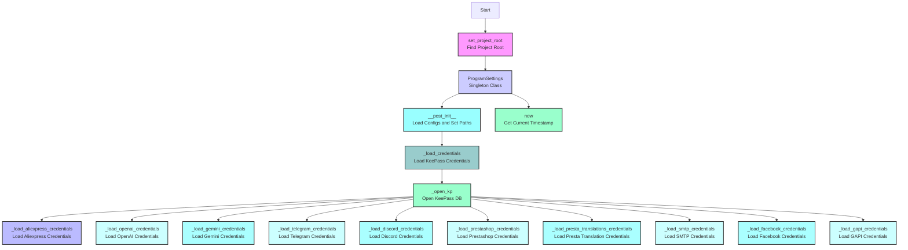

## ИНСТРУКЦИЯ:

Анализируй предоставленный код подробно и объясни его функциональность. Ответ должен включать три раздела:

1.  **<алгоритм>**: Опиши рабочий процесс в виде пошаговой блок-схемы, включая примеры для каждого логического блока, и проиллюстрируй поток данных между функциями, классами или методами.
2.  **<mermaid>**: Напиши код для диаграммы в формате `mermaid`, проанализируй и объясни все зависимости,
    которые импортируются при создании диаграммы.
    **ВАЖНО!** Убедитесь, что все имена переменных, используемые в диаграмме `mermaid`,
    имеют осмысленные и описательные имена. Имена переменных вроде `A`, `B`, `C`, и т.д., не допускаются!

    **Дополнительно**: Если в коде есть импорт `import header`, добавьте блок `mermaid` flowchart, объясняющий `header.py`:
    ```mermaid
    flowchart TD
        Start --> Header[<code>header.py</code><br> Determine Project Root]

        Header --> import[Import Global Settings: <br><code>from src import gs</code>]
    ```

3.  **<объяснение>**: Предоставьте подробные объяснения:
    -   **Импорты**: Их назначение и взаимосвязь с другими пакетами `src.`.
    -   **Классы**: Их роль, атрибуты, методы и взаимодействие с другими компонентами проекта.
    -   **Функции**: Их аргументы, возвращаемые значения, назначение и примеры.
    -   **Переменные**: Их типы и использование.
    -   Выделите потенциальные ошибки или области для улучшения.

Дополнительно, постройте цепочку взаимосвязей с другими частями проекта (если применимо).

Это обеспечивает всесторонний и структурированный анализ кода.
## Формат ответа: `.md` (markdown)
**КОНЕЦ ИНСТРУКЦИИ**

### **<алгоритм>**
```
1.  **`set_project_root(marker_files)`**:
    *   Начало: Определить путь к директории текущего файла.
        *   Пример: если файл `credentials.py` находится в `hypotez/src/`, то путь будет `hypotez/src/`.
    *   Поиск: Итерировать по родительским директориям, начиная с текущей.
    *   Проверка: Для каждой родительской директории проверить наличие хотя бы одного из `marker_files`.
        *   Пример: если `marker_files` это `('__root__', '.git')`, то ищем файлы или директории с таким именем.
    *   Найдено: Если `marker_file` найден, то текущая директория является корнем проекта.
        *   Пример: Если `.git` найден в `hypotez/`, то `hypotez/` - корень проекта.
    *   Не найдено: Если ни один маркер не найден, то корнем проекта остается директория скрипта.
    *   Добавление в sys.path: Если корень проекта не в `sys.path`, добавить его.
        *   Пример: Добавление `hypotez/` в `sys.path`, что делает возможным импорт пакетов из `src/` .
    *   Возврат: Вернуть путь к корню проекта.

2.  **`singleton(cls)`**:
    *   Декоратор: Используется для создания класса-синглтона, что гарантирует наличие только одного экземпляра класса.
    *   Логика: Внутри функции `get_instance` хранится словарь `instances`.
        *   Первый вызов: Если класса нет в `instances`, создается экземпляр и добавляется в `instances`.
        *   Последующие вызовы: Возвращается существующий экземпляр из `instances`.
    *   Возврат: Функция `get_instance`.

3. **`ProgramSettings` class**:
    *   Инициализация: Инициализируется с помощью декоратора `@singleton` и `@dataclass`.
    *   Атрибуты: Хранит настройки приложения, пути, учетные данные, которые являются  `SimpleNamespace`
    *   `__post_init__`:
       *   Загрузка `config.json`: Загружает общие настройки из `config.json` в `self.config` .
       *   Установка таймстемп формата: Устанавливает формат времени для генерации меток времени.
       *   Настройка путей: Инициализирует пути для `bin`, `src`, `log`, `tmp`, `data`, `secrets`, `google_drive`, `external_storage`, `toolbox`, `endpoints`.
       *   Проверка новой версии: Проверяет наличие новой версии на github.
       *   Определение системных путей: Добавляет пути к бинарникам в системные пути.
       *   Подавление GTK: Подавляет вывод GTK сообщений в консоль.
       *   Загрузка учетных данных: Вызывает `_load_credentials()`.

4. **`_load_credentials()`**:
    *   Открытие KeePass: Открывает базу данных KeePass через `_open_kp()`.
    *   Загрузка: Вызывает методы для загрузки отдельных учетных данных.
    *   Возвращает: Ничего.

5. **`_open_kp(retry)`**:
    *   Попытки: Повторяет попытки открытия KeePass базы данных, пока не закончатся попытки (аргумент `retry`).
    *   Пароль: Считывает пароль из файла `password.txt` , если файл существует. В противном случае запрашивает пароль через консоль.
    *   Открытие базы: Используя библиотеку `PyKeePass`, открывает базу данных.
    *   Возврат: Возвращает открытый экземпляр `PyKeePass` или `None`, если не удалось открыть.

6. **`_load_*_credentials(kp)`**:
   *   Загрузка данных: Методы для загрузки данных из KeePass (`_load_aliexpress_credentials`, `_load_openai_credentials`,  `_load_gemini_credentials`, `_load_telegram_credentials`, `_load_discord_credentials`, `_load_prestashop_credentials`, `_load_presta_translations_credentials`, `_load_smtp_credentials`, `_load_facebook_credentials`, `_load_gapi_credentials`).
   *   Поиск: Находит группы и записи в KeePass, используя `kp.find_groups(path=[...]`).
   *   Извлечение: Извлекает необходимые данные из пользовательских свойств записей.
   *   Сохранение: Сохраняет данные в соответствующие атрибуты `self.credentials`.
   *  Возврат:  Возвращает `True`, если данные были успешно загружены, `False` в противном случае.

7.  **`now` property**:
    *   Генерация метки времени: Возвращает текущую дату и время в формате, определенном в `self.config.timestamp_format`
    *   Форматирование: Обрезает микросекунды до 3 символов, формируя строку.
    *   Возврат: Возвращает отформатированную строку с меткой времени.

**Примеры потока данных:**

1.  При запуске программы вызывается `set_project_root`, который ищет корень проекта.
2.  Создается единственный экземпляр `ProgramSettings`.
3.  В `__post_init__` загружаются настройки из `config.json` и вычисляются пути.
4.  Вызывается метод `_load_credentials()`, который открывает KeePass и загружает учетные данные.
5.  Кредиты из KeePass загружаются в `self.credentials` в зависимости от вызванного метода.
6.  Свойство `now` возвращает текущую метку времени в заданном формате.

```mermaid
flowchart TD
    Start --> setProjectRoot[<code>set_project_root</code><br> Find Project Root]
    setProjectRoot --> singletonDecorator[<code>singleton</code> Decorator <br> for ProgramSettings]
    singletonDecorator --> programSettingsClass[<code>ProgramSettings</code> Class Instance Creation]
    programSettingsClass --> postInit[<code>__post_init__</code> Method: Initialize paths and configs]
    postInit --> loadCredentials[<code>_load_credentials()</code> Method<br> Load credentials from KeePass]
    loadCredentials --> openKeePass[_open_kp(retry) <br> Open KeePass Database]
    openKeePass --> loadAliexpress[<code>_load_aliexpress_credentials()</code><br> Load Aliexpress Credentials]
    loadAliexpress --> loadOpenAI[<code>_load_openai_credentials()</code><br> Load OpenAI Credentials]
    loadOpenAI --> loadGemini[<code>_load_gemini_credentials()</code><br> Load Gemini Credentials]
     loadGemini --> loadTelegram[<code>_load_telegram_credentials()</code><br> Load Telegram Credentials]
    loadTelegram --> loadDiscord[<code>_load_discord_credentials()</code><br> Load Discord Credentials]
    loadDiscord --> loadPrestashop[<code>_load_prestashop_credentials()</code><br> Load Prestashop Credentials]
    loadPrestashop --> loadPrestaTranslations[<code>_load_presta_translations_credentials()</code> <br> Load Prestashop Translations Credentials]
    loadPrestaTranslations --> loadSmtp[<code>_load_smtp_credentials()</code> <br>Load SMTP Credentials]
    loadSmtp --> loadFacebook[<code>_load_facebook_credentials()</code> <br>Load Facebook Credentials]
     loadFacebook --> loadGapi[<code>_load_gapi_credentials()</code> <br>Load Google API Credentials]
    loadGapi --> end[End of Credentials Loading]

    programSettingsClass --> nowProperty[<code>now</code> property <br> Get current timestamp]

    style setProjectRoot fill:#f9f,stroke:#333,stroke-width:2px
    style singletonDecorator fill:#ccf,stroke:#333,stroke-width:2px
    style programSettingsClass fill:#9ff,stroke:#333,stroke-width:2px
    style postInit fill:#9cc,stroke:#333,stroke-width:2px
    style loadCredentials fill:#9fc,stroke:#333,stroke-width:2px
    style openKeePass fill:#bbf,stroke:#333,stroke-width:2px
    style loadAliexpress fill:#cff,stroke:#333,stroke-width:2px
    style loadOpenAI fill:#aff,stroke:#333,stroke-width:2px
    style loadGemini fill:#cff,stroke:#333,stroke-width:2px
     style loadTelegram fill:#cff,stroke:#333,stroke-width:2px
    style loadDiscord fill:#aff,stroke:#333,stroke-width:2px
    style loadPrestashop fill:#cff,stroke:#333,stroke-width:2px
     style loadPrestaTranslations fill:#aff,stroke:#333,stroke-width:2px
     style loadSmtp fill:#cff,stroke:#333,stroke-width:2px
    style loadFacebook fill:#aff,stroke:#333,stroke-width:2px
      style loadGapi fill:#aff,stroke:#333,stroke-width:2px
    style end fill:#9f9,stroke:#333,stroke-width:2px
        style nowProperty fill:#9fc,stroke:#333,stroke-width:2px
```

### **<mermaid>**


**Объяснение зависимостей `mermaid`:**

1.  `setProjectRoot`: Функция `set_project_root` определяет корень проекта, основываясь на наличии маркерных файлов (например, `.git` или `__root__`). Она не импортирует никаких дополнительных модулей и зависит только от стандартных библиотек `pathlib`, `os` и `sys`.

2.  `ProgramSettingsClass`: Представляет класс настроек программы, который является синглтоном. Он использует декоратор `singleton` и `@dataclass`. Зависит от стандартных библиотек `dataclasses`, `pathlib`, `socket`, `os`, `sys`, `json`, `getpass`, `warnings`, `datetime`, `types` и `typing`. Также зависит от внешних библиотек `pykeepass`, а также модулей `src.check_release`, `src.logger.logger`, `src.utils.file`, `src.utils.jjson`, `src.utils.printer`.

3.  `postInit`: Метод `__post_init__` инициализирует экземпляр класса `ProgramSettings` после его создания. Он устанавливает пути проекта, загружает конфигурацию из `config.json` и вызывает функцию проверки обновления. Зависит от  `src.utils.jjson` для загрузки json настроек и `src.check_release` для проверки обновлений.

4.  `loadCredentials`: Метод `_load_credentials` отвечает за загрузку учетных данных из KeePass. Он вызывает метод `_open_kp` для открытия базы данных KeePass и вызывает различные методы `_load_*_credentials` для загрузки конкретных учетных данных.

5.  `openKeePass`: Функция `_open_kp` открывает базу данных KeePass. Она зависит от `pykeepass`, `getpass`, `src.logger.logger`.

6.  `loadAliexpress`:  Метод `_load_aliexpress_credentials` извлекает данные для Aliexpress API из KeePass. Он использует объект `PyKeePass`.
7.  `loadOpenai`:  Метод `_load_openai_credentials` извлекает данные для OpenAI API из KeePass. Он использует объект `PyKeePass`.
8.  `loadGemini`: Метод `_load_gemini_credentials` извлекает данные для Gemini API из KeePass. Он использует объект `PyKeePass`.
9.   `loadTelegram`: Метод `_load_telegram_credentials` извлекает данные для Telegram API из KeePass. Он использует объект `PyKeePass`.
10. `loadDiscord`: Метод `_load_discord_credentials` извлекает данные для Discord API из KeePass. Он использует объект `PyKeePass`.
11. `loadPrestashop`: Метод `_load_prestashop_credentials` извлекает данные для Prestashop API из KeePass. Он использует объект `PyKeePass`.
12. `loadPrestaTranslations`: Метод `_load_presta_translations_credentials` извлекает данные для переводов Prestashop API из KeePass. Он использует объект `PyKeePass`.
13. `loadSmtp`: Метод `_load_smtp_credentials` извлекает данные для SMTP из KeePass. Он использует объект `PyKeePass`.
14. `loadFacebook`: Метод `_load_facebook_credentials` извлекает данные для Facebook API из KeePass. Он использует объект `PyKeePass`.
15. `loadGapi`: Метод `_load_gapi_credentials` извлекает данные для Google API из KeePass. Он использует объект `PyKeePass`.

16. `nowProperty`: Свойство `now` возвращает текущую метку времени. Зависит от `datetime` и настроек из `self.config`.

### **<объяснение>**

**Импорты:**

*   `datetime` (из `datetime`): Используется для работы с датой и временем, в частности, для генерации меток времени в методе `now`.
*   `getpass`: Используется для получения пароля пользователя, если пароль не был найден в файле.
*   `os`: Используется для взаимодействия с операционной системой, например, для работы с путями к файлам и переменными окружения.
*   `sys`: Используется для работы с системными параметрами, например, добавление путей в `sys.path` и выхода из программы.
*   `json`: Используется для работы с файлами JSON, в данном случае для чтения файла конфигурации `config.json`.
*   `warnings`: Используется для управления предупреждениями, например, подавление предупреждений GTK.
*   `socket`: Используется для получения имени хоста.
*   `dataclasses` (`dataclass`, `field`): Используется для создания классов данных, в частности, для класса `ProgramSettings`.
*   `pathlib` (`Path`): Используется для работы с путями к файлам и директориям.
*   `types` (`SimpleNamespace`): Используется для создания простых объектов, которые могут содержать произвольные атрибуты, как `self.config`.
*   `typing` (`Optional`, `List`, `Dict`): Используется для аннотации типов.
*   `pykeepass` (`PyKeePass`): Используется для работы с базами данных KeePass, откуда извлекаются учетные данные.
*   `src.check_release`: Используется для проверки наличия новой версии проекта.
*   `src.logger.logger` (`logger`): Используется для логирования.
*    `src.logger.exceptions`: Используется для обработки кастомных исключений.
*   `src.utils.file` (`read_text_file`): Используется для чтения текстовых файлов.
*   `src.utils.jjson` (`j_loads`, `j_loads_ns`): Используется для загрузки JSON-данных.
*   `src.utils.printer` (`pprint`): Используется для красивого вывода данных.

**Классы:**

*   `ProgramSettings`:
    *   **Роль**: Синглтон, который хранит все настройки программы.
    *   **Атрибуты**:
        *   `host_name`: Имя хоста.
        *   `base_dir`: Корневая директория проекта.
        *   `config`: Настройки из файла `config.json`.
        *   `credentials`: Учетные данные для различных сервисов, полученные из KeePass.
        *   `MODE`: Режим работы (например, 'dev', 'prod').
        *   `path`:  Пути к различным директориям проекта.
    *   **Методы**:
        *   `__post_init__`: Выполняет начальную настройку после создания экземпляра.
        *   `_load_credentials`: Загружает учетные данные из KeePass.
        *   `_open_kp`: Открывает базу данных KeePass.
        *   `_load_*_credentials`: Методы для загрузки учетных данных для разных сервисов.
        *   `now`: Возвращает текущую метку времени.
    *   **Взаимодействие**: Этот класс является центральным элементом для доступа к настройкам и учетным данным во всем проекте.

**Функции:**

*   `set_project_root(marker_files)`:
    *   **Аргументы**:
        *   `marker_files` (tuple): Список маркерных файлов или директорий для определения корня проекта.
    *   **Возвращаемое значение**: `Path` к корню проекта.
    *   **Назначение**: Находит корневую директорию проекта.
    *   **Пример**:
        ```python
        root_path = set_project_root(marker_files=('__root__', '.git'))
        print(root_path) # Выведет путь к корневой директории
        ```
*   `singleton(cls)`:
    *   **Аргументы**:
        *   `cls`: Класс, для которого создается синглтон.
    *   **Возвращаемое значение**: Функция-декоратор `get_instance`.
    *   **Назначение**: Декоратор для создания синглтона.
    *   **Пример**:
        ```python
        @singleton
        class MyClass:
            ...
        ```

**Переменные:**

*   `gs` (`ProgramSettings`): Глобальный экземпляр класса `ProgramSettings`, используемый для доступа к настройкам.
*   `marker_files` (`tuple`): Список файлов для определения корня проекта в `set_project_root`.
*   `password`(`str`): Пароль для KeePass базы данных.
*   `retry`(`int`): Количество попыток открытия KeePass базы данных в `_open_kp`.

**Потенциальные ошибки и области для улучшения:**

1.  **Безопасность пароля KeePass:** Хранение пароля в файле `password.txt` является **крайне небезопасным**. Этот файл не должен попадать в репозиторий и его следует удалять после использования. Лучше всего запрашивать пароль каждый раз через `getpass` или использовать другие более безопасные методы хранения паролей.

2.  **Обработка исключений:** Многие блоки `try...except` просто печатают ошибку и возвращают `False`, что может затруднить отладку. Следует добавить логирование и возможно, выбрасывать исключения для более корректной обработки ошибок.

3.  **Конфигурация путей:**  Пути к бинарникам заданы в коде, что может быть неудобно при изменении расположения бинарников. Лучше перенести эти настройки в `config.json`

4.  **Управление секретами:** Стоит рассмотреть более безопасные методы хранения секретных данных, например, использовать переменные окружения,  менеджер секретов.

5.  **Отсутствие явной обработки ошибок при загрузке конфигураций:** В блоке `if not self.config:`  нет обработки, кроме логирования. Необходимо добавить либо выбрасывание исключения, либо возврат значения по умолчанию.

6.  **Отсутствие проверки наличия ключей в KeePass:**  Если ключ не существует в KeePass, то будет возвращено `None`, это может вызвать ошибку позже.  Лучше добавить проверки на наличие ключей перед их использованием.

**Взаимосвязи с другими частями проекта:**

*   `credentials.py` используется для загрузки настроек и учетных данных, необходимых для работы других модулей проекта.
*   Модули проекта (например, те, что находятся в `src/endpoints/`) будут использовать `gs` для доступа к учетным данным и настройкам.
*   `credentials.py` зависит от `src/utils/jjson.py` для загрузки конфигураций и `src/logger/logger.py` для логирования.
*   `src.check_release` используется для проверки наличия новой версии проекта.

Этот анализ предоставляет подробное понимание функциональности кода `credentials.py`, включая его алгоритм, зависимости, объяснение импортов, классов, функций, переменных и областей для улучшения.