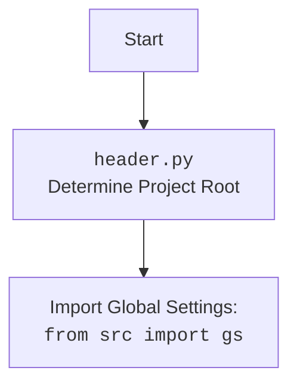

## <алгоритм>

1.  **`set_project_root(marker_files)`**:
    *   **Начало**: Функция вызывается с кортежем `marker_files` (по умолчанию `('__root__', '.git')`).
    *   **Определение начального пути**: Определяется путь к директории, в которой расположен текущий файл (`credentials.py`).
    *   **Поиск родительских директорий**:
        *   Перебираются текущая директория и ее родительские директории.
        *   Для каждой директории проверяется наличие любого из `marker_files`.
        *   Если файл-маркер найден, директория становится корневой, поиск прекращается.
    *   **Добавление в `sys.path`**: Если корневая директория не в `sys.path`, то она добавляется.
    *   **Возврат**: Возвращается путь к корневой директории.

    **Пример**:
    *   Если `credentials.py` находится в `project/src/credentials.py`, а маркер `.git` находится в `project`, то `set_project_root` вернет `Path('project')`.

2.  **`singleton(cls)`**:
    *   **Принятие класса**: Функция вызывается с классом `ProgramSettings`.
    *   **Создание `instance`**: При первом вызове возвращаемой функции создает экземпляр `cls`, сохраняет его в `instance`.
    *   **Возврат `instance`**: При последующих вызовах возвращается ранее созданный `instance`, обеспечивая создание только одного объекта класса.
    
3.  **`ProgramSettings.__init__(**kwargs)`**:
    *   **Инициализация**: Создание экземпляра класса `ProgramSettings`.
    *   **Определение корневой директории**: Вызывается `set_project_root` для установки `base_dir`.
    *   **Загрузка конфигурации**: Загрузка `config.json` в `self.config`.
    *   **Инициализация путей**: Инициализируется объект `path` для хранения путей к директориям.
    *   **Проверка обновлений**: Вызывается `check_latest_release`.
    *   **Загрузка учетных данных**: Вызывается `_load_credentials`.

4.  **`ProgramSettings._load_credentials(self)`**:
    *   **Открытие KeePass**: Вызывается `_open_kp`, который пытается открыть базу данных `credentials.kdbx`.
    *   **Загрузка учетных данных**: Вызываются методы `_load_*_credentials` для загрузки данных из KeePass.

5.  **`ProgramSettings._open_kp(self, retry)`**:
    *   **Попытка открытия**: В цикле (максимум `retry` раз) делается попытка открыть базу данных KeePass.
    *   **Чтение пароля**: Пытается прочитать пароль из `password.txt` или запрашивает его через консоль.
    *   **Обработка ошибок**: Если открытие не удалось, то выводится сообщение об ошибке, уменьшается счетчик `retry` и повторяется попытка.
    *   **Возврат**: Возвращает объект `PyKeePass` или `None` в случае неудачи.
    *   **Завершение работы**: Если все попытки открытия KeePass исчерпаны, программа завершается.

6.  **`ProgramSettings._load_*_credentials(self, kp)`**:
    *   **Загрузка**: Из переданного объекта `PyKeePass` (`kp`) загружает данные из конкретной группы (например, `'suppliers/aliexpress/api'`) в `self.credentials` как атрибуты.
    *   **Возврат**: Возвращает `True` после загрузки.

## <mermaid>
```mermaid
flowchart TD
    Start[Начало] --> set_project_root_call[Вызов set_project_root()]
    set_project_root_call --> find_project_root[Поиск корневой директории]
    find_project_root -- Найдена корневая директория --> set_root_path[Установить корневой путь]
    find_project_root -- Не найдена корневая директория --> use_script_dir[Использовать директорию скрипта]
    set_root_path --> set_sys_path[Добавить в sys.path]
    use_script_dir --> set_sys_path
    set_sys_path --> return_root_path[Возврат корневого пути]
    return_root_path --> singleton_call[Вызов декоратора singleton]
    singleton_call --> create_instance[Создание экземпляра ProgramSettings (при первом вызове)]
    create_instance --> init_program_settings[Инициализация ProgramSettings]
    init_program_settings --> load_config[Загрузка config.json]
    load_config --> init_paths[Инициализация путей]
    init_paths --> check_updates[Проверка обновлений]
    check_updates --> load_credentials[Вызов _load_credentials]
    load_credentials --> open_kp_call[Вызов _open_kp]
    open_kp_call --> try_open_kp[Попытка открыть базу KeePass]
    try_open_kp -- Успешно открыта --> load_all_creds[Загрузка всех учетных данных]
    try_open_kp -- Не удалось открыть --> retry_open[Повтор попытки открытия KeePass]
    retry_open -- Исчерпаны попытки --> exit_program[Завершение программы]
    retry_open -- Еще попытки --> try_open_kp
    load_all_creds --> load_aliexpress[Загрузка учетных данных Aliexpress]
    load_all_creds --> load_openai[Загрузка учетных данных OpenAI]
    load_all_creds --> load_gemini[Загрузка учетных данных Gemini]
     load_all_creds --> load_telegram[Загрузка учетных данных Telegram]
     load_all_creds --> load_discord[Загрузка учетных данных Discord]
     load_all_creds --> load_prestashop[Загрузка учетных данных PrestaShop]
     load_all_creds --> load_presta_trans[Загрузка учетных данных PrestaShop Translations]
     load_all_creds --> load_smtp[Загрузка учетных данных SMTP]
     load_all_creds --> load_facebook[Загрузка учетных данных Facebook]
     load_all_creds --> load_gapi[Загрузка учетных данных Google API]
    load_gapi --> End[Конец]
    End --> return_program_settings[Возврат единственного экземпляра ProgramSettings]
```


## <объяснение>

### Импорты

*   `sys`: Предоставляет доступ к некоторым переменным и функциям, используемым или поддерживаемым интерпретатором Python. В данном контексте используется для добавления пути к корневой директории в `sys.path`, что позволяет импортировать модули из корневой директории.
*   `getpass`: Позволяет безопасно получать пароли от пользователя, не отображая их на экране. Используется для ввода мастер-пароля от KeePass.
*   `json`: Используется для загрузки конфигурации из файла `config.json`.
*   `os`: Предоставляет взаимодействие с операционной системой. Неявно используется `Path`, `exists` - для работы с файловой системой.
*   `pathlib.Path`:  Используется для представления путей к файлам и директориям.
*   `types.SimpleNamespace`: Упрощенный класс для хранения атрибутов.
*   `PyKeePass`: Библиотека для работы с файлами баз данных KeePass. Используется для загрузки учетных данных.
*   `src.header`:  Импортируется как `_`, но не используется напрямую. Вероятно, используется для вызова сайд эффектов, например для инициализации логирования или других глобальных настроек при импорте `header.py`.
*   `src.config_loader.j_loads_ns`: Функция для загрузки JSON-файлов в виде `SimpleNamespace` объектов.
*   `src.exceptions`: Набор пользовательских исключений, используемых в проекте.
*   `src.logger`: Модуль логирования для записи информации об ошибках и других событиях.

### Классы

*   `ProgramSettings`:
    *   **Роль**: Центральный класс для управления настройками проекта, включая пути, конфигурации и учетные данные.
    *   **Атрибуты**:
        *   `host_name`: Имя хоста, не определено в коде, возможно инициализируется где-то еще в проекте.
        *   `base_dir`: Путь к корневой директории проекта, определяемый функцией `set_project_root`.
        *   `config`: Объект `SimpleNamespace`, содержащий настройки проекта из `config.json`.
        *   `credentials`: Объект `SimpleNamespace`, содержащий загруженные учетные данные из KeePass.
        *   `MODE`: Режим работы проекта (например, 'dev', 'prod'), не определен в данном коде.
        *   `path`: Объект `SimpleNamespace`, содержащий пути к различным директориям проекта.
    *   **Методы**:
        *   `__init__(self, **kwargs)`: Конструктор класса, который инициализирует объект, загружает конфигурацию, пути и учетные данные.
        *   `_load_credentials(self)`: Загружает все учетные данные из KeePass.
        *   `_open_kp(self, retry: int = 3)`: Открывает базу данных KeePass.
        *   `_load_*_credentials(self, kp: PyKeePass)`: Загружает учетные данные из конкретных групп KeePass.
        *   `now(self)`: Возвращает текущее время в формате, указанном в `config.json`.

### Функции

*   `set_project_root(marker_files)`:
    *   **Аргументы**: `marker_files` - кортеж с именами файлов или каталогов, по которым определяется корень проекта.
    *   **Возвращает**: `Path` - путь к корневой директории или путь к директории, где находится скрипт, если маркер не найден.
    *   **Назначение**: Находит корневую директорию проекта.
*    `singleton(cls)`:
     *  **Аргументы**: `cls` - класс, который нужно сделать синглтоном.
     *  **Возвращает**: `function` - функция, возвращающая экземпляр класса-синглтона.
     *  **Назначение**:  Декоратор, гарантирующий, что у класса будет только один экземпляр.

### Переменные

*   `marker_files`: Кортеж, определяющий маркерные файлы для `set_project_root`.
*   `gs`: Глобальный экземпляр класса `ProgramSettings`, доступный для всего проекта.
*   `password`: Пароль для KeePass, получаемый из файла `password.txt` (в режиме разработки) или вводимый пользователем (в режиме продакшн).
*   `kp`: Объект `PyKeePass`, представляющий открытую базу данных KeePass.

### Потенциальные ошибки и области для улучшения

*   **Хранение паролей в `password.txt`**: Хранение пароля KeePass в открытом виде в файле `password.txt` является серьезной уязвимостью безопасности, особенно в режиме разработки. Следует использовать более безопасный способ хранения, например, переменные среды, менеджер секретов или шифрование.
*   **Обработка ошибок открытия KeePass**: При возникновении исключения во время открытия KeePass, программа может аварийно завершится. Следует перехватывать все возможные ошибки и предусмотреть более гибкую обработку, например, запросить пароль заново или использовать пароль по умолчанию.
*   **Обработка исключений**: В коде присутствуют общие блоки `except Exception as ex`, которые не позволяют точно определить причину ошибки. Следует использовать более конкретные исключения для более точной обработки.
*   **Отсутствие `MODE`**:  Переменная `MODE` упоминается, но не инициализируется в данном коде. Необходимо убедиться, что режим (`dev`, `prod`, и тд.) корректно устанавливается и используется в проекте.
*   **Небезопасный способ запроса пароля**: В режиме продакшн  используется `getpass.getpass` с `print(f'Введите мастер-пароль KeePass: ').lower()`.  Это выводит пароль на экран, хотя и не сохраняет его. Следует использовать только `getpass.getpass()` без вывода запроса на экран.
*   **Не используется `_`**: Импорт `src.header` as `_` - но переменная не используется, возможно код нужно обновить.
*   **Не все атрибуты используются**: В `ProgramSettings` есть атрибут `host_name`, но нигде не задается в этом коде. Необходимо проверить что все атрибуты корректно используются и устанавливаются.

### Взаимосвязи

*   Модуль `src.credentials` зависит от модулей `src.header`, `src.config_loader`, `src.exceptions`, `src.logger` и `PyKeePass`.
*   Модуль `src.credentials` создает глобальный экземпляр `ProgramSettings`, который используется в других частях проекта для доступа к настройкам и учетным данным.
*   Функция `set_project_root` используется для определения корневой директории проекта и позволяет импортировать модули из нее.

Этот анализ обеспечивает детальное понимание функциональности модуля `src.credentials` и его взаимосвязей с другими частями проекта.