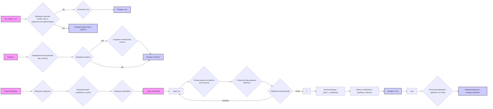

## <алгоритм>

**1. `set_project_root`:**
   - **Начало:** Функция принимает кортеж `marker_files` (по умолчанию: `pyproject.toml`, `requirements.txt`, `.git`).
   - **Инициализация:** Устанавливает `current_path` как путь к директории, где находится файл скрипта. Изначально `__root__` равно `current_path`.
   - **Обход родительских директорий:**
     - Начиная с `current_path` и переходя к его родительским директориям.
     - Проверяет, существует ли хотя бы один файл из `marker_files` в текущей родительской директории.
     - **Пример:** 
       - Если `marker_files` содержит `pyproject.toml` и файл `pyproject.toml` найден в родительской директории `/home/user/project`, то `__root__` будет установлено в `/home/user/project`.
     - Если хотя бы один файл найден:
       - Устанавливает `__root__` в путь родительской директории.
       - Завершает обход.
   - **Добавление в sys.path:** Если `__root__` отсутствует в `sys.path`, добавляет его в начало списка.
   - **Возврат:** Возвращает `__root__` (путь к корневой директории проекта).
   - **Конец.**

**2. `singleton`:**
   - **Начало:** Декоратор принимает класс `cls`.
   - **Создание `instance`:** Создаёт `instance` равным `None`.
   - **Определение внутренней функции `get_instance`:**
     - Проверяет, является ли `instance` `None`.
     - Если да, создаёт экземпляр класса `cls` и присваивает его `instance`.
     - Возвращает `instance`.
   - **Возврат:** Возвращает функцию `get_instance`.
   - **Конец.**

**3. `ProgramSettings`:**
   - **Начало:** Инициализация класса `ProgramSettings`.
   - **Инициализация атрибутов:**
     - `host_name` - устанавливается имя хоста.
     - `base_dir` -  устанавливается путь к корневой директории проекта с помощью `set_project_root`.
   - **Загрузка конфигурации:**
      - Загружает `config.json` в `self.config` в виде `SimpleNamespace`.
      - **Пример:** Если `config.json` содержит `{"author": "hypo", "mode": ["dev"]}`, то `self.config.author` будет "hypo" и `self.config.mode` будет `["dev"]`.
      - Устанавливает `self.config.project_name`.
   - **Инициализация путей:** Инициализирует `self.path` с различными путями проекта.
      - **Пример:** `self.path.secrets` будет установлен в путь `/path/to/project/secrets`.
   - **Проверка версии:** Вызывает `check_latest_release` для проверки новой версии.
   - **Загрузка учетных данных:** Вызывает `_load_credentials` для загрузки учетных данных из KeePass.
   - **Конец.**

**4. `_load_credentials`:**
  - **Начало:** Функция загрузки учётных данных.
  - **Открытие KeePass:** Вызывает `_open_kp` для открытия базы данных KeePass (`credentials.kdbx`).
  - **Обработка KeePass:**
    - Если база данных открыта успешно:
        - Вызывает методы для загрузки конкретных учётных данных: `_load_aliexpress_credentials`, `_load_openai_credentials`, `_load_gemini_credentials`, `_load_telegram_credentials`, `_load_discord_credentials`, `_load_PrestaShop_credentials`, `_load_presta_translations_credentials`, `_load_smtp_credentials`, `_load_facebook_credentials`, `_load_gapi_credentials`.
        - **Пример:** `_load_aliexpress_credentials` загрузит API ключи Aliexpress.
  - **Конец.**

**5. `_open_kp`:**
  - **Начало:** Функция открытия базы данных KeePass.
  - **Цикл retry:** Пытается открыть базу данных `retry` раз (по умолчанию 3).
  - **Чтение пароля:** Пытается прочитать пароль из файла `password.txt`.
    - **Если пароль не найден:** Запрашивает пароль через консоль.
    - **Пример:** В режиме разработки пароль считывается из `password.txt`, а в продакшн вводится через консоль.
  - **Открытие KeePass:** Пытается открыть базу данных KeePass.
  - **Обработка исключений:**
     - Если возникает исключение, печатает сообщение об ошибке и уменьшает счетчик `retry`.
     - Если `retry` равен 0, завершает работу программы.
  - **Возврат:** Возвращает объект `PyKeePass` или `None` в случае неудачи.
  - **Конец.**

**6. Методы `_load_*_credentials` (пример `_load_aliexpress_credentials`):**
   - **Начало:** Функция загрузки учётных данных Aliexpress из KeePass.
   - **Проверка наличия группы:** Проверяет наличие группы `suppliers/aliexpress/api`.
   - **Получение записи:** Получает запись с учетными данными.
   - **Запись данных:** Присваивает учетные данные из записи в атрибуты `self.credentials`.
       - **Пример:** `self.credentials.aliexpress.api_key = entry.get_custom_property('api_key')`.
   - **Возврат:** Возвращает `True` или `False`.
   - **Конец.**

**7. `now`:**
   - **Начало:** Функция для получения текущей метки времени.
   - **Получение формата:** Получает формат из настроек `self.config.time_format`.
   - **Форматирование времени:** Форматирует текущее время и возвращает его в виде строки.
   - **Конец.**

## <mermaid>

**Объяснение зависимостей:**

- **`set_project_root`**: Эта функция не имеет зависимостей от других частей модуля, но использует `Path` из модуля `pathlib` и `sys` для работы с файловой системой и путями. Она возвращает путь к корневой директории проекта, который используется в `ProgramSettings`.
- **`singleton`**: Это декоратор, который не зависит от других частей модуля, но изменяет поведение класса, к которому применяется, делая его синглтоном.
- **`ProgramSettings`**: Этот класс зависит от:
    - **`set_project_root`**: Для определения корневой директории проекта.
    - **`Path`**: Для работы с путями.
    - **`j_loads_ns`**:  Для загрузки JSON конфигурации из файла.
    - **`_load_credentials`**: Для загрузки учетных данных из KeePass.
    - **`check_latest_release`**: Для проверки наличия новой версии проекта.
     - **`PyKeePass`**: Для работы с базой данных KeePass.
    - **`logger`**: Для логирования событий и ошибок.
     - **`getpass`**:  Для безопасного ввода пароля через консоль.
     - **`sys`**: Для завершения работы программы при критических ошибках.
- **`_load_credentials`**: Зависит от `_open_kp` и методов `_load_*_credentials`, которые, в свою очередь, зависят от `PyKeePass`.
- **`_open_kp`**: Зависит от `PyKeePass`, `Path`, `getpass`, `logger`, `sys`.
- **`_load_*_credentials`**: Зависит от `PyKeePass`, и структуры базы данных KeePass.
- **`now`**: Зависит от атрибута `self.config` и его настройки `time_format`.

## <объяснение>

**Импорты:**

- **`pathlib.Path`**: Используется для работы с путями в файловой системе. `Path` позволяет создавать, проверять и манипулировать путями в кроссплатформенном режиме.
- **`typing.Tuple`**: Используется для определения типа данных как кортеж, что обеспечивает явную типизацию.
- **`getpass`**:  Используется для безопасного получения пароля от пользователя через консоль без отображения введенных символов.
- **`sys`**: Используется для доступа к системным функциям, в частности для добавления путей в `sys.path` и для выхода из программы.
- **`src.utils.j_loads_ns`**:  Используется для загрузки JSON-файла и преобразования его в `SimpleNamespace` для удобного доступа к атрибутам.
- **`src.utils.logger`**:  Используется для логирования событий и ошибок.
- **`pykeepass.PyKeePass`**: Используется для работы с файлами баз данных KeePass.
- **`types.SimpleNamespace`**:  Используется для создания объекта, который может содержать произвольные атрибуты.

**Классы:**

- **`ProgramSettings`**:
    - **Роль:** Этот класс является ядром управления настройками и учетными данными проекта. Он отвечает за загрузку конфигурации из `config.json`, учетных данных из KeePass и инициализацию всех необходимых параметров.
    - **Атрибуты:**
        - `host_name` (`str`): Имя хоста.
        - `base_dir` (`Path`): Корневая директория проекта.
        - `config` (`SimpleNamespace`): Конфигурация проекта.
        - `credentials` (`SimpleNamespace`): Учетные данные.
        - `MODE` (`str`): Режим работы проекта (например, `dev`, `prod`).
        - `path` (`SimpleNamespace`): Различные пути проекта (например, `secrets`, `logs`).
    - **Методы:**
       - `__init__`: Инициализирует класс, загружает конфигурацию, устанавливает пути, вызывает `check_latest_release` и загружает учетные данные.
       - `_load_credentials`: Загружает учетные данные из KeePass.
       - `_open_kp`: Открывает базу данных KeePass, обрабатывая исключения.
        - `_load_*_credentials`: Методы для загрузки конкретных учетных данных из KeePass.
       - `now`: Возвращает текущую метку времени.
    - **Взаимодействие:** Этот класс взаимодействует с файловой системой (`Path`), загружает настройки из JSON (`j_loads_ns`), работает с базой данных KeePass (`PyKeePass`) и глобально доступен через экземпляр `gs`.

**Функции:**

- **`set_project_root`**:
    - **Аргументы:** `marker_files` (кортеж с именами файлов или директорий).
    - **Возвращает:** `Path` (путь к корневой директории проекта).
    - **Назначение:** Находит корневую директорию проекта, начиная с текущей директории файла.
    - **Пример:** Если проект находится в `/home/user/project` и в корне есть `pyproject.toml`, то функция вернет `/home/user/project`.
- **`singleton`**:
    - **Аргументы:** `cls` (класс, который нужно сделать синглтоном).
    - **Возвращает:** `function` (функция для получения экземпляра синглтона).
    - **Назначение:** Декоратор для создания класса-синглтона, гарантируя, что будет создан только один экземпляр.
- **`_open_kp`**:
    - **Аргументы:** `retry` (количество попыток открытия базы данных).
    - **Возвращает:** `PyKeePass` или `None` в случае неудачи.
    - **Назначение:** Открывает базу данных KeePass, обрабатывая ошибки.
- **`_load_*_credentials`**:
    - **Аргументы:** `kp` (объект PyKeePass).
    - **Возвращает:** `bool` (успех или неудача загрузки).
    - **Назначение:** Загружает конкретные учетные данные из KeePass в `self.credentials`.
- **`now`**:
    - **Аргументы:** Нет.
    - **Возвращает:** `str` (текущая метка времени).
    - **Назначение:** Возвращает текущую метку времени в формате из `config.json`.

**Переменные:**

- **`__root__` (`Path`):**  Используется в `set_project_root` для хранения пути к корневой директории.
- **`current_path` (`Path`):**  Используется в `set_project_root` для хранения текущего пути.
- **`marker_files` (`Tuple`):**  Используется в `set_project_root` для хранения имен файлов или директорий, которые используются для определения корневой директории.
- **`retry` (`int`):**  Используется в `_open_kp` для хранения количества оставшихся попыток открытия KeePass.
- **`password` (`str`):** Используется в `_open_kp` для хранения пароля от базы данных KeePass.
- **`kp` (`PyKeePass`):** Используется в `_open_kp` и методах `_load_*_credentials` для работы с KeePass.
- **`gs` (`ProgramSettings`):**  Глобальный экземпляр класса `ProgramSettings`, доступный из других модулей.

**Потенциальные ошибки и области для улучшения:**

- **Безопасность паролей:** Хранение пароля в файле `password.txt` является уязвимостью. Необходимо разработать механизм безопасного хранения паролей, возможно, используя менеджеры секретов или переменные окружения.
- **Обработка исключений:** В коде встречаются общие блоки `except Exception as ex:`, что может затруднить отладку. Следует использовать более специфичные исключения и предоставлять детальные сообщения об ошибках.
- **Глобальный экземпляр `gs`:** Хотя глобальный экземпляр упрощает доступ, его использование может усложнить тестирование и понимание зависимостей. Рассмотреть возможность использования паттерна Dependency Injection для более гибкой архитектуры.
- **Загрузка учетных данных:** Логика загрузки учетных данных из KeePass может быть упрощена и сделана более модульной. Можно использовать более гибкий механизм для сопоставления путей и атрибутов.
- **Конфигурация:** Загрузка конфигурации из `config.json` происходит в одном месте, но можно расширить этот механизм, чтобы конфигурация могла загружаться из нескольких источников (например, переменные окружения).
- **Типизация:** Добавление аннотаций типов для функций и переменных повысит читаемость и поддерживаемость кода.

**Цепочка взаимосвязей с другими частями проекта:**

- Модуль `credentials` является центральным для всего проекта, так как он управляет настройками и учетными данными.
- Он используется другими модулями, которые зависят от этих настроек и учетных данных.
- Глобальный экземпляр `gs` позволяет другим модулям получать доступ к этим данным без создания новых экземпляров класса `ProgramSettings`.
- Модуль `src.utils.j_loads_ns` используется для загрузки конфигурации из файла `config.json`.
- Модуль `src.utils.logger` используется для логирования событий и ошибок.

В целом, данный модуль играет важную роль в проекте, отвечая за конфигурацию и безопасность учетных данных. Улучшение безопасности паролей и обработки исключений может сделать этот модуль более надежным и удобным в использовании.