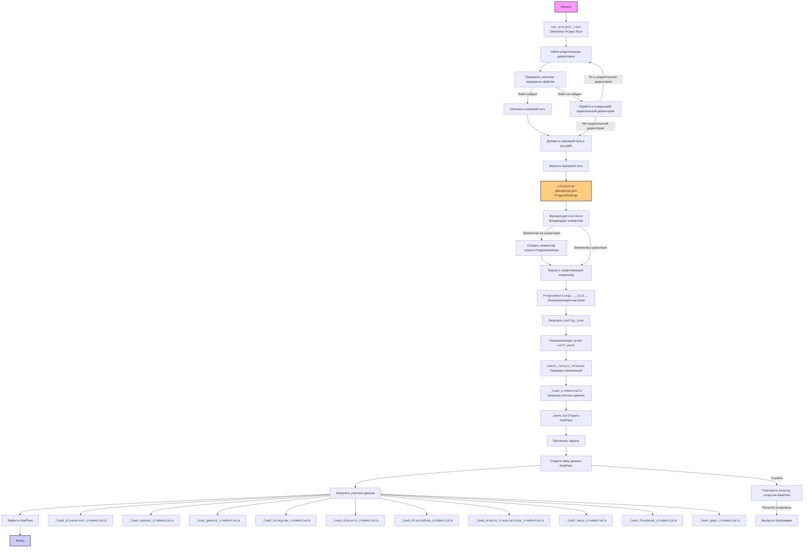

## <алгоритм>

### `set_project_root`
1.  **Начало:** Функция `set_project_root` вызывается с кортежем `marker_files`.
    *   Пример: `marker_files = ('pyproject.toml', 'requirements.txt', '.git')`
2.  **Определение текущего пути:** Определяется абсолютный путь к директории, где находится файл, вызывающий функцию `set_project_root`.
    *   Пример: Если файл находится в `/home/user/project/src/credentials.py`, то `current_path` будет `/home/user/project/src`.
3.  **Инициализация корневого пути:** Переменная `__root__` инициализируется текущим путем.
    *   Пример: `__root__ = /home/user/project/src`
4.  **Цикл по родительским директориям:** Начинается цикл по текущей директории и её родительским директориям.
    *   Пример: `/home/user/project/src`, `/home/user/project`, `/home/user`, `/home`, `/`
5.  **Проверка маркера:** Для каждой родительской директории проверяется, существует ли хотя бы один из файлов `marker_files`.
    *   Пример: Если `marker_files = ('pyproject.toml', 'requirements.txt', '.git')`, проверяется наличие `/home/user/project/src/pyproject.toml`, `/home/user/project/src/requirements.txt`, `/home/user/project/src/.git`, затем для `/home/user/project` и т.д.
6.  **Обновление корневого пути:** Если хотя бы один маркер найден, `__root__` обновляется до текущей родительской директории, и цикл завершается.
    *   Пример: Если файл `pyproject.toml` найден в `/home/user/project`, то `__root__` становится `/home/user/project`.
7.  **Добавление в `sys.path`:** Если корневой путь не в списке `sys.path`, он добавляется в начало списка.
8.  **Возврат корневого пути:** Функция возвращает найденный корневой путь.
    *   Пример: Возвращается `/home/user/project`.

### `singleton`

1.  **Декоратор:** Функция `singleton` является декоратором, который принимает класс `cls` в качестве аргумента.
    *   Пример: `@singleton` перед классом `ProgramSettings`.
2.  **Создание экземпляра:** Внутри декоратора создаётся переменная `instance`, которая изначально имеет значение `None`.
3.  **Функция `getinstance`:** Возвращается функция `getinstance`.
4.  **Возврат экземпляра:** При первом вызове `getinstance` создаёт экземпляр класса `cls` и сохраняет его в `instance`. При последующих вызовах `getinstance` возвращает тот же самый экземпляр `instance`.

### `ProgramSettings.__init__`
1.  **Инициализация:** Конструктор `__init__` вызывается при создании объекта `ProgramSettings`.
2.  **Определение базовой директории:** Вызывается функция `set_project_root` для определения корневой директории проекта и присваивается атрибуту `base_dir`.
3.  **Загрузка конфигурации:** Загружается JSON файл `config.json` и его содержимое сохраняется в атрибут `config` как `SimpleNamespace`.
4.  **Инициализация путей:** Инициализируется атрибут `path` для хранения путей к разным директориям проекта.
5.  **Проверка обновлений:** Вызывается метод `check_latest_release`, который проверяет наличие новых релизов.
6.  **Загрузка учетных данных:** Вызывается метод `_load_credentials` для загрузки учетных данных из KeePass.

### `ProgramSettings._load_credentials`
1.  **Открытие базы данных KeePass:** Метод вызывает `_open_kp` для открытия базы данных KeePass.
    *   Пример: Пытается открыть файл `credentials.kdbx` с паролем из `password.txt` или запрошенным через `getpass`.
2.  **Загрузка учетных данных:** Вызывается ряд методов для загрузки учетных данных из разных разделов базы данных KeePass, например, `_load_aliexpress_credentials`, `_load_openai_credentials` и т.д.
    *   Пример: `_load_aliexpress_credentials` загружает данные из группы `suppliers/aliexpress/api` и сохраняет их в `self.credentials.aliexpress`.
3.  **Закрытие базы данных KeePass:** База данных KeePass закрывается после загрузки учетных данных.
4.  **Обработка исключений:** Если происходит ошибка открытия базы данных, то повторяет попытку определенное количество раз.

### `ProgramSettings._open_kp`

1. **Цикл retry:** Запускается цикл с количеством попыток `retry`.
2. **Чтение пароля:** Происходит попытка прочитать пароль из `password.txt` или ввести через консоль.
3. **Открытие KeePass:** База данных KeePass открывается с использованием полученного пароля.
4. **Возврат:** В случае успеха, база данных KeePass возвращается.
5. **Обработка ошибок:** В случае ошибки выводится сообщение, уменьшается количество попыток, и цикл продолжается.
6. **Критическая ошибка:** Если попытки исчерпаны, выводится сообщение об ошибке и программа завершает работу.

### `ProgramSettings._load_*_credentials`
1.  **Поиск группы и записи:** Метод находит нужную группу и запись в базе данных KeePass.
2.  **Загрузка данных:** Извлекает необходимые данные из найденной записи и сохраняет их в соответствующий атрибут объекта `self.credentials`.
    *   Пример: Если вызывается `_load_aliexpress_credentials`, то данные из группы `suppliers/aliexpress/api` сохраняются в `self.credentials.aliexpress`.

### Глобальная переменная `gs`
1.  **Создание экземпляра:** Создаётся глобальный экземпляр класса `ProgramSettings` с именем `gs`.
2.  **Глобальный доступ:** Этот экземпляр можно использовать в любом месте проекта для доступа к общим настройкам и учетным данным.

## <mermaid>

### Описание зависимостей:

*   **`set_project_root`**: Определяет корневой каталог проекта, используя список маркерных файлов, и добавляет его в `sys.path`.
*   **`singleton`**: Декоратор, который гарантирует, что только один экземпляр класса `ProgramSettings` будет создан.
*   **`ProgramSettings`**: Класс, управляющий настройками программы, включающий загрузку конфигурации из `config.json` и учетных данных из KeePass.
    *   `__init__`: Инициализирует экземпляр класса, определяя базовую директорию, загружая конфигурацию и учетные данные.
    *   `_load_credentials`: Загружает учетные данные из KeePass, вызывая методы для различных групп данных.
    *   `_open_kp`: Открывает базу данных KeePass с паролем, полученным из файла или консоли.
    *   `_load_*_credentials`: Методы, загружающие конкретные учетные данные (Aliexpress, OpenAI, и т.д.).
* **`getpass`**: Используется в `_open_kp` для запроса пароля от базы KeePass в режиме продакшена.
*  **`sys`**: Используется в `set_project_root` для добавления корневого пути проекта в `sys.path` и в `_open_kp` для выхода из программы в случае критической ошибки.
*  **`Path`**: Используется для работы с путями к файлам и директориям.
*  **`json`**: Используется для чтения конфигурационного файла `config.json`.
* **`PyKeePass`**: Используется для работы с базой данных KeePass.
* **`logging`**: Используется для логирования ошибок.
* **`SimpleNamespace`**: Используется для хранения конфигурации и учетных данных.

## <объяснение>

### Импорты:

*   **`pathlib.Path`**: Используется для работы с путями к файлам и директориям. Это позволяет коду быть кросс-платформенным.
*   **`json`**: Используется для чтения и разбора JSON-файлов, в частности `config.json`.
*   **`sys`**: Модуль, предоставляющий доступ к некоторым переменным и функциям, взаимодействующим с интерпретатором Python, используется для управления путями поиска модулей и для выхода из программы в случае ошибки.
*  **`getpass`**: Используется для безопасного ввода пароля с консоли, не отображая его на экране.
*  **`logging`**: Используется для записи событий и ошибок.
*   **`PyKeePass`**: Библиотека для работы с базами данных KeePass (.kdbx). Используется для загрузки учетных данных.
*   **`types.SimpleNamespace`**: Используется для создания простых объектов, содержащих атрибуты, что позволяет удобно хранить настройки и учетные данные.

### Классы:

*   **`ProgramSettings`**:
    *   **Роль**: Основной класс для управления настройками и учетными данными проекта. Это синглтон, гарантирующий наличие только одного экземпляра.
    *   **Атрибуты**:
        *   `host_name` (str): Имя хоста.
        *   `base_dir` (`Path`): Путь к корневой директории проекта.
        *   `config` (`SimpleNamespace`): Объект, содержащий настройки из `config.json`.
        *   `credentials` (`SimpleNamespace`): Объект, содержащий учетные данные, загруженные из KeePass.
        *   `MODE` (str): Режим работы приложения (dev, prod и т. д.).
        *   `path` (`SimpleNamespace`): Объект, содержащий пути к различным директориям проекта.
    *   **Методы**:
        *   `__init__`: Инициализирует объект, загружает конфигурацию и учетные данные.
        *   `_load_credentials`: Загружает все учетные данные из KeePass.
        *   `_open_kp`: Открывает базу данных KeePass.
        *   `_load_*_credentials`: Загружает учетные данные из конкретных групп и записей KeePass (Aliexpress, OpenAI, и т.д.).
        *    `now`: Возвращает текущую дату и время в формате, указанном в `config.json`.
    *   **Взаимодействие**:
        *   Использует `set_project_root` для определения базовой директории.
        *   Загружает данные из `config.json`.
        *   Использует `PyKeePass` для доступа к файлу `credentials.kdbx`.

### Функции:

*   **`set_project_root(marker_files)`**:
    *   **Аргументы**: `marker_files` (tuple) - список файлов, используемых для определения корневой директории.
    *   **Возвращает**: `Path` - путь к корневой директории проекта.
    *   **Назначение**: Определяет корневую директорию проекта, начиная поиск от текущей директории и вверх по дереву каталогов.
    *   **Пример**: Если `marker_files` = `('pyproject.toml', 'requirements.txt', '.git')` и  файл `pyproject.toml` находится в `/home/user/project`, то функция вернет `/home/user/project`.
*   **`singleton(cls)`**:
    *   **Аргументы**: `cls` - класс, который необходимо сделать синглтоном.
    *   **Возвращает**: `function` - функция, возвращающая экземпляр класса синглтона.
    *   **Назначение**: Декоратор, который гарантирует, что только один экземпляр класса будет создан.
    *   **Пример**: `@singleton` используется перед объявлением класса `ProgramSettings`, гарантируя, что всегда будет использоваться один экземпляр настроек.
*   **`_open_kp(retry)`**:
    *   **Аргументы**: `retry` - количество попыток открытия базы данных KeePass.
    *   **Возвращает**: `PyKeePass` или `None` - возвращает объект KeePass если удалось открыть базу данных, иначе `None`.
    *   **Назначение**: Открывает базу данных KeePass, обрабатывая возможные исключения.
    *   **Пример**: Пытается открыть файл `credentials.kdbx`, используя пароль из файла или введенный пользователем.
*   **`_load_*_credentials(kp)`**:
    *   **Аргументы**: `kp` - объект `PyKeePass`
    *   **Возвращает**: `bool` - возвращает True в случае успешной загрузки, иначе `False`.
    *   **Назначение**: Загружает учетные данные из конкретной группы и записи в базе данных KeePass.
    *    **Пример**: `_load_aliexpress_credentials` загружает учетные данные для API Aliexpress.
*   **`now()`**:
    *   **Аргументы**: Нет.
    *   **Возвращает**: `str` - текущее время в формате из `config.json`.
    *    **Назначение**: Предоставляет текущую дату и время в необходимом формате.

### Переменные:

*   `__root__` (`Path`): Временная переменная, используется для хранения пути к корневой директории проекта.
*   `current_path` (`Path`): Путь к директории, где расположен текущий скрипт.
*   `gs` (`ProgramSettings`): Глобальный экземпляр класса `ProgramSettings`, предоставляющий доступ к настройкам и учетным данным.
*   `password` (`str`): Пароль от базы данных KeePass.

### Потенциальные ошибки и области для улучшения:

*   **Хранение паролей**: Файл `password.txt` хранит пароль от базы данных KeePass в открытом виде, что является серьезной уязвимостью. Необходимо разработать более безопасный метод хранения, например, используя переменные окружения или Keyring.
*   **Обработка исключений**: В коде есть общие блоки обработки исключений (`except Exception as ex`), которые могут скрывать ошибки. Необходимо использовать более специфические исключения для более точной обработки ошибок.
*   **Зависимости**: Код сильно зависит от структуры базы данных KeePass. В случае изменения этой структуры, потребуется корректировка методов `_load_*_credentials`.
*  **Открытие `credentials.kdbx`**: Необходимо использовать более безопасный способ хранения пароля, особенно для продакшн окружения.
*  **Отсутствие контроля окружения**: Необходимо проверять наличие всех необходимых файлов и переменных окружения на этапе инициализации для избежания ошибок времени выполнения.

### Взаимосвязь с другими частями проекта:

*   Этот модуль является центральным для всего проекта, предоставляя доступ к настройкам и учетным данным.
*   Другие модули проекта импортируют глобальный экземпляр `gs` для доступа к настройкам и учетным данным.
*   Модуль использует `config.json` для загрузки основных настроек проекта.

Этот анализ предоставляет полное и структурированное понимание функциональности кода в файле `credentials.py`.