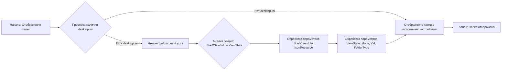

## Анализ файла desktop.ini

### 1. <алгоритм>

Файл `desktop.ini` является конфигурационным файлом Windows, который используется для настройки внешнего вида папки. 
Он не содержит исполняемого кода, поэтому блок-схема алгоритма будет описывать интерпретацию этого файла операционной системой.

1. **Чтение файла:** Windows, при отображении содержимого папки, проверяет наличие файла `desktop.ini` в этой папке.
   * **Пример:** Пользователь открывает папку "Мои документы" в Проводнике. Windows ищет `desktop.ini` в этой папке.

2. **Анализ секций:** Если файл найден, Windows анализирует его секции, каждая из которых заключена в квадратные скобки `[]`.
   * **Пример:** Windows находит секцию `[.ShellClassInfo]` и `[ViewState]`.

3. **Обработка `.ShellClassInfo`:** Windows обрабатывает параметры в секции `[.ShellClassInfo]`, которые определяют общие настройки папки.
   * **Пример:** Windows читает строку `IconResource=C:\\WINDOWS\\System32\\SHELL32.dll,300` и устанавливает значок папки, используя ресурс 300 из `SHELL32.dll`.

4. **Обработка `ViewState`:** Windows обрабатывает параметры в секции `[ViewState]`, которые определяют пользовательские настройки отображения папки.
    *  **Пример:** Windows читает параметры, такие как `Mode`, `Vid`, `FolderType` и применяет их для настройки отображения папки.

5. **Отображение папки:** Windows использует полученные настройки для отображения папки пользователю.

### 2. <mermaid>

**Анализ диаграммы `mermaid`:**

* `A`:  Начало процесса отображения папки.
* `B`:  Проверка на существование файла `desktop.ini` в папке.
* `C`:  Если файл существует, происходит его чтение.
* `D`:  Анализ файла для выявления секций `[.ShellClassInfo]` и `[ViewState]`.
* `E`: Обработка параметров в секции `[.ShellClassInfo]`, конкретно параметра `IconResource`, который задает иконку папки.
* `F`:  Обработка параметров в секции `[ViewState]`, таких как `Mode`, `Vid` и `FolderType`, которые задают вид отображения папки.
* `G`: Отображение папки с настройками, либо по умолчанию, если файла `desktop.ini` не было, либо с кастомными, если он был обработан.
* `H`: Конец процесса, папка отображена для пользователя.

Диаграмма отображает последовательность действий Windows при отображении папки и обработке файла `desktop.ini`.

### 3. <объяснение>

Файл `desktop.ini` не является исполняемым кодом, это конфигурационный файл, который используется Windows для настройки отображения папок.

* **Импорты:** Файл не импортирует никакие модули или библиотеки, так как является конфигурационным файлом. Его обрабатывает сама операционная система.

* **Классы:** Файл не содержит определений классов. Он предоставляет данные для использования Windows.

* **Функции:** Файл не содержит функций.

* **Переменные:**
    * `IconResource`: строка, указывающая путь к файлу и номер ресурса значка для отображения папки.
        *   **Тип:** Строка (текст).
        *   **Пример:** `IconResource=C:\\WINDOWS\\System32\\SHELL32.dll,300`.
    * `Mode`:  параметр режима отображения папки, значение не указано в примере.
        *   **Тип:** Строка.
        *   **Возможные значения:** зависят от настроек Windows.
    * `Vid`: параметр, возможно связанный с видом отображения папки, значение не указано в примере.
        *   **Тип:** Строка.
        *   **Возможные значения:** зависят от настроек Windows.
    * `FolderType`:  тип папки, значение `Generic` в примере.
        *   **Тип:** Строка.
        *   **Возможные значения:** `Generic`, `Documents`, `Music`, `Pictures`, и т.д.

**Объяснение параметров:**

* `[.ShellClassInfo]` : эта секция содержит общие настройки для папки, такие как иконка.
   *  `IconResource`:  Указывает, какой значок использовать для отображения папки. Он ссылается на файл `SHELL32.dll` и ресурс под номером 300, в котором находится значок.
* `[ViewState]`: Эта секция содержит пользовательские настройки вида отображения папки.
   *   `Mode`, `Vid` и `FolderType` :  задают различные параметры отображения папки, такие как режим показа, вид элементов и тип папки.

**Потенциальные ошибки и области для улучшения:**

*  **Ошибки в формате:**  Неправильный синтаксис в файле `desktop.ini` может привести к тому, что Windows не сможет правильно интерпретировать настройки, и отображение папки может быть некорректным.
*   **Отсутствие файла:** Если файл `desktop.ini` отсутствует, папка будет отображаться со стандартными настройками.
*   **Безопасность:**  Файл `desktop.ini` можно использовать для кастомизации папок, но стоит помнить, что изменение системных файлов и папок может привести к нестабильной работе системы.

**Взаимосвязь с другими частями проекта:**

В контексте проекта `hypotez`, данный файл `desktop.ini` относится к настройкам интерфейса на уровне операционной системы, но не имеет прямой связи с кодом Python, если таковой существует в этом проекте. Он просто обеспечивает корректное отображение папки с исходными файлами.