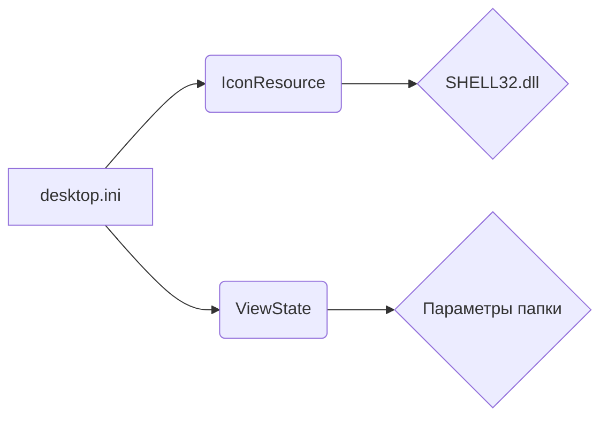

```MD
# Анализ кода desktop.ini

**1. <input code>**

```
[.ShellClassInfo]
IconResource=C:\\WINDOWS\\System32\\SHELL32.dll,300
[ViewState]
Mode=
Vid=
FolderType=Generic
```

**2. <algorithm>**

Данный код не содержит алгоритма в традиционном понимании. Он представляет собой конфигурационный файл, используемый Windows для определения визуального представления и поведения папок в проводнике Windows.

Нет пошаговой блок-схемы, так как это не код программы, а метаданные.


**3. <mermaid>**



* **desktop.ini**: Файл конфигурации.
* **IconResource**: Указывает, какой значок использовать для папки (из SHELL32.dll).
* **ViewState**: Содержит параметры, определяющие вид папки в проводнике Windows.
* **SHELL32.dll**: Система DLL, содержащая ресурсы графического интерфейса, в том числе значки.
* **Параметры папки**: `Mode`, `Vid`, `FolderType` - эти ключи описывают дополнительные параметры отображения.


**4. <explanation>**

Этот файл `desktop.ini` - это некий "скрытый" конфигурационный файл, создаваемый Windows для папок.  Он не содержит какого-либо функционального кода в стиле программ.  Он содержит метаданные, которые используются Windows Shell для управления отображением и поведением данной папки в оболочке Windows Explorer.  

* **[.ShellClassInfo]**: Этот раздел содержит информацию, связанную с атрибутами класса объекта папки (Shell Class).  Главным образом, указывает значок для папки.
* **IconResource=C:\\WINDOWS\\System32\\SHELL32.dll,300**: Этот параметр указывает, что значок для данной папки должен быть взят из файла SHELL32.dll, а конкретно, значок с индексом 300.  `SHELL32.dll` - это системная DLL, содержащая различные графические ресурсы, включая иконки.
* **[ViewState]**: Этот раздел содержит информацию о состоянии папки, которая, в частности, не используется в данном случае.
* **Mode=**: Пустое значение, вероятно, означает, что нет особых параметров отображения.
* **Vid=**: Пустое значение.
* **FolderType=Generic**: Определяет тип папки как "Общие" (Generic).

**Взаимосвязи с другими частями проекта:**

Данный `desktop.ini` не зависит напрямую от других файлов проекта.  Он  является локальным метаданными для папки, которая находится в системе и никак не связан с логикой работы приложения.


**Возможные ошибки или области для улучшений:**

Неприменимо, так как это не код программы, а метаданные.


**Заключение:**

Файл `desktop.ini` - это простой текстовый файл, определяющий дополнительные атрибуты для папок в Windows. В данном случае он указывает значок для папки и некоторые атрибуты отображения, но не содержит какого-либо функционального кода.